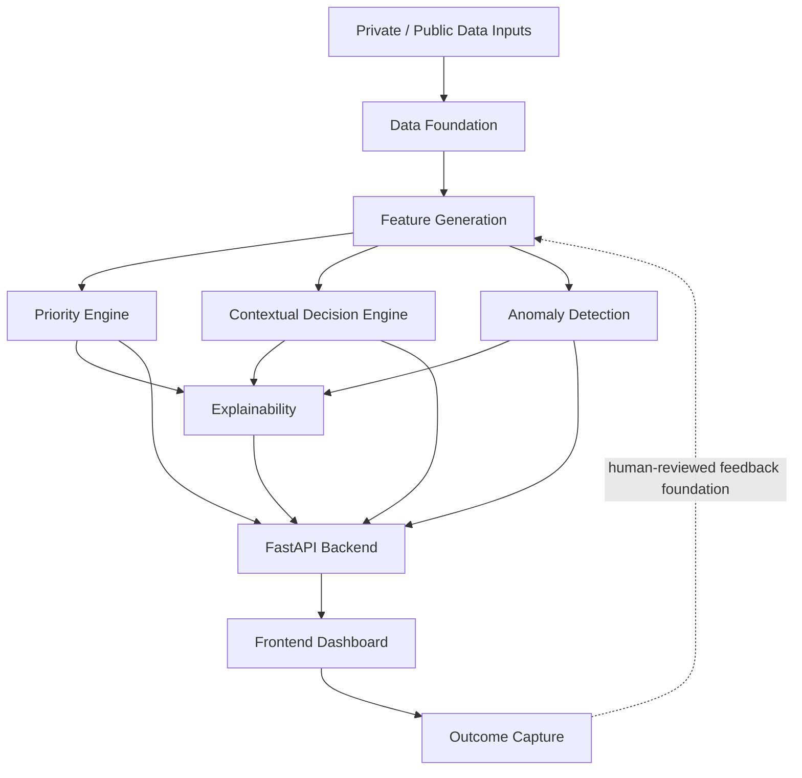

<div align="center">

# KshetraAI

### Explainable field-force intelligence for agricultural sales operations.

**Syngenta Hackathon May 2026 | Stage 1 Submission**

</div>

KshetraAI helps a field representative decide:

- who to visit
- what action to take
- what risk or opportunity needs attention
- why the system is recommending it
- what happened after the visit

The project is built as a deterministic, explainable, human-governed prototype.

---

# Problem

Agricultural field representatives often work from static visit plans while field realities change quickly.

Operational priorities can shift because of:

- inventory movement
- sales and demand signals
- retailer engagement gaps
- crop and weather context
- anomaly or opportunity signals
- field outcome feedback

The core challenge is not only prediction. It is helping the representative make a clear, explainable operational decision.

---

# Solution

KshetraAI converts available operational signals into a field-force workflow:

```text
Data -> Features -> Priority -> Action -> Alerts -> Explanation -> Outcome
```

The system is intentionally:

- deterministic
- explainable
- modular
- local-demo ready
- human-governed

---

# What We Built

- Data foundation for private/internal data and public-data signal preparation.
- Feature generation pipeline for normalized decision signals.
- Dynamic prioritization engine for ranked daily visit planning.
- Contextual decision engine for next best actions.
- Anomaly and opportunity detection for operational alerts.
- Explainability layer for evidence, confidence, and reasoning.
- Outcome capture foundation for field feedback.
- FastAPI backend exposing the workflow through structured endpoints.
- React + TypeScript frontend for the demo workflow.
- Deterministic demo package with sample outputs and verification scripts.

---

# System Flow



---

# Demo Scenario

The fixed demo path uses:

```text
rep_id: REP_0164
territory_id: TER_0164
date: 2026-05-17
selected_entity: RTL_01300
```

Demo workflow:

```text
Dashboard -> Daily Plan -> Recommendation -> Explanation -> Alerts -> Outcome
```

---

# Submission Materials

| Material | Location | Purpose |
|---|---|---|
| Stage 1 Presentation Deck | [`demo/presentation_deck/Kisaan-KshetraAI-slides.pdf`](demo/presentation_deck/Kisaan-KshetraAI-slides.pdf) | Main presentation for the submission |
| Judge Reference Appendix | [`demo/presentation_deck/kshetraai_judge_reference_appendix.pdf`](demo/presentation_deck/kshetraai_judge_reference_appendix.pdf) | Detailed module-wise technical reference supporting the deck |

The repository includes setup instructions, demo scripts, sample outputs, and implementation files for reviewers who want to inspect or run the prototype.

---

# How To Run

Create and activate the Python environment:

```powershell
python -m venv .venv
.\.venv\Scripts\Activate.ps1
python -m pip install -U pip
python -m pip install -r requirements.txt
```

Run the backend:

```powershell
uvicorn backend.main:app --reload
```

Open the API documentation:

```text
http://127.0.0.1:8000/docs
```

Run the frontend:

```powershell
cd frontend
npm install
npm run dev
```

Run core checks:

```powershell
python -m unittest discover -s tests -p "test*.py"
python demo\scripts\verify_demo_workflow.py
python demo\scripts\run_acceptance_checks.py
```

Run the frontend production build:

```powershell
cd frontend
npm run build
```

Regenerate the judge appendix PDF:

```powershell
python demo\scripts\build_judge_reference_pdf.py
```

For a cloud demo, the backend can serve committed sanitized sample outputs instead of local processed CSVs:

```text
KSHETRA_API_DATA_MODE=sample
KSHETRA_CORS_ORIGINS=https://your-vercel-frontend-url
```

Set the frontend API base URL in Vercel:

```text
VITE_KSHETRA_API_BASE_URL=https://your-backend-url
```

---

# Data Privacy

Private company-provided source files may be kept locally in:

```text
private-data/
```

That directory is confidential and ignored by Git.

Public-domain fetched/reference inputs may be kept locally in:

```text
public-data/
```

That directory is also ignored by Git.

Committed demo artifacts should remain processed, sanitized, or reference-level outputs. Raw private source data should not be committed or shared through the repository.

---

# Current Scope And Limits

Implemented for the Stage 1 prototype:

- local deterministic demo workflow
- processed-output driven backend
- frontend workflow for plan, action, alert, explanation, and outcome
- saved judge-facing presentation and technical appendix

Current limits:

- no production database persistence
- no authentication or role-based access
- no cloud deployment
- public NDVI and pest data are foundation/reference-level, not full live production integrations
- anomaly thresholds are prototype-level and not production-calibrated
- no map or route optimization view

---

# Tech Stack

| Layer | Technology |
|---|---|
| Backend | Python, FastAPI |
| Data Processing | Pandas, NumPy |
| Config | YAML |
| Frontend | React, TypeScript, Vite |
| Testing | Python unittest, frontend build checks |

---

# Repository Map

```text
backend/      FastAPI backend and intelligence modules
frontend/     React dashboard workflow
datasets/     Generated processed outputs
demo/         Presentation materials, sample outputs, scripts, scenarios
docs/         Architecture, implementation, contracts, ground-truth notes
tests/        Backend and workflow tests
```

---

# Final Note

KshetraAI demonstrates how agricultural field execution can move from static planning to signal-driven prioritization, contextual action, transparent reasoning, and outcome capture.
