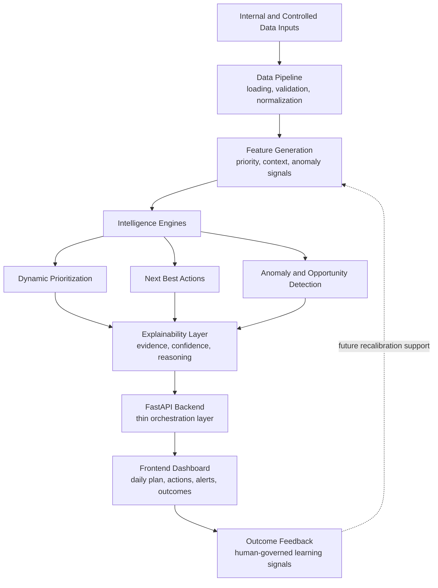

# KshetraAI

## AI-Guided Field Force Intelligence Platform

# Project Overview

KshetraAI is an explainable agricultural field-force intelligence platform for helping sales representatives decide who to visit, what action to take, what risk needs attention, and why the system is recommending it.

The project turns static field operations into deterministic, signal-driven, explainable workflows using company-provided operational data and controlled demo outputs.

---

# System Architecture Diagram



---

# Core Capabilities

- Daily visit prioritization based on operational, agronomic, inventory, and engagement signals.
- Next best actions for each selected retailer or field entity.
- Alert and anomaly detection for operational risks and opportunities.
- Explainability for priorities, recommendations, alerts, and confidence levels.
- Outcome capture for future human-reviewed learning and recalibration.

---

# Current Build Status

Current phase:

```text
Architecture & Governance Complete
-> End-to-End Prototype Implemented
-> Final Review and Demo Readiness
```

| Build | Component | Status | Implementation Control Doc |
|---|---|---|---|
| 01 | Dataset & Schema Setup |  | [`01_dataset_schema_setup_build.md`](docs/implementation/01_dataset_schema_setup_build.md) |
| 02 | Feature Generation Pipeline |  | [`02_feature_generation_pipeline.md`](docs/implementation/02_feature_generation_pipeline.md) |
| 03 | Dynamic Prioritization Engine |  | [`03_dynamic_prioritization_engine.md`](docs/implementation/03_dynamic_prioritization_engine.md) |
| 04 | Contextual Decision Engine |  | [`04_contextual_decision_engine.md`](docs/implementation/04_contextual_decision_engine.md) |
| 05 | Anomaly & Opportunity Detection Engine |  | [`05_anomaly_and_opportunity_detection_engine.md`](docs/implementation/05_anomaly_and_opportunity_detection_engine.md) |
| 06 | Explainability & Trust Engine |  | [`06_explainability_and_trust_engine.md`](docs/implementation/06_explainability_and_trust_engine.md) |
| 07 | Outcome Learning & Feedback Engine |  | [`07_outcome_learning_and_feedback_engine.md`](docs/implementation/07_outcome_learning_and_feedback_engine.md) |
| 08 | FastAPI Backend Integration |  | [`08_fastApi_backend_integration.md`](docs/implementation/08_fastApi_backend_integration.md) |
| 09 | Frontend Dashboard & Workflow Layer |  | [`09_frontend_dashboard_and_workflow_layer.md`](docs/implementation/09_frontend_dashboard_and_workflow_layer.md) |
| 10 | Demo Integration, Testing & Final Polish |  | [`10_demo_integration_testing_final_polish.md`](docs/implementation/10_demo_integration_testing_final_polish.md) |

Next:

```text
Final review, demo rehearsal, and submission packaging.
```

---

# Tech Stack

| Layer | Technology |
|---|---|
| Backend | Python + FastAPI |
| Frontend | React + TypeScript + Vite |
| Data Processing | Pandas + NumPy |
| Config | YAML |
| Testing | Python unittest / pytest-compatible tests + frontend build checks |

---

# Project Structure

```text
KshetraAI/
|-- backend/                      # FastAPI backend and intelligence modules
|   |-- api/                      # Thin API routes, schemas, and services
|   |-- data/                     # Loading, validation, normalization, joins
|   |-- features/                 # Feature generation pipeline
|   |-- engines/                  # Priority and contextual decision engines
|   |-- anomaly/                  # Alert and opportunity detection
|   |-- explainability/           # Evidence and reasoning generation
|   |-- learning/                 # Outcome capture and feedback views
|   `-- main.py                   # Backend application entrypoint
|-- frontend/                     # React dashboard
|   |-- components/               # Reusable UI components
|   |-- pages/                    # Daily plan, actions, alerts, outcomes
|   |-- services/                 # API client functions
|   |-- hooks/                    # API/data hooks
|   `-- styles/                   # Global styling
|-- datasets/                     # Generated local datasets and demo outputs
|-- demo/                         # Judge-facing runbook, scripts, and sample outputs
|-- docs/                         # Architecture, contracts, implementation docs, prompts
|-- tests/                        # Backend and workflow tests
`-- README.md
```

---

# Local Setup

Create and activate the Python virtual environment:

```powershell
python -m venv .venv
.\.venv\Scripts\Activate.ps1
python -m pip install -U pip
python -m pip install -r requirements.txt
```

Run the backend:

```powershell
uvicorn backend.main:app --reload
```

Open API docs:

```text
http://127.0.0.1:8000/docs
```

Run the frontend:

```powershell
cd frontend
npm install
npm run dev
```

Run checks:

```powershell
python -m unittest
cd frontend
npm run build
```

---

# Data Privacy Note

Private company-provided source files may be kept locally in `private-data/`.

That directory is confidential, ignored by Git, and should only be read by the data pipeline. Generated demo artifacts committed under `demo/sample_outputs/` should remain sanitized API-level outputs, not raw private data.

---

# Documentation Map

- Architecture docs: [`docs/architecture/`](docs/architecture/)
- Implementation contracts: [`docs/implementation_contracts/`](docs/implementation_contracts/)
- Build execution docs: [`docs/implementation/`](docs/implementation/)
- Ground truth checks: [`docs/ground_truth/`](docs/ground_truth/)
- AI workflow prompts: [`docs/prompts/`](docs/prompts/)
- Scoring references: [`docs/scoring/`](docs/scoring/)
- Demo runbook: [`demo/runbook.md`](demo/runbook.md)
- Judge-facing demo flow: [`demo/judging_flow/`](demo/judging_flow/)

---

# Demo Focus

KshetraAI demonstrates how explainable AI systems can augment agricultural field operations through transparent, adaptive, and operationally grounded intelligence workflows.
