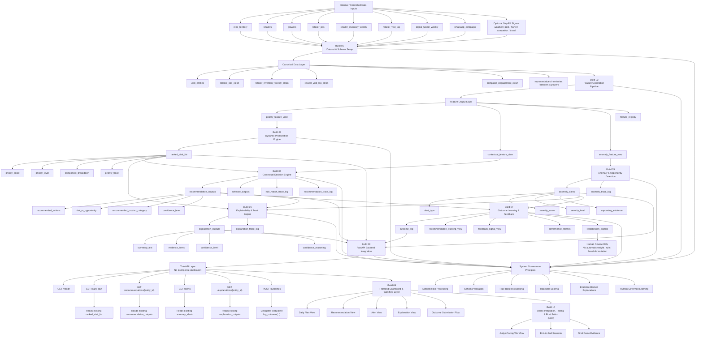

# KshetraAI

## AI-Guided Field Force Intelligence Platform

---

# Overview

KshetraAI is an explainable agricultural field-force intelligence platform designed to help agricultural sales representatives make adaptive, data-driven, and context-aware operational decisions.

The system transforms static field operations into:

```text
Dynamic,
signal-driven,
explainable intelligence workflows.
```

KshetraAI combines:

- agronomic intelligence
- operational prioritization
- anomaly detection
- contextual recommendations
- explainable reasoning
- outcome-driven feedback learning

to support smarter field-force execution.

---

# Problem Statement

Traditional agricultural field operations often rely on:

- fixed visit schedules
- repetitive territory rotations
- manual intuition
- delayed operational response

However, agricultural environments are highly dynamic.

Operational priorities can rapidly change due to:

- pest outbreaks
- rainfall deviation
- crop-stage transitions
- inventory shortages
- competitor activity
- regional demand shifts

Field representatives require:

```text
Real-time contextual intelligence
to decide:
- who to visit
- when to visit
- what to discuss
- what operational risk exists
- what opportunity should be captured
```

KshetraAI is designed to solve this challenge.

---

# Core Objectives

KshetraAI focuses on five major operational capabilities.

---

# 1. Dynamic Prioritization

Generate adaptive visit prioritization using:

- weather signals
- crop stress
- pest alerts
- inventory conditions
- sales opportunity
- relationship context
- competitive pressure
- travel efficiency

The system determines:

```text
Who should be visited first,
and why.
```

---

# 2. Contextual Next Best Action

Generate contextual operational recommendations such as:

- what product to discuss
- what advisory to provide
- what inventory issue to address
- what risk/opportunity exists

The system determines:

```text
What should be done during the visit.
```

---

# 3. Anomaly & Opportunity Detection

Detect unusual operational patterns such as:

- stock-out risk
- sudden demand spike
- pest emergence
- regional sales decline
- crop stress escalation

The system determines:

```text
What abnormal event requires immediate attention.
```

---

# 4. Explainability & Trust

Provide transparent reasoning for:

- priority rankings
- recommendations
- alerts
- confidence levels

The system ensures:

```text
Operational intelligence remains explainable.
```

---

# 5. Outcome Learning

Capture:

- field outcomes
- recommendation effectiveness
- sales conversion
- alert validation

to support future system improvement.

The system learns:

```text
What worked operationally.
```

---

# Core System Philosophy

KshetraAI intentionally prioritizes:

```text
Explainable operational intelligence.
```

NOT:

```text
Opaque autonomous AI systems.
```

The system emphasizes:

- deterministic behavior
- rule-based reasoning
- evidence-backed intelligence
- modular architecture
- operational traceability

---

# Key Engineering Principles


| Principle      | Meaning                                    |
| -------------- | ------------------------------------------ |
| Deterministic  | Same inputs → same outputs                 |
| Explainable    | All intelligence remains traceable         |
| Modular        | Components remain isolated                 |
| Scoped         | Small localized implementation             |
| Stable         | Preserve architecture                      |
| Human-Governed | Humans own architecture and business logic |


---

# High-Level System Flow

```text
Raw Operational Signals
        ↓
Data Pipeline
        ↓
Feature Builder
        ↓
Priority Engine
        ↓
Contextual Decision Engine
        ↓
Anomaly Detection Engine
        ↓
Explainability Engine
        ↓
API Layer
        ↓
Frontend Dashboard
        ↓
Outcome Learning Engine
```

---

# System Architecture Diagram




---

# Core Components

---

# 1. Data Pipeline

Responsible for:

- data loading
- validation
- normalization
- joining operational datasets

Outputs:

```text
Feature-ready operational views.
```

---

# 2. Feature Builder

Responsible for:

- generating normalized intelligence features
- converting raw signals into interpretable scores

Example features:

- weather_risk_score
- inventory_need_score
- competitive_pressure_score

---

# 3. Priority Engine

Responsible for:

- weighted multi-signal ranking
- operational prioritization

Outputs:

- priority score
- priority level
- ranked visit list

---

# 4. Contextual Decision Engine

Responsible for:

- contextual next best actions
- operational recommendations
- advisory generation

Outputs:

- recommended actions
- product suggestions
- confidence levels

---

# 5. Anomaly Detection Engine

Responsible for:

- detecting unusual operational events
- baseline comparison
- severity classification

Outputs:

- anomaly alerts
- severity levels
- operational escalation signals

---

# 6. Explainability Engine

Responsible for:

- generating human-readable reasoning
- evidence mapping
- confidence explanation

Outputs:

- explainable operational reasoning

---

# 7. Outcome Learning Engine

Responsible for:

- outcome tracking
- recommendation effectiveness
- feedback analytics
- future recalibration support

---

# 8. API Layer

Responsible for:

- exposing backend intelligence through structured APIs

Built using:

```text
FastAPI
```

---

# 9. Frontend Dashboard

Responsible for:

- operational visualization
- workflow interaction
- explainability visibility
- outcome submission

Built using:

```text
React + TypeScript
```

---

# Technology Stack


| Layer           | Technology                |
| --------------- | ------------------------- |
| Backend         | Python + FastAPI          |
| Frontend        | React + TypeScript        |
| Data Processing | Pandas + NumPy            |
| Storage         | SQLite / PostgreSQL       |
| Config          | YAML                      |
| Visualization   | TailwindCSS               |
| Testing         | Pytest + Frontend Testing |


---

# Project Structure

```text
KshetraAI/
├── docs/                         # Architecture, contracts, prompts, and project governance
│   ├── architecture/             # System design, data schema, infrastructure, roadmap
│   ├── implementation_contracts/ # Module boundaries, file ownership, implementation rules
│   ├── prompts/                  # AI-assisted engineering workflow prompts
│   ├── diagrams/                 # Mermaid/system diagrams
│   ├── ground_truth/             # doc to verify the grounded implementation
│   ├── scoring/                  # Scoring references and formulas
│   └── implementation/           # Implementation notes and planning docs
├── backend/                      # Python backend and intelligence system
│   ├── api/                      # Thin FastAPI orchestration layer
│   │   ├── routes/               # Endpoint definitions
│   │   ├── schemas/              # Request and response models
│   │   ├── services/             # API orchestration helpers
│   │   ├── dependencies/         # Shared API dependencies
│   │   └── middleware/           # API middleware
│   ├── config/                   # YAML weights, thresholds, rules, and templates
│   ├── data/                     # Data loading, validation, normalization, and joins
│   │   ├── loaders/              # CSV/SQLite/input loading utilities
│   │   ├── validators/           # Schema and value validation
│   │   ├── normalizers/          # Datatype and value normalization
│   │   ├── joins/                # Dataset join logic
│   │   └── schemas/              # Dataset schema definitions
│   ├── pipelines/                # Feature-view build pipelines
│   ├── features/                 # Normalized feature generation
│   ├── engines/                  # Priority and contextual decision engines
│   ├── anomaly/                  # Anomaly and opportunity detection
│   ├── explainability/           # Evidence, confidence, and reasoning generation
│   ├── learning/                 # Outcome logging and feedback analytics
│   ├── rules/                    # Controlled rule templates
│   ├── utils/                    # Shared backend utilities
│   └── main.py                   # Backend application entrypoint
├── frontend/                     # React/TypeScript operational dashboard
│   ├── components/               # Reusable UI components
│   ├── pages/                    # Dashboard workflow screens
│   ├── services/                 # API client functions
│   ├── hooks/                    # Reusable React hooks
│   ├── state/                    # Simple frontend state management
│   ├── layouts/                  # Page layouts
│   ├── styles/                   # Styling assets
│   └── utils/                    # Frontend utilities
├── datasets/                     # Derived datasets and controlled gap-fill data
│   ├── raw/                      # Non-confidential source inputs, if any
│   ├── processed/                # Generated processed views
│   └── synthetic/                # Gap-fill/demo seed data for unavailable signals
├── demo/                         # End-to-end demo workflow assets
│   ├── scenarios/                # Demo scenarios and storylines
│   ├── scripts/                  # Demo helper scripts
│   ├── sample_outputs/           # Saved sample outputs
│   ├── screenshots/              # Demo screenshots
│   ├── judging_flow/             # Judge-facing walkthrough material
│   └── presentation_notes/       # Presentation notes
├── notebooks/                    # Exploration notebooks
├── scripts/                      # Local utility scripts
├── tests/                        # Automated tests
└── README.md                     # Project overview
```

Private company-provided source files may be kept locally in `private-data/`.
That directory is confidential, ignored by Git, and should only be read by the data pipeline.

---

# Local Python Setup

Create and activate the virtual environment:

```powershell
python -m venv .venv
.\.venv\Scripts\Activate.ps1
```

Install the local package with development tools:

```powershell
python -m pip install -U pip
```

Project dependencies will be added in the backend/frontend setup files as each scoped implementation phase begins.

Run tests after test tooling is added:

```powershell
pytest
```

---

# Documentation Architecture

The project follows a strict documentation hierarchy.

---

# 1. Architecture Documents

Location:

```text
docs/architecture/
```

Purpose:

Defines:

- business logic
- intelligence philosophy
- scoring systems
- explainability philosophy
- infrastructure architecture

These documents are considered:

```text
Architectural truth.
```

---

# 2. Implementation Contracts

Location:

```text
docs/implementation_contracts/
```

Purpose:

Defines:

- module responsibilities
- implementation boundaries
- file ownership
- dependency rules
- allowed behavior

These documents are considered:

```text
Implementation governance.
```

---

# 3. Prompt Layer

Location:

```text
docs/prompts/
```

Purpose:

Defines:

- AI-assisted engineering workflow
- implementation discipline
- review discipline
- architecture preservation workflow

These documents are considered:

```text
Operational AI governance.
```

---

# AI-Assisted Engineering Philosophy

KshetraAI is intentionally designed for:

```text
Controlled AI-assisted engineering.
```

The system uses:

- architecture-driven development
- contract-driven implementation
- prompt-controlled engineering workflows

This prevents:

- architectural drift
- uncontrolled abstraction
- schema mutation
- hidden business logic
- unstable implementations

---

# Implementation Strategy

The project follows:

```text
Component-by-component implementation.
```

Preferred workflow:

```text
Data Pipeline
        ↓
Feature Builder
        ↓
Priority Engine
        ↓
Contextual Engine
        ↓
Anomaly Engine
        ↓
Explainability Engine
        ↓
API Layer
        ↓
Frontend Dashboard
        ↓
Demo Integration
```

---

# Explainability Philosophy

Explainability is a core architectural requirement.

The system must always preserve:

- evidence visibility
- score traceability
- recommendation reasoning
- anomaly reasoning
- confidence transparency

The system intentionally avoids:

- black-box scoring
- hidden heuristics
- opaque recommendation systems

---

# Deterministic System Philosophy

KshetraAI intentionally prioritizes:

```text
Deterministic operational intelligence.
```

Given identical inputs:

```text
Outputs must remain identical.
```

This improves:

- trust
- debugging
- explainability
- reproducibility
- operational reliability

---

# Prototype Philosophy

KshetraAI V1 prioritizes:

- clarity
- operational coherence
- explainability
- modularity
- deterministic intelligence

NOT:

- massive scalability
- distributed complexity
- premature optimization

---

# Demo Vision

The final prototype should demonstrate:

```text
How agricultural field-force operations
can become adaptive,
signal-driven,
explainable,
and continuously improving.
```

The demo focuses on:

- operational intelligence
- explainability visibility
- actionable recommendations
- anomaly visibility
- feedback learning

---

# Setup Philosophy

The project is designed to run:

- locally
- deterministically
- with company-provided internal data and controlled gap-fill datasets
- without mandatory cloud infrastructure

This ensures:

- easier development
- reproducible demos
- offline-friendly workflows

---

# Future Roadmap

Potential future extensions include:

- ML-assisted recalibration
- route optimization
- geospatial intelligence
- mobile deployment
- offline synchronization
- multilingual advisory generation
- advanced forecasting
- reinforcement learning-based prioritization

These are intentionally deferred until:

```text
The explainable deterministic core system
is stable.
```

---

# Current Status

Current phase:

```text
Architecture & Governance Complete
→ Controlled Implementation Phase Starting
```

---

# Build Progress

| Build | Component | Status | Implementation Control Doc |
|---|---|---|---|
| 01 | Dataset & Schema Setup |  | [`01_dataset_schema_setup_build.md`](docs/implementation/01_dataset_schema_setup_build.md) |
| 02 | Feature Generation Pipeline |  | [`02_feature_generation_pipeline.md`](docs/implementation/02_feature_generation_pipeline.md) |
| 03 | Dynamic Prioritization Engine |  | [`03_dynamic_prioritization_engine.md`](docs/implementation/03_dynamic_prioritization_engine.md) |
| 04 | Contextual Decision Engine |  | [`04_contextual_decision_engine.md`](docs/implementation/04_contextual_decision_engine.md) |
| 05 | Anomaly & Opportunity Detection Engine |  | [`05_anomaly_and_opportunity_detection_engine.md`](docs/implementation/05_anomaly_and_opportunity_detection_engine.md) |
| 06 | Explainability & Trust Engine |  | [`06_explainability_and_trust_engine.md`](docs/implementation/06_explainability_and_trust_engine.md) |
| 07 | Outcome Learning & Feedback Engine |  | [`07_outcome_learning_and_feedback_engine.md`](docs/implementation/07_outcome_learning_and_feedback_engine.md) |
| 08 | FastAPI Backend Integration |  | [`08_fastApi_backend_integration.md`](docs/implementation/08_fastApi_backend_integration.md) |
| 09 | Frontend Dashboard & Workflow Layer |  | [`09_frontend_dashboard_and_workflow_layer.md`](docs/implementation/09_frontend_dashboard_and_workflow_layer.md) |
| 10 | Demo Integration, Testing & Final Polish |  | [`10_demo_integration_testing_final_polish.md`](docs/implementation/10_demo_integration_testing_final_polish.md) |

Status values:

```text
Not Started → In Progress → Under Review → Complete
```

Completed:

- architecture design
- intelligence design
- implementation contracts
- AI governance prompts
- engineering workflow planning
- infrastructure planning
- Build 01 dataset and schema setup
- Build 02 feature generation pipeline
- Build 03 dynamic prioritization engine
- Build 04 contextual decision engine
- Build 05 anomaly and opportunity detection engine
- Build 06 explainability and trust engine
- Build 07 outcome learning and feedback engine
- Build 08 FastAPI backend integration
- Build 09 frontend dashboard and workflow layer

Next:

```text
Build 10: Demo Integration, Testing & Final Polish.
```

---

# Final Vision

KshetraAI aims to demonstrate:

```text
How explainable AI systems
can augment agricultural field operations
through transparent,
adaptive,
and operationally grounded intelligence workflows.
```
