```mermaid
flowchart TD

%% ====================================
%% Dynamic Prioritization Scoring Engine
%% ====================================

A["Raw Contextual Signals"]

%% -------------------------
%% Input Signals
%% -------------------------

A1["Weather Data"] --> A
A2["Pest & Disease Alerts"] --> A
A3["NDVI / Crop Stress"] --> A
A4["Crop Growth Stage"] --> A
A5["Sales & POS Data"] --> A
A6["Inventory Data"] --> A
A7["CRM / Visit History"] --> A
A8["Competitor Activity"] --> A
A9["Geo / Route Information"] --> A

%% -------------------------
%% Signal Processing Layer
%% -------------------------

A --> B["Signal Normalization & Scoring"]

%% -------------------------
%% Agronomic Urgency
%% -------------------------

B --> C1["Agronomic Urgency<br/>Weight: 30%"]

C1a["Pest/Disease Risk<br/>35%"] --> C1
C1b["Crop Stage Risk<br/>25%"] --> C1
C1c["Weather Risk<br/>20%"] --> C1
C1d["NDVI Stress<br/>20%"] --> C1

%% -------------------------
%% Sales Opportunity
%% -------------------------

B --> C2["Sales Opportunity<br/>Weight: 25%"]

C2a["Historical Sales<br/>30%"] --> C2
C2b["Seasonal Product Relevance<br/>30%"] --> C2
C2c["Purchase History<br/>20%"] --> C2
C2d["Regional Crop Acreage<br/>20%"] --> C2

%% -------------------------
%% Inventory Need
%% -------------------------

B --> C3["Inventory Need<br/>Weight: 20%"]

C3a["Current Inventory<br/>40%"] --> C3
C3b["Sales Velocity<br/>35%"] --> C3
C3c["Stock-Out Risk<br/>25%"] --> C3

%% -------------------------
%% Relationship Need
%% -------------------------

B --> C4["Relationship Need<br/>Weight: 10%"]

C4a["Days Since Last Visit<br/>50%"] --> C4
C4b["Account Importance<br/>30%"] --> C4
C4c["Pending Issues<br/>20%"] --> C4

%% -------------------------
%% Competitive Pressure
%% -------------------------

B --> C5["Competitive Pressure<br/>Weight: 10%"]

C5a["Competitor Promotions<br/>40%"] --> C5
C5b["Regional Sales Drop<br/>35%"] --> C5
C5c["Competitor Availability<br/>25%"] --> C5

%% -------------------------
%% Travel Cost
%% -------------------------

B --> C6["Travel Cost<br/>Penalty: -5%"]

C6a["Distance<br/>40%"] --> C6
C6b["Route Time<br/>35%"] --> C6
C6c["Cluster Efficiency<br/>25%"] --> C6

%% -------------------------
%% Final Priority Engine
%% -------------------------

C1 --> D["Final Priority Scoring Engine"]
C2 --> D
C3 --> D
C4 --> D
C5 --> D
C6 --> D

%% -------------------------
%% Formula
%% -------------------------

D --> E["Priority Score Formula

0.30 × Agronomic Urgency
+ 0.25 × Sales Opportunity
+ 0.20 × Inventory Need
+ 0.10 × Relationship Need
+ 0.10 × Competitive Pressure
- 0.05 × Travel Cost"]

%% -------------------------
%% Output Layer
%% -------------------------

E --> F["Final Priority Score"]

F --> G{"Priority Level"}

G -->|"80–100"| H1["Critical"]
G -->|"65–79"| H2["High"]
G -->|"50–64"| H3["Medium"]
G -->|"Below 50"| H4["Low"]

%% -------------------------
%% Final Recommendation
%% -------------------------

H1 --> I["Ranked Visit Recommendation"]
H2 --> I
H3 --> I
H4 --> I

I --> J["Explainable Reasoning"]

J --> J1["Why this visit?"]
J --> J2["Which signals contributed most?"]
J --> J3["What operational risk/opportunity exists?"]

%% -------------------------
%% Styling
%% -------------------------

classDef source fill:#f5f5f5,stroke:#555,stroke-width:1px;
classDef component fill:#e8f0ff,stroke:#2855a3,stroke-width:1px;
classDef scoring fill:#fff4d6,stroke:#b87900,stroke-width:1px;
classDef output fill:#e9f8ee,stroke:#2d7a46,stroke-width:1px;

class A,A1,A2,A3,A4,A5,A6,A7,A8,A9 source;
class B,C1,C2,C3,C4,C5,C6 component;
class D,E,F,G,H1,H2,H3,H4 scoring;
class I,J,J1,J2,J3 output;
```

# KshetraAI — Priority Intelligence Framework (V1)

---

# 1. Objective

The purpose of the Priority Intelligence Engine is to determine:

```text
Which farmers/retailers should be visited today,
in what sequence,
and why.
```

The system converts multiple agricultural and operational signals into:

- A unified priority score
- Ranked visit recommendations
- Explainable reasoning
- Actionable field intelligence

---

# 2. Design Principles

The framework is designed to be:

- Practical
- Explainable
- Data-supported
- Operationally meaningful
- Implementable within hackathon scope
- Extensible for future ML optimization

---

# 3. Scoring Hierarchy

```text
Raw Signals
    ↓
Signal-Level Scores
    ↓
Component Scores
    ↓
Final Priority Score
    ↓
Ranked Visit Recommendations
```

---

# 4. Final Priority Components

| Component | Weight | Purpose |
|---|---|---|
| Agronomic Urgency | 30% | Measures crop/pest/weather urgency |
| Sales Opportunity | 25% | Measures business/revenue opportunity |
| Inventory Need | 20% | Measures retailer stock urgency |
| Relationship Need | 10% | Measures account engagement urgency |
| Competitive Pressure | 10% | Measures market defense urgency |
| Travel Cost | -5% | Penalizes impractical routing |

---

# 5. Component Definitions

---

# Component 1 — Agronomic Urgency (30%)

## Purpose

Measures how urgently agricultural conditions require field intervention.

This is the most important component because agriculture is highly time-sensitive.

---

## Signals

| Signal | Weight | Why It Matters |
|---|---|---|
| Pest/Disease Risk | 35% | Immediate product/advisory relevance |
| Crop Growth Stage Risk | 25% | Certain stages are highly vulnerable |
| Weather Risk | 20% | Rainfall/humidity influence outbreaks |
| NDVI/Crop Stress | 20% | Indicates vegetation stress |

---

## Example Inputs

```text
Pest alert active
Cotton in flowering stage
High humidity
NDVI stress detected
```

---

## Example Output

```text
Agronomic Urgency Score = 84
```

---

# Component 2 — Sales Opportunity (25%)

## Purpose

Measures commercial potential and expected business impact.

---

## Signals

| Signal | Weight | Why It Matters |
|---|---|---|
| Historical Sales Performance | 30% | Indicates revenue potential |
| Seasonal Product Relevance | 30% | Product demand depends on crop cycle |
| Purchase History | 20% | Predicts buying likelihood |
| Regional Crop Acreage | 20% | Larger cultivated area means higher opportunity |

---

## Example Inputs

```text
High cotton acreage
Strong insecticide demand season
Retailer historically performs well
```

---

## Example Output

```text
Sales Opportunity Score = 78
```

---

# Component 3 — Inventory Need (20%)

## Purpose

Measures urgency of retailer stock replenishment.

---

## Signals

| Signal | Weight | Why It Matters |
|---|---|---|
| Current Inventory Level | 40% | Low stock increases urgency |
| Sales Velocity | 35% | Fast-moving stock depletes quickly |
| Stock-Out Risk | 25% | Prevents missed sales |

---

## Example Inputs

```text
Low insecticide stock
High recent sales velocity
High regional demand expected
```

---

## Example Output

```text
Inventory Need Score = 88
```

---

# Component 4 — Relationship Need (10%)

## Purpose

Measures urgency of maintaining account engagement.

---

## Signals

| Signal | Weight | Why It Matters |
|---|---|---|
| Days Since Last Visit | 50% | Long gaps reduce engagement |
| Account Importance | 30% | Strategic accounts matter more |
| Pending Follow-Up/Issue | 20% | Open issues require attention |

---

## Example Inputs

```text
No visit in 20 days
High-value retailer
Pending farmer complaint
```

---

## Example Output

```text
Relationship Need Score = 64
```

---

# Component 5 — Competitive Pressure (10%)

## Purpose

Measures urgency created by competitor activity.

---

## Signals

| Signal | Weight | Why It Matters |
|---|---|---|
| Competitor Promotions | 40% | Aggressive local push |
| Regional Sales Drop | 35% | Indicates market pressure |
| Competitor Product Availability | 25% | Competitive accessibility matters |

---

## Example Inputs

```text
Competitor discount campaign active
Regional sales declining
Competitor stock widely available
```

---

## Example Output

```text
Competitive Pressure Score = 71
```

---

# Component 6 — Travel Cost (-5%)

## Purpose

Penalizes impractical or inefficient visits.

This is intentionally low-weighted because business/agronomic urgency should dominate.

---

## Signals

| Signal | Weight | Why It Matters |
|---|---|---|
| Distance | 40% | Long travel reduces efficiency |
| Estimated Route Time | 35% | Time impacts daily coverage |
| Route Cluster Efficiency | 25% | Nearby visits improve efficiency |

---

## Example Inputs

```text
Retailer located far from cluster
Poor route efficiency
Long travel time
```

---

## Example Output

```text
Travel Cost Score = 42
```

---

# 6. Final Priority Formula

```text
Priority Score =
0.30 × Agronomic Urgency
+ 0.25 × Sales Opportunity
+ 0.20 × Inventory Need
+ 0.10 × Relationship Need
+ 0.10 × Competitive Pressure
- 0.05 × Travel Cost
```

---

# 7. Example Calculation

## Component Scores

| Component | Score |
|---|---|
| Agronomic Urgency | 84 |
| Sales Opportunity | 78 |
| Inventory Need | 88 |
| Relationship Need | 64 |
| Competitive Pressure | 71 |
| Travel Cost | 42 |

---

## Final Score

```text
Priority Score =
0.30(84)
+ 0.25(78)
+ 0.20(88)
+ 0.10(64)
+ 0.10(71)
- 0.05(42)

= 73.7
```

---

# 8. Priority Classification

| Score Range | Priority Level |
|---|---|
| 80–100 | Critical |
| 65–79 | High |
| 50–64 | Medium |
| Below 50 | Low |

---

# 9. Explainability Layer

Every recommendation must include reasons directly mapped from signals.

---

## Example

```text
Retailer: Ramesh Agro Center

Priority Score: 73.7 (High)

Reason:
- Cotton crop in pest-sensitive stage
- Active bollworm alert detected
- Insecticide inventory running low
- Regional demand expected to increase
- Competitor promotion active nearby
```

---

# 10. Why This Framework Is Strong

This framework is:

- Explainable
- Modular
- Easy to prototype
- ML-extensible
- Operationally realistic
- Compatible with available data
- Suitable for daily recalibration

---

# 11. Future Evolution

Initially:

```text
Expert-defined interpretable weights
```

Later:

```text
Outcome-based ML recalibration
```

The system can gradually learn optimal weights using:

- Sales outcomes
- Recommendation acceptance
- Order placement
- Revenue per visit
- Regional performance trends

---

# 12. Final One-Line Definition

```text
An explainable multi-signal priority intelligence engine
for agricultural field operations.
```


