```mermaid
flowchart TD

%% ==================================================
%% KshetraAI — Contextual Decision & Next Best Action
%% ==================================================

A["Input Context"]

A1["Priority Output<br/>priority score, priority level"] --> A
A2["Agronomic Signals<br/>crop, stage, weather, pest, NDVI"] --> A
A3["Business Signals<br/>sales, demand, product relevance"] --> A
A4["Inventory Signals<br/>stock level, sales velocity"] --> A
A5["Relationship Signals<br/>last visit, pending issue"] --> A
A6["Competitive Signals<br/>promotion, sales drop, availability"] --> A

A --> B["Context Understanding Layer"]

B --> C1["Agronomic Risk Logic"]
B --> C2["Inventory Action Logic"]
B --> C3["Sales Opportunity Logic"]
B --> C4["Relationship Logic"]
B --> C5["Competitive Response Logic"]

%% -------------------------
%% Agronomic Logic
%% -------------------------

C1 --> D1["Risk Inference"]
D1 --> D1a["Pest Risk"]
D1 --> D1b["Disease Risk"]
D1 --> D1c["Weather-Linked Crop Risk"]

D1 --> E1["Example Decision:<br/>Possible fungal disease risk"]

%% -------------------------
%% Inventory Logic
%% -------------------------

C2 --> D2["Stock Action Inference"]
D2 --> D2a["Low Inventory"]
D2 --> D2b["High Sales Velocity"]
D2 --> D2c["Stock-Out Risk"]

D2 --> E2["Example Decision:<br/>Recommend restocking"]

%% -------------------------
%% Sales Logic
%% -------------------------

C3 --> D3["Opportunity Inference"]
D3 --> D3a["Seasonal Relevance"]
D3 --> D3b["High Demand"]
D3 --> D3c["Strong Purchase History"]

D3 --> E3["Example Decision:<br/>Promote relevant product"]

%% -------------------------
%% Relationship Logic
%% -------------------------

C4 --> D4["Engagement Inference"]
D4 --> D4a["Long Visit Gap"]
D4 --> D4b["Strategic Account"]
D4 --> D4c["Pending Follow-Up"]

D4 --> E4["Example Decision:<br/>Resolve issue / follow up"]

%% -------------------------
%% Competitive Logic
%% -------------------------

C5 --> D5["Market Defense Inference"]
D5 --> D5a["Competitor Promotion"]
D5 --> D5b["Regional Sales Drop"]
D5 --> D5c["Competitor Availability"]

D5 --> E5["Example Decision:<br/>Defensive promotion response"]

%% -------------------------
%% Decision Consolidation
%% -------------------------

E1 --> F["Decision Consolidation Engine"]
E2 --> F
E3 --> F
E4 --> F
E5 --> F

F --> G["Next Best Action"]

G --> G1["Product to Discuss"]
G --> G2["Agronomic Advice"]
G --> G3["Restocking Suggestion"]
G --> G4["Promotion / Offer"]
G --> G5["Follow-Up Action"]

%% -------------------------
%% Confidence & Explainability
%% -------------------------

F --> H["Confidence Assignment"]
H --> H1["High Confidence"]
H --> H2["Medium Confidence"]
H --> H3["Low Confidence"]

F --> I["Evidence Layer"]
I --> I1["Which signals triggered the decision?"]
I --> I2["What risk/opportunity was inferred?"]
I --> I3["Why this action is suitable?"]

I --> J["Controlled Explanation Generator"]
H --> J
G --> J

J --> K["Structured Recommendation Output"]

K --> K1["Risk / Opportunity"]
K --> K2["Recommended Action"]
K --> K3["Evidence"]
K --> K4["Confidence"]
K --> K5["Rep-facing Explanation"]

%% -------------------------
%% Field Usage
%% -------------------------

K --> L["Field Rep Dashboard"]

L --> M["Rep Executes Visit"]

M --> N["Outcome Capture"]

N --> N1["Action Accepted / Ignored"]
N --> N2["Sale / Order"]
N --> N3["No Purchase"]
N --> N4["Rep Feedback"]

N --> O["Future Rule / Model Improvement"]

%% -------------------------
%% Styling
%% -------------------------

classDef input fill:#f5f5f5,stroke:#555,stroke-width:1px;
classDef logic fill:#e8f0ff,stroke:#2855a3,stroke-width:1px;
classDef inference fill:#fff4d6,stroke:#b87900,stroke-width:1px;
classDef action fill:#e9f8ee,stroke:#2d7a46,stroke-width:1px;
classDef explanation fill:#f3e8ff,stroke:#6b21a8,stroke-width:1px;
classDef feedback fill:#fdecec,stroke:#b33939,stroke-width:1px;

class A,A1,A2,A3,A4,A5,A6 input;
class B,C1,C2,C3,C4,C5,F logic;
class D1,D1a,D1b,D1c,D2,D2a,D2b,D2c,D3,D3a,D3b,D3c,D4,D4a,D4b,D4c,D5,D5a,D5b,D5c,E1,E2,E3,E4,E5,H,H1,H2,H3 inference;
class G,G1,G2,G3,G4,G5,K,K1,K2,K3,K4,K5,L,M action;
class I,I1,I2,I3,J explanation;
class N,N1,N2,N3,N4,O feedback;
```

# KshetraAI — Contextual Decision & Next Best Action Engine (V1)

---

# 1. Objective

The purpose of the Contextual Decision Engine is to determine:

```text
What should the field representative do during the visit,
based on the current agricultural and operational context.
```

The system converts contextual signals and priority outputs into:

- Risk/opportunity understanding
- Recommended field actions
- Product discussion guidance
- Agronomic advisories
- Operational recommendations
- Explainable reasoning

---

# 2. Core Philosophy

The system should NOT behave like:

```text
An uncontrolled chatbot generating random advice.
```

Instead, the system should function as:

```text
A controlled contextual decision intelligence engine.
```

The engine uses:

- Structured signals
- Deterministic logic
- Curated agronomic rules
- Business rules
- Threshold-based reasoning
- Explainable inference

LLMs are used ONLY for:

- Natural language formatting
- Human-readable explanations

NOT for:

- Agronomic diagnosis
- Core decision-making
- Critical operational reasoning

---

# 3. Core Responsibility

The engine answers:

```text
Given the current situation,
what is the most appropriate field action?
```

---

# 4. High-Level Decision Flow

```text
Raw Signals
    ↓
Contextual Signal Understanding
    ↓
Risk / Opportunity Detection
    ↓
Decision Logic Engine
    ↓
Next Best Action Recommendation
    ↓
Explainability Layer
```

---

# 5. Core Decision Components

| Component | Purpose |
|---|---|
| Agronomic Risk Logic | Detect crop/pest/weather-related risks |
| Inventory Action Logic | Detect stock replenishment needs |
| Sales Opportunity Logic | Detect business opportunities |
| Relationship Logic | Detect engagement/follow-up needs |
| Competitive Response Logic | Detect market-defense requirements |
| Route Feasibility Logic | Ensure operational practicality |

---

# 6. Agronomic Risk Logic

## Purpose

Infer possible agricultural risks using contextual environmental signals.

The engine DOES NOT diagnose diseases directly.

Instead, it estimates:

```text
Risk likelihood
```

---

## Example Inputs

```text
Crop = Cotton
Crop Stage = Flowering
Humidity = High
Rainfall = High
NDVI Stress = Moderate
```

---

## Example Risk Inference

```text
Possible fungal disease risk
Confidence: High
```

---

## Example Action

```text
- Prioritize field inspection
- Inspect crop symptoms
- Discuss fungicide advisory if symptoms are confirmed
```

---

# 7. Agronomic Rule Framework

The system uses:

```text
Curated Rule Templates
```

instead of unconstrained LLM reasoning.

---

## Example Rule

```yaml
rule_id: COTTON_FUNGAL_RISK_01

if:
  crop: cotton
  crop_stage: flowering_or_boll_formation
  rainfall_7d: high
  humidity: high
  ndvi_stress: moderate_or_high

then:
  risk_type: fungal_disease_risk
  confidence: high

recommended_action:
  - prioritize_visit
  - inspect_crop_symptoms
  - discuss_fungicide_advisory_if_confirmed
```

---

# 8. Inventory Action Logic

## Purpose

Detect stock replenishment urgency.

---

## Example Inputs

```text
Inventory = Low
Sales Velocity = High
Demand Forecast = Increasing
```

---

## Example Decision

```text
High stock-out risk
```

---

## Example Actions

```text
- Prioritize retailer visit
- Recommend restocking
- Suggest inventory expansion
```

---

# 9. Sales Opportunity Logic

## Purpose

Detect high-potential commercial opportunities.

---

## Example Inputs

```text
Seasonal product relevance = High
Regional crop acreage = High
Historical retailer performance = Strong
```

---

## Example Decision

```text
High sales opportunity
```

---

## Example Actions

```text
- Promote Product X
- Discuss bundle offer
- Recommend seasonal campaign
```

---

# 10. Relationship Logic

## Purpose

Maintain retailer/farmer engagement quality.

---

## Example Inputs

```text
Days since last visit = High
Strategic retailer = Yes
Pending issue = Active
```

---

## Example Decision

```text
Relationship engagement risk
```

---

## Example Actions

```text
- Schedule follow-up
- Resolve pending issue
- Strengthen engagement
```

---

# 11. Competitive Response Logic

## Purpose

Detect market-defense situations.

---

## Example Inputs

```text
Competitor promotion active
Regional sales declining
Competitor inventory widely available
```

---

## Example Decision

```text
Competitive pressure detected
```

---

## Example Actions

```text
- Prioritize retailer engagement
- Discuss competitive differentiation
- Recommend defensive promotional strategy
```

---

# 12. Route Feasibility Logic

## Purpose

Ensure recommended actions remain operationally feasible.

---

## Example Inputs

```text
Travel distance = High
Route efficiency = Low
Nearby cluster opportunity = High
```

---

## Example Actions

```text
- Reorder visit sequence
- Cluster nearby visits
- Optimize travel route
```

---

# 13. Structured Recommendation Output

The system should always generate:

---

## Priority Context

```json
{
  "priority_score": 73.7,
  "priority_level": "High"
}
```

---

## Risk / Opportunity Context

```json
{
  "risk_or_opportunity": "Possible fungal disease risk",
  "confidence": "High"
}
```

---

## Recommended Actions

```json
{
  "recommended_actions": [
    "Prioritize visit today",
    "Inspect crop symptoms",
    "Discuss fungicide advisory if symptoms are confirmed"
  ]
}
```

---

## Evidence Layer

```json
{
  "evidence": [
    "High rainfall in last 7 days",
    "High humidity",
    "Crop in vulnerable growth stage",
    "NDVI stress detected"
  ]
}
```

---

# 14. Explainability Layer

Every recommendation must explain:

- Why the recommendation exists
- Which signals contributed
- What operational/agronomic situation is inferred
- What action should be taken

---

## Example Explanation

```text
Cotton crop in this region is currently in a vulnerable flowering stage.
Recent rainfall and humidity levels increase the probability of fungal disease emergence.
NDVI stress signals indicate potential crop health deterioration.
A field visit is recommended to inspect crop symptoms and discuss fungicide advisories if symptoms are confirmed.
```

---

# 15. Safety & Reliability Principles

The system should NEVER:

- Make medical/agronomic certainty claims
- Claim confirmed disease diagnosis
- Generate unsupported recommendations
- Use hallucinated reasoning

The system should ALWAYS:

- Use confidence-based language
- Use explainable evidence
- Separate inference from diagnosis
- Recommend field verification where necessary

---

# 16. System Architecture Philosophy

The engine is intentionally:

- Hybrid
- Controlled
- Explainable
- Modular

Different decision domains use different logic styles.

---

# 17. Decision Method by Component

| Component | Logic Type |
|---|---|
| Agronomic Risk | Curated rule-based reasoning |
| Inventory Need | Threshold + business logic |
| Sales Opportunity | Historical trend scoring |
| Relationship Need | Operational rules |
| Competitive Response | Trend + threshold logic |
| Route Feasibility | Distance/cluster optimization |

---

# 18. Future Evolution

Initially:

```text
Expert-curated deterministic rules
```

Later:

```text
Outcome-informed adaptive optimization
```

Future versions may incorporate:

- ML-assisted risk estimation
- Reinforcement feedback learning
- Adaptive recommendation ranking
- Historical outcome calibration

---

# 19. Final One-Line Definition

```text
An explainable contextual decision intelligence engine
that recommends the next best field action
using controlled agronomic and operational reasoning.
```


