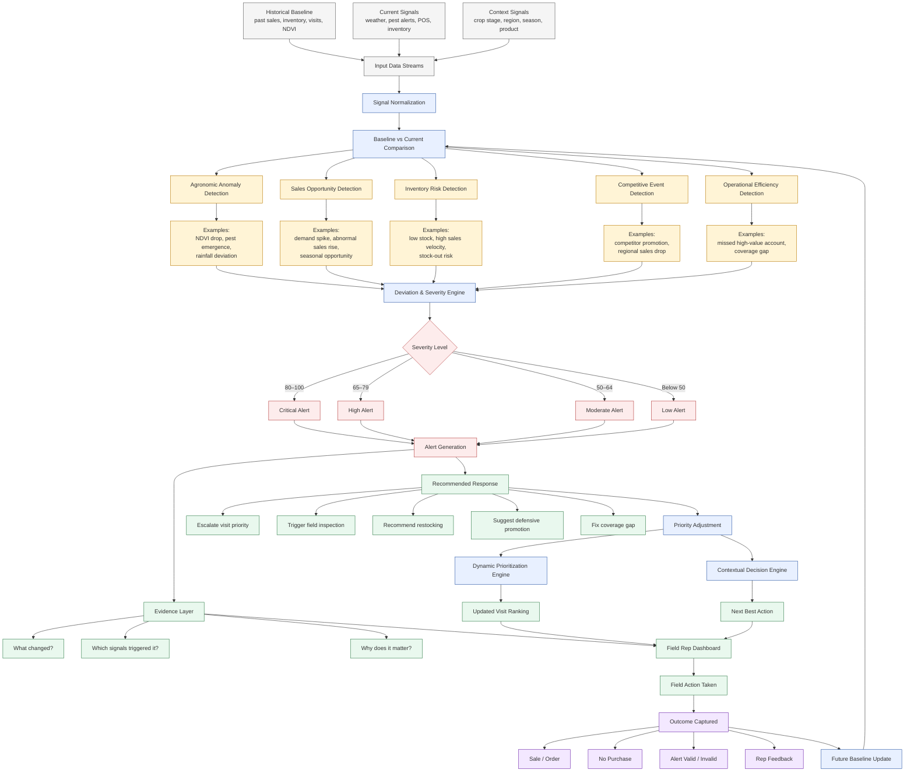

# KshetraAI — Anomaly & Opportunity Detection Engine (V1)

---

# 1. Objective

The purpose of the Anomaly & Opportunity Detection Engine is to identify:

```text
Unusual events, emerging risks,
or high-impact opportunities
that require immediate field attention.
```

The system continuously monitors agricultural, operational, sales, and competitive signals to detect:

- Unexpected changes
- Abnormal trends
- Emerging threats
- High-value opportunities
- Operational inefficiencies

The engine enables the field organization to behave:

```text
Proactively instead of reactively.
```

---

# 2. Core Philosophy

Agriculture is highly dynamic.

Many critical situations emerge suddenly:

- Pest outbreaks
- Disease spread
- Sudden demand spikes
- Inventory shortages
- Competitor campaigns
- Crop stress events

Traditional field planning reacts too slowly because it depends on:

- Fixed schedules
- Manual observation
- Delayed reporting
- Human intuition alone

The anomaly engine continuously asks:

```text
What changed unexpectedly?
```

---

# 3. Core Responsibilities

The engine detects:

- Agronomic anomalies
- Sales anomalies
- Inventory anomalies
- Competitive anomalies
- Operational anomalies

and converts them into:

- Alerts
- Escalations
- Priority adjustments
- Immediate field recommendations

---

# 4. High-Level Detection Flow

```text
Historical Baseline
        vs
Current Contextual Signals
        ↓
Deviation Detection
        ↓
Risk / Opportunity Identification
        ↓
Severity Estimation
        ↓
Priority Escalation
        ↓
Field Alert Generation
```

---

# 5. Core Detection Components

| Component | Purpose |
|---|---|
| Agronomic Anomaly Detection | Detect crop/pest/weather abnormalities |
| Sales Opportunity Detection | Detect unusual demand or revenue patterns |
| Inventory Risk Detection | Detect stock-out or replenishment anomalies |
| Competitive Event Detection | Detect competitor-driven market shifts |
| Operational Efficiency Detection | Detect field execution inefficiencies |

---

# 6. Agronomic Anomaly Detection

## Purpose

Detect abnormal agricultural risk patterns.

---

## Signals Used

- Pest surveillance alerts
- Rainfall deviation
- Humidity changes
- NDVI stress changes
- Crop stage vulnerability
- Temperature anomalies

---

## Example Detection

### Normal Context

```text
Cotton region typically shows moderate NDVI variation.
```

### Current Context

```text
Sudden NDVI stress increase
combined with high humidity and rainfall.
```

---

## Detected Event

```text
Possible emerging fungal disease risk
```

---

## Example Actions

```text
- Escalate region priority
- Recommend field inspection
- Trigger agronomic advisory
- Prioritize fungicide discussion
```

---

# 7. Sales Opportunity Detection

## Purpose

Detect abnormal demand or revenue opportunities.

---

## Signals Used

- POS sales data
- Product demand trends
- Seasonal demand expectations
- Regional sales growth
- Retailer order frequency

---

## Example Detection

### Historical Baseline

```text
Average fungicide demand:
20 units/day
```

### Current Context

```text
Current fungicide demand:
48 units/day
```

---

## Detected Event

```text
Abnormal demand surge detected
```

---

## Example Actions

```text
- Escalate retailer priority
- Recommend stock expansion
- Trigger field follow-up
- Increase sales focus in region
```

---

# 8. Inventory Risk Detection

## Purpose

Detect inventory imbalance or stock-out risk.

---

## Signals Used

- Current inventory level
- Sales velocity
- Product movement rate
- Expected demand
- Inventory aging

---

## Example Detection

```text
Low inventory
+
Rapid sales velocity
+
Increasing regional demand
```

---

## Detected Event

```text
High stock-out probability
```

---

## Example Actions

```text
- Prioritize retailer visit
- Recommend urgent replenishment
- Escalate inventory alert
```

---

# 9. Competitive Event Detection

## Purpose

Detect aggressive competitor activity.

---

## Signals Used

- Competitor promotions
- Market-share decline
- Competitor inventory availability
- Regional retailer feedback
- Product switching behavior

---

## Example Detection

```text
Competitor discount campaign active
+
Regional sales drop observed
```

---

## Detected Event

```text
High competitive pressure
```

---

## Example Actions

```text
- Increase retailer engagement
- Recommend defensive promotion
- Prioritize strategic accounts
```

---

# 10. Operational Efficiency Detection

## Purpose

Detect field execution inefficiencies.

---

## Signals Used

- Rep visit frequency
- Missed high-priority accounts
- Route inefficiency
- Territory coverage gaps
- Delayed follow-ups

---

## Example Detection

```text
High-value retailer not visited for 18 days
```

---

## Detected Event

```text
Coverage gap detected
```

---

## Example Actions

```text
- Escalate account priority
- Trigger follow-up visit
- Optimize route planning
```

---

# 11. Detection Methodology

The engine primarily uses:

```text
Historical Baseline vs Current Context
```

---

# 12. Core Detection Methods

| Detection Method | Purpose |
|---|---|
| Threshold-Based Detection | Detect critical limit violations |
| Trend Deviation Detection | Detect unusual trend movement |
| Baseline Comparison | Compare current vs historical behavior |
| Rule-Based Detection | Curated agronomic/business rules |
| Statistical Outlier Detection | Detect abnormal numerical patterns |

---

# 13. Example Threshold Logic

## Example

```yaml
rule_id: INVENTORY_STOCKOUT_ALERT_01

if:
  inventory_level: low
  sales_velocity: high
  regional_demand_trend: increasing

then:
  anomaly_type: stockout_risk
  severity: high

recommended_action:
  - prioritize_retailer_visit
  - recommend_restocking
  - escalate_inventory_alert
```

---

# 14. Severity Classification

| Severity Score | Classification |
|---|---|
| 80–100 | Critical |
| 65–79 | High |
| 50–64 | Moderate |
| Below 50 | Low |

---

# 15. Alert Output Structure

The system should always generate:

---

## Alert Context

```json
{
  "alert_type": "Stock-out Risk",
  "severity": "High",
  "confidence": "High"
}
```

---

## Evidence Layer

```json
{
  "evidence": [
    "Inventory level critically low",
    "Sales velocity increased by 42%",
    "Regional fungicide demand rising"
  ]
}
```

---

## Recommended Actions

```json
{
  "recommended_actions": [
    "Prioritize retailer visit",
    "Recommend immediate restocking",
    "Increase regional inventory monitoring"
  ]
}
```

---

# 16. Explainability Layer

Every anomaly alert must explain:

- What changed
- Why it matters
- Which signals triggered detection
- What action is recommended

---

## Example Explanation

```text
Fungicide demand in this region has increased significantly above historical baseline levels.
At the same time, retailer inventory levels are critically low.
This creates a high stock-out risk during a potentially high-demand period.
An immediate retailer visit and replenishment recommendation are advised.
```

---

# 17. Relationship with Other Components

The anomaly engine directly interacts with:

---

## Dynamic Prioritization Engine

```text
Detected anomalies can increase priority scores.
```

Example:

```text
Sudden pest emergence
→ Increase agronomic urgency
→ Escalate visit priority
```

---

## Contextual Decision Engine

```text
Detected anomalies influence next best actions.
```

Example:

```text
Stock-out anomaly
→ Recommend replenishment discussion
```

---

# 18. Design Principles

The anomaly engine must be:

- Explainable
- Real-time aware
- Operationally useful
- Data-supported
- Scalable
- Alert-driven
- Practical for field deployment

---

# 19. Future Evolution

Initially:

```text
Threshold-based + rule-based anomaly detection
```

Later:

```text
ML-driven adaptive anomaly detection
```

Future enhancements may include:

- Time-series forecasting
- Predictive anomaly modeling
- Early outbreak prediction
- Adaptive threshold learning
- Region-specific behavioral baselines

---

# 20. Final One-Line Definition

```text
An explainable proactive intelligence engine
that detects emerging agricultural,
business, inventory, and operational anomalies
requiring immediate field action.
```


