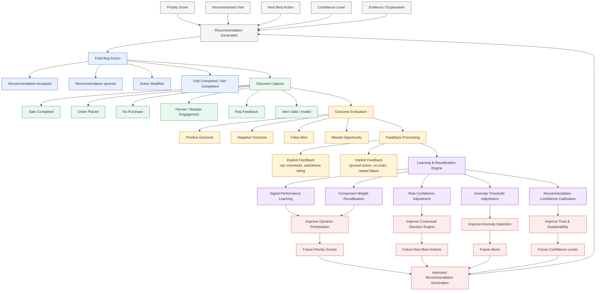

# KshetraAI — Outcome Learning & Feedback Engine (V1)

---

# 1. Objective

The purpose of the Outcome Learning & Feedback Engine is to determine:

```text
Did the system recommendations actually work,
and how should the system improve over time?
```

The engine continuously learns from:

- Field visit outcomes
- Representative actions
- Sales results
- Recommendation acceptance
- Operational feedback
- Regional performance trends

The goal is to transform the system from:

```text
Static intelligence
```

into:

```text
Adaptive operational intelligence
```

---

# 2. Core Philosophy

Agricultural operations are dynamic.

A recommendation that works in one region, season, or crop condition may not work elsewhere.

Therefore:

```text
The system must continuously learn from real-world outcomes.
```

The engine should:

- Reinforce successful recommendations
- Reduce ineffective recommendations
- Improve signal weighting
- Improve confidence estimation
- Improve future prioritization
- Improve action quality

---

# 3. Core Responsibilities

The engine tracks:

- Which recommendations were shown
- Which recommendations were accepted
- Which visits happened
- Which actions produced positive outcomes
- Which actions failed
- Which signals consistently led to success/failure

---

# 4. High-Level Learning Flow

```text
Recommendation Generated
        ↓
Field Representative Action
        ↓
Visit Outcome Captured
        ↓
Outcome Evaluation
        ↓
Feedback Processing
        ↓
Weight / Rule Adjustment
        ↓
Future Recommendation Improvement
```

---

# 5. Core Learning Components

| Component | Purpose |
|---|---|
| Recommendation Tracking | Track what the system suggested |
| Rep Action Tracking | Track whether reps followed recommendations |
| Outcome Evaluation | Measure recommendation effectiveness |
| Signal Performance Learning | Learn which signals are useful |
| Rule & Weight Recalibration | Improve future scoring and decisions |
| Confidence Calibration | Improve trustworthiness of recommendations |

---

# 6. Recommendation Tracking

## Purpose

Track all system-generated recommendations.

---

## Captured Information

- Priority score
- Recommended visit
- Recommended product
- Suggested advisory
- Suggested action
- Generated confidence level
- Timestamp
- Territory/region

---

## Example

```json
{
  "recommendation_id": "REC_1021",
  "priority_score": 73.7,
  "recommended_action": "Discuss fungicide advisory",
  "confidence": "High"
}
```

---

# 7. Representative Action Tracking

## Purpose

Track whether the representative followed the recommendation.

---

## Captured Information

- Visit completed or not
- Recommendation accepted or ignored
- Modified field action
- Visit duration
- Follow-up scheduled

---

## Example

```json
{
  "visit_completed": true,
  "recommendation_followed": true,
  "follow_up_created": false
}
```

---

# 8. Outcome Evaluation

## Purpose

Evaluate whether the recommendation produced a useful result.

---

## Possible Outcomes

| Outcome Type | Meaning |
|---|---|
| Sale Completed | Positive commercial outcome |
| Order Placed | Strong commercial signal |
| Farmer Engagement | Advisory accepted |
| No Purchase | Recommendation ineffective or mistimed |
| False Alert | Incorrect anomaly detection |
| Missed Opportunity | Recommendation should have existed |

---

## Example

```text
Recommendation:
Prioritize fungicide retailer visit

Outcome:
Retailer placed large seasonal order

Result:
Recommendation considered successful
```

---

# 9. Signal Performance Learning

## Purpose

Learn which signals consistently contribute to successful outcomes.

---

## Example

System observes:

```text
High humidity
+
NDVI stress
+
Flowering-stage cotton
```

frequently leads to:

```text
Successful fungicide sales
```

Therefore:

```text
Increase confidence in similar future cases
```

---

# 10. Weight Recalibration

## Purpose

Improve future scoring quality.

---

# Current System

Initially:

```text
Expert-defined interpretable weights
```

---

# Future Evolution

As outcomes accumulate:

```text
Signals producing successful outcomes gain influence.
Signals producing poor outcomes lose influence.
```

---

## Example

### Initial Weight

```text
Weather Risk = 20%
```

### Observed Reality

Weather risk strongly correlates with successful outcomes.

### Updated Weight

```text
Weather Risk = 28%
```

---

# 11. Rule Recalibration

## Purpose

Improve decision logic quality.

---

## Example

Initial Rule:

```text
High humidity + rainfall → fungal risk
```

Observed Outcome:

```text
Rule frequently correct in cotton,
less accurate in soybean
```

System Adjustment:

```text
Increase confidence for cotton-specific cases
Reduce confidence for soybean cases
```

---

# 12. Confidence Calibration

## Purpose

Improve recommendation trustworthiness.

---

# Problem

A system may produce:

```text
High confidence recommendation
```

but outcomes may show:

```text
Low actual success rate
```

---

# Goal

Align:

```text
Predicted confidence
```

with:

```text
Real-world reliability
```

---

## Example

If:

```text
High-confidence recommendations succeed only 52% of the time
```

Then:

```text
Confidence calibration is adjusted downward
```

---

# 13. Learning Signals Captured

| Signal Category | Examples |
|---|---|
| Commercial Outcomes | Sales, orders, revenue |
| Engagement Outcomes | Recommendation acceptance |
| Operational Outcomes | Visit completion, route efficiency |
| Agronomic Outcomes | Advisory usefulness |
| Alert Outcomes | Valid vs invalid anomalies |

---

# 14. Feedback Types

## Explicit Feedback

Direct rep input.

Example:

```text
Recommendation useful
Recommendation irrelevant
Wrong timing
Incorrect risk inference
```

---

## Implicit Feedback

Behavior-based signals.

Example:

```text
Rep ignored recommendation
No order placed
Visit repeatedly unsuccessful
```

---

# 15. Learning Methodology

Initially:

```text
Rule-based recalibration
```

Later:

```text
Data-driven adaptive optimization
```

---

# 16. Future ML Evolution

Future versions may incorporate:

| ML Capability | Purpose |
|---|---|
| Recommendation Success Prediction | Predict likelihood of positive outcomes |
| Adaptive Weight Learning | Learn optimal scoring weights |
| Reinforcement Learning | Learn best actions from outcomes |
| Confidence Calibration Models | Improve reliability estimation |
| Personalized Rep Optimization | Learn rep-specific behavior patterns |

---

# 17. Example Full Learning Cycle

---

## Step 1 — Recommendation

```text
Visit Retailer A
Discuss fungicide restocking
```

---

## Step 2 — Rep Action

```text
Rep follows recommendation
```

---

## Step 3 — Outcome

```text
Retailer places order
```

---

## Step 4 — Learning

System learns:

```text
Inventory depletion
+
Humidity increase
+
Cotton flowering stage
```

is strongly associated with:

```text
Successful fungicide recommendation
```

---

## Step 5 — Future Improvement

Future similar cases receive:

- Higher confidence
- Higher priority
- Faster escalation

---

# 18. Relationship with Other Components

---

## Dynamic Prioritization Engine

```text
Outcome learning improves future priority weights.
```

---

## Contextual Decision Engine

```text
Outcome learning improves next best action quality.
```

---

## Anomaly Detection Engine

```text
Outcome learning improves anomaly thresholds and alert quality.
```

---

# 19. Design Principles

The learning engine must be:

- Explainable
- Incremental
- Data-driven
- Operationally realistic
- Human-feedback aware
- Safe for gradual optimization

---

# 20. Safety Principles

The engine should NEVER:

- Automatically overwrite critical agronomic rules blindly
- Learn from extremely sparse/noisy outcomes without validation
- Remove explainability

The engine should ALWAYS:

- Preserve human interpretability
- Keep auditability
- Support rollback/review
- Allow controlled recalibration

---

# 21. Final One-Line Definition

```text
An adaptive feedback intelligence engine
that continuously improves prioritization,
decision-making, and recommendation quality
using real-world field outcomes.
```


