```mermaid
flowchart TD

%% ==========================================
%% KshetraAI — Explainability & Trust Layer
%% ==========================================

A["Input Intelligence Signals"]

A1["Priority Scores"] --> A
A2["Triggered Rules"] --> A
A3["Contextual Decisions"] --> A
A4["Detected Anomalies"] --> A
A5["Raw Operational Signals"] --> A
A6["Confidence Estimates"] --> A

A --> B["Decision Trace Construction"]

%% -------------------------
%% Trace Components
%% -------------------------

B --> C1["Signal Attribution"]
B --> C2["Rule Traceability"]
B --> C3["Evidence Mapping"]
B --> C4["Confidence Estimation"]
B --> C5["Recommendation Transparency"]

%% -------------------------
%% Signal Attribution
%% -------------------------

C1 --> D1["Which signals contributed?"]

D1 --> D1a["High Rainfall"]
D1 --> D1b["High Humidity"]
D1 --> D1c["NDVI Stress"]
D1 --> D1d["Crop Vulnerability Stage"]

%% -------------------------
%% Rule Traceability
%% -------------------------

C2 --> D2["Which rules triggered?"]

D2 --> D2a["COTTON_FUNGAL_RISK_01"]
D2 --> D2b["INVENTORY_STOCKOUT_ALERT_01"]
D2 --> D2c["COMPETITOR_PRESSURE_ALERT_02"]

%% -------------------------
%% Evidence Mapping
%% -------------------------

C3 --> D3["Operational Evidence"]

D3 --> D3a["Rainfall increased in last 7 days"]
D3 --> D3b["Inventory critically low"]
D3 --> D3c["Regional sales declining"]

%% -------------------------
%% Confidence Estimation
%% -------------------------

C4 --> D4["Confidence Layer"]

D4 --> D4a["High Confidence"]
D4 --> D4b["Medium Confidence"]
D4 --> D4c["Low Confidence"]

%% -------------------------
%% Recommendation Transparency
%% -------------------------

C5 --> D5["Why was this action recommended?"]

D5 --> D5a["Why this retailer?"]
D5 --> D5b["Why this product?"]
D5 --> D5c["Why this advisory?"]

%% -------------------------
%% Explanation Consolidation
%% -------------------------

D1 --> E["Structured Explanation Engine"]
D2 --> E
D3 --> E
D4 --> E
D5 --> E

%% -------------------------
%% Safety Validation
%% -------------------------

E --> F["Safety & Validation Layer"]

F --> F1["Prevent unsupported claims"]
F --> F2["Prevent hallucinated reasoning"]
F --> F3["Separate inference from diagnosis"]
F --> F4["Preserve explainability"]

%% -------------------------
%% Human-Readable Explanation
%% -------------------------

F --> G["Human-Readable Explanation Generator"]

G --> H["Rep-Friendly Explanation"]

H --> H1["Why this recommendation exists"]
H --> H2["Which signals contributed"]
H --> H3["What risk/opportunity exists"]
H --> H4["Why confidence is high/medium/low"]
H --> H5["What action should be taken"]

%% -------------------------
%% Final Recommendation Package
%% -------------------------

H --> I["Final Explainable Recommendation"]

I --> I1["Priority Score"]
I --> I2["Risk / Opportunity"]
I --> I3["Evidence"]
I --> I4["Recommended Actions"]
I --> I5["Confidence"]
I --> I6["Operational Explanation"]

%% -------------------------
%% Field Usage
%% -------------------------

I --> J["Field Rep Dashboard / Mobile App"]

J --> K["Rep Trust & Adoption"]

K --> L["Recommendation Acceptance"]

L --> M["Outcome Learning Engine"]

%% -------------------------
%% Styling
%% -------------------------

classDef input fill:#f5f5f5,stroke:#555,stroke-width:1px;
classDef process fill:#e8f0ff,stroke:#2855a3,stroke-width:1px;
classDef explain fill:#fff4d6,stroke:#b87900,stroke-width:1px;
classDef safety fill:#fdecec,stroke:#b33939,stroke-width:1px;
classDef output fill:#e9f8ee,stroke:#2d7a46,stroke-width:1px;
classDef trust fill:#f3e8ff,stroke:#6b21a8,stroke-width:1px;

class A,A1,A2,A3,A4,A5,A6 input;
class B,C1,C2,C3,C4,C5,E,G process;
class D1,D1a,D1b,D1c,D1d,D2,D2a,D2b,D2c,D3,D3a,D3b,D3c,D4,D4a,D4b,D4c,D5,D5a,D5b,D5c explain;
class F,F1,F2,F3,F4 safety;
class H,H1,H2,H3,H4,H5,I,I1,I2,I3,I4,I5,I6,J output;
class K,L,M trust;
```

# KshetraAI — Explainability & Trust Layer (V1)

---

# 1. Objective

The purpose of the Explainability & Trust Layer is to ensure that every recommendation, alert, prioritization, and action generated by the system is:

- Understandable
- Transparent
- Evidence-backed
- Trustworthy
- Operationally interpretable

The layer converts internal AI reasoning into:

```text
Human-understandable operational intelligence.
```

---

# 2. Core Philosophy

The system should NEVER behave like:

```text
A black-box AI making unexplained decisions.
```

Instead, the system should function as:

```text
An explainable operational co-pilot.
```

Field representatives must understand:

- Why a recommendation exists
- Which signals contributed
- What risk/opportunity was inferred
- What confidence the system has
- Why a particular action is suggested

---

# 3. Why Explainability Matters

Explainability directly affects:

- Recommendation acceptance rate
- Field representative trust
- Operational adoption
- Decision confidence
- Human-AI collaboration quality

Without explainability:

- Reps may ignore recommendations
- Incorrect assumptions may go unnoticed
- Trust in the system decreases
- AI recommendations become difficult to operationalize

---

# 4. Core Responsibilities

The Explainability Layer is responsible for:

- Signal transparency
- Reason generation
- Evidence mapping
- Confidence communication
- Recommendation traceability
- Safety validation

---

# 5. High-Level Explainability Flow

```text
Signals + Rules + Scores
            ↓
Decision Trace Construction
            ↓
Evidence Mapping
            ↓
Confidence Estimation
            ↓
Human-Readable Explanation
            ↓
Field Representative Display
```

---

# 6. Core Explainability Components

| Component | Purpose |
|---|---|
| Signal Attribution | Show which signals contributed |
| Rule Traceability | Show which rules triggered |
| Evidence Layer | Provide operational evidence |
| Confidence Layer | Communicate certainty/uncertainty |
| Recommendation Transparency | Explain why actions were suggested |
| Safety Validation | Prevent unsupported explanations |

---

# 7. Signal Attribution

## Purpose

Clearly identify:

```text
Which signals contributed most
to a recommendation or alert.
```

---

## Example

### Signals

```text
- High humidity
- High rainfall
- Cotton flowering stage
- NDVI stress detected
```

---

## Result

```text
These signals increased fungal disease risk estimation.
```

---

# 8. Rule Traceability

## Purpose

Show:

```text
Which decision logic or rules were triggered.
```

---

## Example

### Triggered Rule

```yaml
COTTON_FUNGAL_RISK_01
```

---

## Reason

```text
Cotton crop in vulnerable stage
+
High rainfall
+
High humidity
+
NDVI stress
```

---

# 9. Evidence Layer

## Purpose

Provide supporting operational context.

The system should explain:

- What changed
- Why it matters
- What evidence supports the inference

---

## Example

```text
Rainfall levels in the region have increased significantly during the last 7 days.
Cotton crops are currently in a vulnerable flowering stage.
NDVI stress signals indicate possible crop health deterioration.
```

---

# 10. Confidence Layer

## Purpose

Communicate:

```text
How certain the system is
about a recommendation or alert.
```

---

# Confidence Categories

| Confidence Level | Meaning |
|---|---|
| High | Strong supporting evidence |
| Medium | Moderate evidence available |
| Low | Weak or incomplete evidence |

---

# Example

```text
Possible fungal disease risk
Confidence: High
```

---

# Important Principle

The system should NEVER claim:

```text
Fungal disease confirmed.
```

Instead:

```text
Possible fungal disease risk detected.
```

This preserves operational safety.

---

# 11. Recommendation Transparency

## Purpose

Explain:

```text
Why a particular action is recommended.
```

---

## Example

### Recommendation

```text
Recommend fungicide discussion.
```

### Explanation

```text
High humidity and rainfall increase fungal disease probability.
Cotton crops are in a vulnerable stage.
NDVI stress signals indicate possible crop deterioration.
```

---

# 12. Structured Explanation Format

Every recommendation should contain:

---

## Priority Context

```json
{
  "priority_score": 73.7,
  "priority_level": "High"
}
```

---

## Risk / Opportunity Context

```json
{
  "risk_or_opportunity": "Possible fungal disease risk",
  "confidence": "High"
}
```

---

## Evidence Layer

```json
{
  "evidence": [
    "High rainfall in last 7 days",
    "High humidity",
    "Cotton in flowering stage",
    "NDVI stress detected"
  ]
}
```

---

## Recommended Action

```json
{
  "recommended_actions": [
    "Prioritize field visit",
    "Inspect crop symptoms",
    "Discuss fungicide advisory if symptoms are confirmed"
  ]
}
```

---

# 13. Human-Readable Explanation Generation

## Purpose

Convert structured reasoning into:

```text
Field-representative-friendly explanations.
```

---

# Example

```text
Cotton crops in this region are currently in a vulnerable flowering stage.
Recent rainfall and humidity conditions increase the likelihood of fungal disease emergence.
Satellite-based NDVI signals also indicate possible crop stress.
A field inspection and fungicide advisory discussion are recommended.
```

---

# 14. Safety Validation Layer

## Purpose

Prevent:

- Hallucinated reasoning
- Unsupported recommendations
- Fake certainty
- Contradictory explanations

---

# Safety Rules

The system should ALWAYS:

- Ground explanations in evidence
- Show uncertainty when applicable
- Separate inference from diagnosis
- Preserve auditability

---

# Example

Correct:

```text
Possible fungal disease risk detected.
```

Incorrect:

```text
Crop is infected with fungal disease.
```

---

# 15. Recommendation Auditability

## Purpose

Allow operational review and debugging.

Every recommendation should preserve:

- Input signals
- Triggered rules
- Generated scores
- Confidence values
- Final recommendation
- Outcome history

---

# 16. Explainability Across Components

The Explainability Layer interacts with:

| Component | Explainability Purpose |
|---|---|
| Dynamic Prioritization | Explain why an entity was prioritized |
| Contextual Decision Engine | Explain why an action was suggested |
| Anomaly Detection Engine | Explain why an alert was triggered |
| Outcome Learning Engine | Explain why recalibration occurred |

---

# 17. Example Full Explanation Flow

---

## Step 1 — Signals

```text
High rainfall
High humidity
Cotton flowering stage
NDVI stress
```

---

## Step 2 — Rule Trigger

```text
COTTON_FUNGAL_RISK_01
```

---

## Step 3 — Inference

```text
Possible fungal disease risk
```

---

## Step 4 — Recommendation

```text
Inspect crop symptoms
Discuss fungicide advisory
```

---

## Step 5 — Final Explanation

```text
Recent rainfall and humidity conditions increase fungal disease risk for cotton crops currently in the flowering stage.
Satellite-based NDVI stress signals also indicate possible crop health deterioration.
A field inspection and fungicide advisory discussion are recommended.
```

---

# 18. Design Principles

The Explainability Layer must be:

- Transparent
- Interpretable
- Safe
- Evidence-driven
- Operationally understandable
- Trust-oriented
- Human-centric

---

# 19. Future Evolution

Initially:

```text
Template-based structured explanations
```

Later:

```text
Controlled LLM-assisted explanation generation
```

Future improvements may include:

- Personalized rep explanations
- Region/language-specific explanations
- Adaptive confidence calibration
- Multi-language advisory generation
- Voice-based explainability

---

# 20. Final One-Line Definition

```text
An evidence-driven operational trust layer
that converts AI reasoning into transparent,
safe, and human-understandable field intelligence.
```


