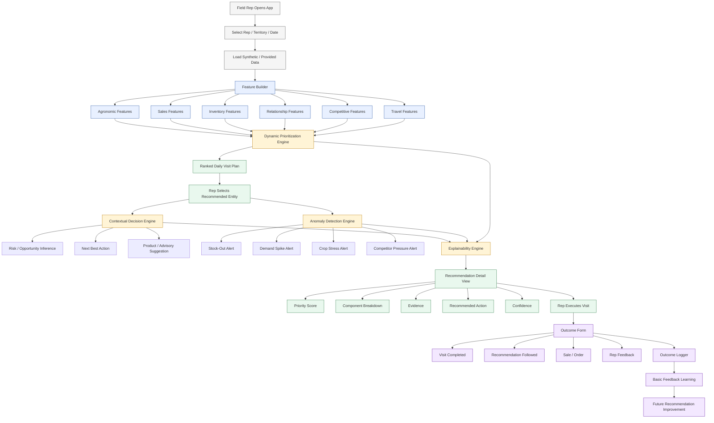

# KshetraAI — Prototype Scope & Demo Plan (V1)

---

# 1. Objective

The purpose of this document is to define:

```text
What exactly will be built for the prototype,
what will be demonstrated,
and what will remain part of the future architecture.
```

The prototype should demonstrate the core intelligence of the system without trying to build the full production platform.

---

# 2. Prototype Philosophy

The prototype should be:

- Focused
- Explainable
- Demo-friendly
- Realistic
- Implementable
- Strong enough to show intelligence

The goal is not to build everything.

The goal is to prove:

```text
Agricultural field planning can become signal-driven,
context-aware, explainable, and adaptive.
```

---

# 3. Core Prototype Scope

The prototype will demonstrate five key capabilities:

| Capability | Prototype Status |
|---|---|
| Dynamic Prioritization | Implemented |
| Contextual Next Best Action | Implemented |
| Anomaly & Opportunity Alerts | Implemented in simplified form |
| Explainability Layer | Implemented |
| Outcome Feedback Capture | Basic implementation |

---

# 4. Out of Scope for Prototype

These are part of future production architecture, not required in full prototype:

- Real-time public API integration
- Full satellite NDVI processing pipeline
- Production-grade route optimization
- Fully trained ML models
- Large-scale offline mobile sync
- Automated weekly model retraining
- Multi-region enterprise deployment
- Advanced role-based access control

---

# 5. Demo User

Primary demo user:

```text
Field Sales Representative
```

The rep uses the system to answer:

```text
Where should I go today?
Why should I go there?
What should I discuss?
What urgent issue needs attention?
What happened after the visit?
```

---

# 6. Demo Scenario

Example scenario:

```text
Rep: Amit
Territory: Wardha
Crop Season: Cotton
Date: Today
```

Current context:

- Cotton crop in vulnerable stage
- Rainfall above normal
- Humidity high
- NDVI stress detected in one cluster
- Insecticide/fungicide demand increasing
- One retailer has low stock
- Competitor promotion active nearby

---

# 7. End-to-End Demo Flow

```text
1. Rep opens dashboard
2. Selects territory/date
3. System shows ranked visit list
4. Rep clicks top recommendation
5. System shows priority score and explanation
6. System shows next best action
7. System shows anomaly/opportunity alert
8. Rep marks visit outcome
9. System captures feedback
10. System shows how feedback improves future recommendations
```

---

# 8. Prototype Screens

## Screen 1 — Territory / Rep Selection

Purpose:

```text
Select rep, territory, and date.
```

Inputs:

- Rep name
- Territory
- Date

Output:

```text
Generate today’s plan
```

---

## Screen 2 — Daily Visit Plan

Purpose:

```text
Show ranked farmers/retailers to visit today.
```

Displayed fields:

- Rank
- Retailer/farmer name
- Priority score
- Priority level
- Main reason
- Recommended action summary

Example:

```text
1. Ramesh Agro Center — 84 — Critical
   Reason: Pest risk + low inventory + high sales velocity
```

---

## Screen 3 — Recommendation Detail

Purpose:

```text
Explain why this entity was prioritized.
```

Displayed fields:

- Priority score
- Component score breakdown
- Triggered signals
- Main evidence
- Priority explanation

---

## Screen 4 — Next Best Action

Purpose:

```text
Tell the rep what to discuss or do.
```

Displayed fields:

- Recommended product
- Agronomic advisory
- Restocking recommendation
- Promotional suggestion
- Follow-up action

Example:

```text
Discuss fungicide advisory.
Inspect crop symptoms.
Recommend retailer restocking.
```

---

## Screen 5 — Alert Panel

Purpose:

```text
Show anomalies and opportunities.
```

Displayed alerts:

- Stock-out risk
- Pest emergence risk
- Demand spike
- Competitor activity
- Coverage gap

---

## Screen 6 — Visit Outcome Form

Purpose:

```text
Capture real-world outcome.
```

Fields:

- Visit completed?
- Recommendation followed?
- Sale made?
- Order placed?
- Farmer/retailer response
- Rep feedback

---

# 9. Backend Modules Required

## Module 1 — Data Loader

Loads sample/synthetic data:

- Retailers/farmers
- Territory data
- Weather signals
- Pest alerts
- Inventory
- POS sales
- CRM/visit logs

---

## Module 2 — Feature Builder

Converts raw signals into feature scores:

- Pest risk score
- Weather risk score
- NDVI stress score
- Inventory risk score
- Sales opportunity score
- Relationship gap score

---

## Module 3 — Priority Engine

Calculates:

```text
Final Priority Score
```

using:

```text
weighted component scoring
```

Outputs:

- Score
- Priority level
- Component breakdown

---

## Module 4 — Contextual Decision Engine

Generates:

- Risk inference
- Next best action
- Product recommendation
- Advisory recommendation

Uses:

```text
controlled rule templates
```

---

## Module 5 — Anomaly Detection Engine

Detects simplified anomalies:

- demand spike
- stock-out risk
- NDVI stress increase
- competitor pressure

---

## Module 6 — Explainability Engine

Generates structured explanations:

- Why this visit?
- Which signals contributed?
- Why this action?
- How confident is the system?

---

## Module 7 — Outcome Logger

Stores:

- Visit outcome
- Recommendation acceptance
- Sales result
- Rep feedback

---

# 10. Data Strategy for Prototype

The prototype can use:

```text
curated synthetic dataset
```

If real provided data is incomplete, create a realistic mock dataset with:

- 10–20 retailers/farmers
- 2–3 territories
- 3–4 crops
- weather risk fields
- pest alert fields
- inventory fields
- sales history fields
- visit history fields
- outcome fields

---

# 11. Sample Data Entities

## Retailer / Farmer Table

```text
entity_id
entity_name
entity_type
territory
crop_focus
latitude
longitude
account_importance
last_visit_days
```

---

## Context Signal Table

```text
entity_id
rainfall_risk
humidity_risk
pest_alert
ndvi_stress
crop_stage_risk
competitor_activity
```

---

## Sales / Inventory Table

```text
entity_id
historical_sales
sales_velocity
current_inventory
stockout_risk
purchase_history_score
```

---

## Recommendation Log Table

```text
recommendation_id
entity_id
priority_score
priority_level
recommended_action
confidence
timestamp
```

---

## Outcome Table

```text
recommendation_id
visit_completed
recommendation_followed
sale_made
order_placed
rep_feedback
```

---

# 12. What Should Be Actually Working

The prototype should actually compute:

- Priority score
- Component score breakdown
- Priority ranking
- Alert generation
- Next best action
- Explanation
- Outcome capture

---

# 13. What Can Be Simulated

The prototype may simulate:

- Real-time weather API
- NDVI pipeline
- Competitor intelligence
- ML-based recalibration
- Offline sync
- Large-scale field deployment

But the demo should clearly mention these as:

```text
production extensions
```

---

# 14. Example Demo Output

## Ranked Visit List

```text
1. Ramesh Agro Center
Priority Score: 84
Priority Level: Critical
Main Reason: Cotton fungal risk + low fungicide stock + high demand velocity
```

---

## Next Best Action

```text
Recommended Action:
- Visit today
- Inspect cotton crop symptoms
- Discuss fungicide advisory
- Recommend fungicide restocking
```

---

## Explanation

```text
This retailer is prioritized because nearby cotton fields are in a vulnerable flowering stage.
Rainfall and humidity are above normal, increasing fungal disease risk.
Inventory data shows low fungicide stock while sales velocity is increasing.
```

---

# 15. Judging Storyline

The demo should tell this story:

```text
Before KshetraAI:
Field reps followed fixed visit routes.

After KshetraAI:
Reps receive daily signal-driven visit plans,
understand why each visit matters,
know what to discuss,
and the system learns from visit outcomes.
```

---

# 16. Success Metrics Demonstrated

The prototype should connect to official outcome metrics:

| Official Metric | Prototype Demonstration |
|---|---|
| Revenue per field day | Prioritizes high-opportunity visits |
| Coverage efficiency | Ranks visits by urgency and feasibility |
| Recommendation acceptance | Provides explainable reasoning |
| Adaptive improvement | Captures outcome feedback |

---

# 17. Recommended Tech Stack for Prototype

## Backend

```text
Python + FastAPI
```

## Data Processing

```text
Pandas
NumPy
```

## Storage

```text
SQLite or PostgreSQL
```

## Frontend

```text
React / Next.js
```

## Visualization

```text
Cards, tables, score breakdowns, alert panels
```

---

# 18. Final Prototype Definition

```text
A focused demo system that converts agricultural,
sales, inventory, and operational signals into
ranked visit recommendations, contextual next best actions,
explainable alerts, and feedback-based learning.
```

---

# 19. Prototype Demo Mermaid Diagram

