# KshetraAI — System Architecture & Infrastructure Design (V1)

---

# 1. Objective

The purpose of the system architecture is to transform the intelligence components into a scalable, explainable, and operationally usable AI platform for agricultural field operations.

The architecture must support:

- Dynamic prioritization
- Contextual decision-making
- Anomaly detection
- Outcome learning
- Explainability
- Offline-first field usage
- Continuous improvement

The system should behave as:

```text
An explainable adaptive operational intelligence platform
for agricultural field representatives.
```

---

# 2. Core Architecture Philosophy

The architecture is designed around:

- Modular intelligence services
- Signal-driven processing
- Explainable decision-making
- Offline-capable field operations
- Continuous feedback learning
- Incremental scalability

The system avoids:

- Monolithic AI black-boxes
- Fully uncontrolled LLM reasoning
- Heavy always-online dependencies
- Hard-coded static planning

---

# 3. High-Level System Layers

The architecture is divided into the following major layers:

| Layer | Purpose |
|---|---|
| Data Source Layer | Collect raw operational/agricultural signals |
| Data Ingestion Layer | Normalize and process incoming data |
| Feature & Context Layer | Build contextual operational features |
| Intelligence Engine Layer | Core AI reasoning and scoring |
| API & Orchestration Layer | Coordinate requests and outputs |
| Application Layer | Dashboard/mobile interfaces |
| Feedback & Learning Layer | Capture outcomes and improve system |

---

# 4. Data Source Layer

The system consumes multiple heterogeneous data sources.

---

## Public Agricultural Signals

### Weather Data
- Rainfall
- Humidity
- Temperature
- Forecast data

### Pest Surveillance
- Government pest bulletins
- Disease alerts
- Regional outbreak reports

### Satellite Data
- NDVI vegetation indices
- Crop stress signals

### Crop Calendars
- Region-wise crop stages
- Seasonal timelines

---

## Internal Enterprise Signals

### Retail POS Data
- Product sales
- Demand trends
- Order frequency

### Inventory Data
- Stock levels
- Stock movement
- Replenishment cycles

### CRM & Visit Logs
- Visit history
- Rep activity
- Follow-up tracking

### Competitive Signals
- Promotions
- Market pressure
- Product availability

---

# 5. Data Ingestion Layer

## Purpose

Collect and standardize incoming data streams.

---

## Responsibilities

- Data fetching
- Signal normalization
- Missing value handling
- Timestamp alignment
- Region/entity mapping
- Batch processing
- Event processing

---

## Example Processing

Raw weather feed:

```text
Humidity = 87%
Rainfall = 112 mm
```

Normalized feature:

```text
High humidity risk
Heavy rainfall deviation
```

---

# 6. Feature & Context Layer

## Purpose

Convert raw signals into operational context.

This layer builds:

```text
Entity-aware contextual features
```

for:
- retailers
- farmers
- territories
- products
- regions

---

## Example Features

| Feature | Example |
|---|---|
| Pest Risk Score | 84 |
| Crop Stress Indicator | Moderate |
| Inventory Risk Score | High |
| Relationship Gap | 18 days |
| Sales Opportunity Score | 76 |

---

## Responsibilities

- Feature generation
- Historical baseline computation
- Context aggregation
- Trend calculation
- Temporal analysis

---

# 7. Intelligence Engine Layer

This is the core reasoning layer of the system.

---

# Core Intelligence Components

| Engine | Purpose |
|---|---|
| Dynamic Prioritization Engine | Rank visits |
| Contextual Decision Engine | Generate next best actions |
| Anomaly Detection Engine | Detect unusual events |
| Outcome Learning Engine | Improve system over time |
| Explainability Layer | Generate transparent reasoning |

---

# 8. Dynamic Prioritization Engine

## Responsibilities

- Multi-signal scoring
- Priority ranking
- Route-aware prioritization
- Entity urgency estimation

---

## Outputs

```text
Priority Score
Priority Level
Ranked Visit List
```

---

# 9. Contextual Decision Engine

## Responsibilities

- Risk inference
- Action recommendation
- Product discussion guidance
- Agronomic advisory generation

---

## Outputs

```text
Next Best Action
Risk Context
Recommended Product
Operational Guidance
```

---

# 10. Anomaly Detection Engine

## Responsibilities

- Baseline deviation detection
- Emerging risk detection
- Demand spike detection
- Inventory anomaly detection
- Competitive event detection

---

## Outputs

```text
Alerts
Escalations
Opportunity Notifications
```

---

# 11. Outcome Learning Engine

## Responsibilities

- Recommendation outcome tracking
- Signal effectiveness learning
- Weight recalibration
- Confidence calibration
- Feedback integration

---

## Outputs

```text
Updated weights
Improved rules
Improved confidence estimates
```

---

# 12. Explainability & Trust Layer

## Responsibilities

- Signal attribution
- Rule traceability
- Evidence generation
- Human-readable explanations
- Confidence communication

---

## Outputs

```text
Explainable recommendations
Evidence-backed reasoning
Operational transparency
```

---

# 13. API & Orchestration Layer

## Purpose

Coordinate communication between:

- Intelligence engines
- Databases
- Applications
- Mobile clients

---

## Example APIs

| API | Purpose |
|---|---|
| /get-daily-plan | Fetch ranked visit list |
| /get-next-best-action | Fetch contextual recommendation |
| /get-alerts | Fetch anomaly alerts |
| /submit-visit-outcome | Capture feedback/outcomes |
| /get-explanation | Fetch explainability context |

---

# 14. Application Layer

The system supports:

---

## Field Representative Mobile App

### Features

- Daily visit recommendations
- Offline access
- Priority explanations
- Alert notifications
- Outcome submission

---

## Operational Dashboard

### Features

- Territory overview
- Alert monitoring
- Rep activity tracking
- Coverage analytics
- Recommendation monitoring

---

# 15. Offline-First Architecture

## Why Important

Field operations often occur in:

- Low-bandwidth regions
- Rural areas
- Intermittent connectivity environments

---

# Offline Strategy

The system supports:

| Capability | Offline Support |
|---|---|
| Daily recommendations | Cached locally |
| Alerts | Synced periodically |
| Visit forms | Stored offline |
| Outcome submission | Delayed sync |
| Explanations | Precomputed locally |

---

# Offline Workflow

```text
Morning Sync
        ↓
Download daily recommendations
        ↓
Rep operates offline
        ↓
Outcomes stored locally
        ↓
Network reconnect
        ↓
Delayed synchronization
```

---

# 16. Storage Architecture

The system uses multiple logical storage layers.

---

## Operational Database

Stores:

- Rep activity
- Visits
- Recommendations
- Outcomes

---

## Feature Store / Feature Tables

Stores:

- Generated contextual features
- Historical baselines
- Entity-level signals

---

## Rule Store

Stores:

- Agronomic rules
- Threshold logic
- Decision templates

---

## Recommendation Log

Stores:

- Generated recommendations
- Priority scores
- Confidence values
- Explanations

---

# 17. Feedback & Learning Layer

## Purpose

Close the operational learning loop.

---

## Responsibilities

- Capture rep outcomes
- Measure recommendation success
- Update weights/rules
- Improve future recommendations

---

## Learning Flow

```text
Recommendation
        ↓
Rep Action
        ↓
Outcome
        ↓
Learning
        ↓
Improved Future Intelligence
```

---

# 18. Prototype Architecture Scope

The production system may be extremely large.

Therefore the hackathon prototype focuses on:

---

## Core Demonstrable Capabilities

- Dynamic prioritization
- Contextual recommendations
- Anomaly alerts
- Explainable reasoning
- Basic feedback learning

---

## Simplifications

- Simulated data pipelines
- Batch feature generation
- Rule-based initial logic
- Limited geographic scope
- Lightweight dashboard

---

# 19. Suggested Technology Direction

(Technology choices may evolve.)

---

## Backend

```text
Python + FastAPI
```

---

## Data Processing

```text
Pandas
NumPy
Lightweight feature pipelines
```

---

## Databases

```text
PostgreSQL
SQLite (prototype/offline)
```

---

## ML / Intelligence

```text
Scikit-learn
XGBoost
Rule-based engines
```

---

## Frontend

```text
React / Next.js
```

---

## Mobile / Offline

```text
PWA or lightweight mobile-first interface
```

---

# 20. System Design Principles

The architecture must remain:

- Explainable
- Modular
- Extensible
- Operationally realistic
- Offline-capable
- Signal-driven
- Human-centric

---

# 21. Final One-Line Definition

```text
A modular explainable AI operations platform
that transforms agricultural signals into
real-time field intelligence and adaptive decision-making.
```

---

# 22. System Architecture Mermaid Diagram

```mermaid
flowchart TD

%% ==========================================
%% KshetraAI — System Architecture
%% ==========================================

A["Data Sources"]

A1["Weather APIs"] --> A
A2["Pest Surveillance"] --> A
A3["Satellite NDVI Data"] --> A
A4["Crop Calendars"] --> A
A5["Retail POS Data"] --> A
A6["Inventory Systems"] --> A
A7["CRM / Visit Logs"] --> A
A8["Competitive Signals"] --> A

A --> B["Data Ingestion Layer"]

B --> B1["Signal Normalization"]
B --> B2["Data Cleaning"]
B --> B3["Region / Entity Mapping"]
B --> B4["Temporal Alignment"]

B --> C["Feature & Context Layer"]

C --> C1["Feature Generation"]
C --> C2["Historical Baselines"]
C --> C3["Trend Analysis"]
C --> C4["Context Aggregation"]

C --> D["Intelligence Engine Layer"]

%% -------------------------
%% Intelligence Components
%% -------------------------

D --> D1["Dynamic Prioritization Engine"]
D --> D2["Contextual Decision Engine"]
D --> D3["Anomaly Detection Engine"]
D --> D4["Outcome Learning Engine"]
D --> D5["Explainability & Trust Layer"]

%% -------------------------
%% API Layer
%% -------------------------

D --> E["API & Orchestration Layer"]

E --> E1["/get-daily-plan"]
E --> E2["/get-next-best-action"]
E --> E3["/get-alerts"]
E --> E4["/submit-visit-outcome"]

%% -------------------------
%% Application Layer
%% -------------------------

E --> F["Application Layer"]

F --> F1["Field Rep Mobile App"]
F --> F2["Operational Dashboard"]

%% -------------------------
%% Offline Capability
%% -------------------------

F --> G["Offline Sync Layer"]

G --> G1["Local Recommendation Cache"]
G --> G2["Offline Outcome Storage"]
G --> G3["Delayed Synchronization"]

%% -------------------------
%% Feedback Loop
%% -------------------------

F --> H["Outcome & Feedback Capture"]

H --> H1["Sales Outcome"]
H --> H2["Recommendation Acceptance"]
H --> H3["Rep Feedback"]
H --> H4["Operational Results"]

H --> I["Feedback & Learning Layer"]

I --> I1["Weight Recalibration"]
I --> I2["Rule Improvement"]
I --> I3["Confidence Calibration"]

I --> D

%% -------------------------
%% Storage Layer
%% -------------------------

J["Storage Layer"]

J1["Operational Database"] --> J
J2["Feature Store"] --> J
J3["Rule Store"] --> J
J4["Recommendation Logs"] --> J

J --> B
J --> C
J --> D
J --> I

%% -------------------------
%% Styling
%% -------------------------

classDef source fill:#f5f5f5,stroke:#555,stroke-width:1px;
classDef process fill:#e8f0ff,stroke:#2855a3,stroke-width:1px;
classDef engine fill:#fff4d6,stroke:#b87900,stroke-width:1px;
classDef app fill:#e9f8ee,stroke:#2d7a46,stroke-width:1px;
classDef feedback fill:#f3e8ff,stroke:#6b21a8,stroke-width:1px;

class A,A1,A2,A3,A4,A5,A6,A7,A8 source;
class B,B1,B2,B3,B4,C,C1,C2,C3,C4,E,E1,E2,E3,E4,G,G1,G2,G3 process;
class D,D1,D2,D3,D4,D5 engine;
class F,F1,F2,J,J1,J2,J3,J4 app;
class H,H1,H2,H3,H4,I,I1,I2,I3 feedback;
```




````markdown
```text
KshetraAI/
│
├── README.md
├── requirements.txt
├── .env
├── .gitignore
│
├── docs/
│   │
│   ├── architecture/
│   │   ├── 00_problem_stat.md
│   │   ├── 01_dynamic_prioritization_engine.md
│   │   ├── 02_contextual_decision_engine.md
│   │   ├── 03_anomaly_and_opportunity_detection.md
│   │   ├── 04_outcome_learning_engine.md
│   │   ├── 05_explainability_and_trust_layer.md
│   │   ├── 06_prototype.md
│   │   ├── 07_infrastructure_design.md
│   │   ├── 08_data_schema.md
│   │   └── 09_development_plan.md
│   │
│   ├── implementation_contracts/
│   │   ├── 00_contract_usage_guide.md
│   │   ├── 01_global_implementation_protocol.md
│   │   ├── 02_data_pipeline_contract.md
│   │   ├── 03_feature_builder_contract.md
│   │   ├── 04_priority_engine_contract.md
│   │   ├── 05_contextual_decision_engine_contract.md
│   │   ├── 06_anomaly_detection_engine_contract.md
│   │   ├── 07_explainability_engine_contract.md
│   │   ├── 08_outcome_learning_engine_contract.md
│   │   ├── 09_api_layer_contract.md
│   │   ├── 10_frontend_dashboard_contract.md
│   │   └── 11_demo_integration_contract.md
│   │
│   ├── prompts/
│   │   ├── 00_initial_system_prompt.md
│   │   ├── 01_coding_session_prompt.md
│   │   ├── 02_code_review_prompt.md
│   │   ├── 03_architecture_preservation_prompt.md
│   │   ├── 04_bugfix_prompt.md
│   │   └── 05_refactoring_prompt.md
│   │
│   ├── diagrams/
│   │   ├── prioritization_engine.mmd
│   │   ├── contextual_engine.mmd
│   │   ├── anomaly_engine.mmd
│   │   ├── infrastructure_design.mmd
│   │   └── prototype_flow.mmd
│   │
│   └── demo/
│       ├── demo_story.md
│       ├── sample_scenarios.md
│       ├── judging_flow.md
│       ├── screenshots/
│       └── presentation_notes.md
│
├── datasets/
│   │
│   ├── raw/
│   │
│   ├── synthetic/
│   │   ├── representatives.csv
│   │   ├── territories.csv
│   │   ├── visit_entities.csv
│   │   ├── crop_context.csv
│   │   ├── weather_signals.csv
│   │   ├── pest_signals.csv
│   │   ├── ndvi_signals.csv
│   │   ├── sales_signals.csv
│   │   ├── inventory_signals.csv
│   │   ├── competitor_signals.csv
│   │   ├── visit_history.csv
│   │   └── outcome_log.csv
│   │
│   └── processed/
│       ├── priority_feature_view.csv
│       └── contextual_feature_view.csv
│
├── backend/
│   │
│   ├── main.py
│   │
│   ├── api/
│   │   ├── routes/
│   │   ├── schemas/
│   │   ├── services/
│   │   ├── dependencies/
│   │   └── middleware/
│   │
│   ├── config/
│   │   ├── priority_weights.yaml
│   │   ├── feature_thresholds.yaml
│   │   ├── anomaly_thresholds.yaml
│   │   ├── explanation_templates.yaml
│   │   ├── confidence_rules.yaml
│   │   └── recalibration_rules.yaml
│   │
│   ├── data/
│   │   ├── loaders/
│   │   ├── validators/
│   │   ├── normalizers/
│   │   ├── joins/
│   │   └── schemas/
│   │
│   ├── pipelines/
│   │   ├── build_priority_view.py
│   │   ├── build_context_view.py
│   │   └── pipeline_runner.py
│   │
│   ├── features/
│   │   ├── agronomic_features.py
│   │   ├── sales_features.py
│   │   ├── inventory_features.py
│   │   ├── relationship_features.py
│   │   ├── competitor_features.py
│   │   ├── travel_features.py
│   │   ├── feature_registry.py
│   │   └── feature_pipeline.py
│   │
│   ├── engines/
│   │   ├── priority_engine.py
│   │   ├── scoring_engine.py
│   │   ├── ranking_engine.py
│   │   ├── contextual_decision_engine.py
│   │   ├── recommendation_engine.py
│   │   ├── advisory_engine.py
│   │   └── action_selector.py
│   │
│   ├── anomaly/
│   │   ├── anomaly_engine.py
│   │   ├── baseline_engine.py
│   │   ├── deviation_detector.py
│   │   ├── alert_generator.py
│   │   ├── severity_classifier.py
│   │   └── trend_analyzer.py
│   │
│   ├── explainability/
│   │   ├── explanation_engine.py
│   │   ├── evidence_mapper.py
│   │   ├── confidence_engine.py
│   │   ├── template_generator.py
│   │   ├── reasoning_formatter.py
│   │   └── explanation_registry.py
│   │
│   ├── learning/
│   │   ├── outcome_logger.py
│   │   ├── feedback_processor.py
│   │   ├── recommendation_tracker.py
│   │   ├── recalibration_engine.py
│   │   ├── analytics_engine.py
│   │   └── metrics_engine.py
│   │
│   ├── rules/
│   │   ├── agronomic_rules.yaml
│   │   ├── inventory_rules.yaml
│   │   ├── sales_rules.yaml
│   │   ├── relationship_rules.yaml
│   │   └── competitor_rules.yaml
│   │
│   └── utils/
│       ├── logger.py
│       ├── constants.py
│       ├── feature_utils.py
│       └── data_utils.py
│
├── frontend/
│   │
│   ├── components/
│   │   ├── PriorityCard.tsx
│   │   ├── RecommendationPanel.tsx
│   │   ├── AlertPanel.tsx
│   │   ├── ExplanationPanel.tsx
│   │   ├── OutcomeForm.tsx
│   │   └── LoadingState.tsx
│   │
│   ├── pages/
│   │   ├── Dashboard.tsx
│   │   ├── VisitPlan.tsx
│   │   ├── RecommendationView.tsx
│   │   ├── AlertsView.tsx
│   │   └── OutcomeSubmission.tsx
│   │
│   ├── services/
│   ├── hooks/
│   ├── state/
│   ├── layouts/
│   ├── styles/
│   └── utils/
│
├── notebooks/
│
├── scripts/
│
├── tests/
│   ├── backend/
│   ├── frontend/
│   └── integration/
│
└── demo/
    ├── sample_runs/
    ├── exports/
    └── recordings/
```
````
