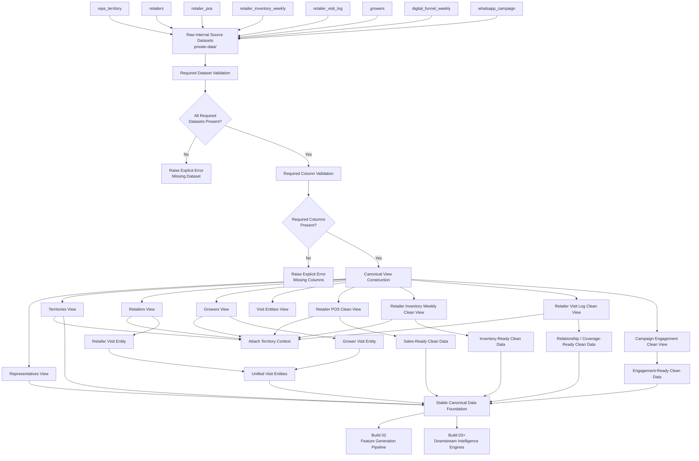

# Build 01 — Dataset & Schema Setup  
## Final Ground-Truth Functionality Record

---

# 1. Build Purpose

Build 01 establishes the **trusted data foundation** for KshetraAI.

The core responsibility of this build is:

```text
Convert company-provided raw operational CSV data
into clean, validated, deterministic canonical views
that downstream builds can safely consume.
```

This build does **not** solve intelligence problems yet.

It does not calculate priority scores, generate recommendations, detect anomalies, or create explanations.

Instead, it answers the foundational question:

```text
Can the system trust the data structure before reasoning starts?
```

---

# 2. What Was Actually Implemented

The implemented Build 01 logic focuses on creating **canonical operational views** from the provided internal datasets.

The key implemented functionality is:

- Validates that required source datasets are present.
- Validates required columns before constructing each canonical view.
- Builds canonical views for representatives, territories, retailers, growers, visit entities, POS sales, inventory, visit logs, and campaign engagement.
- Joins source tables with territory, representative, retailer, and grower context where required.
- Builds a unified visit-entity view from both retailers and growers.
- Builds a unified campaign-engagement view from digital funnel data and WhatsApp campaign data.
- Preserves deterministic output ordering through stable sorting.
- Raises explicit operational errors when required datasets or columns are missing.

The core implementation is centered around canonical view construction through `build_canonical_views(...)`, which creates all Build 01 canonical views in a fixed stable order. The implementation explicitly states that it builds deterministic in-memory canonical views and does not write files, generate features, score priorities, or create recommendations. :contentReference[oaicite:0]{index=0}

---

# 3. Functional Role of Build 01

Build 01 acts as the **data trust layer**.

Its role is to make sure that all later intelligence builds receive data in a predictable structure.

The downstream builds should not directly depend on raw source files such as:

```text
reps_territory.csv
retailers.csv
retailer_pos.csv
retailer_inventory_weekly.csv
retailer_visit_log.csv
growers.csv
digital_funnel_weekly.csv
whatsapp_campaign.csv
```

Instead, downstream logic should consume canonical views such as:

```text
representatives
territories
retailers
growers
visit_entities
retailer_pos_clean
retailer_inventory_weekly_clean
retailer_visit_log_clean
campaign_engagement_clean
```

The implementation defines this canonical view order explicitly through `CANONICAL_VIEW_ORDER`. :contentReference[oaicite:1]{index=1}

---

# 4. Inputs Consumed

Build 01 consumes the internal source datasets required for the first data foundation layer.

The required source datasets are:

```text
reps_territory
retailers
retailer_visit_log
retailer_inventory_weekly
retailer_pos
growers
digital_funnel_weekly
whatsapp_campaign
```

These required inputs are explicitly defined as `REQUIRED_SOURCE_DATASETS`. :contentReference[oaicite:2]{index=2}

If any of these datasets are missing, the implementation raises an explicit `EntityJoinError` instead of silently continuing. :contentReference[oaicite:3]{index=3}

---

# 5. Outputs Produced

Build 01 produces the following canonical views:

```text
representatives
territories
retailers
growers
visit_entities
retailer_pos_clean
retailer_inventory_weekly_clean
retailer_visit_log_clean
campaign_engagement_clean
```

These outputs are returned as a dictionary from `build_canonical_views(...)`. :contentReference[oaicite:4]{index=4}

Each output has a specific functional responsibility.

---

# 6. Canonical Views Implemented

---

## 6.1 Representatives View

### What it does

Creates a representative assignment view from `reps_territory`.

### Logic used

The logic extracts the required representative and territory assignment fields:

```text
rep_id
territory_id
territory_name
state
district
```

It then removes duplicate rows and sorts deterministically by `rep_id`.

### Functional purpose

This view answers:

```text
Which representative belongs to which territory?
```

### Downstream value

Later builds can use this for:

- territory-level planning
- rep-based daily plan generation
- visit-log validation
- workflow filtering

The implementation validates required columns and creates a stable representative frame. :contentReference[oaicite:5]{index=5}

---

## 6.2 Territories View

### What it does

Creates the territory master view from `reps_territory`.

### Logic used

The logic extracts:

```text
territory_id
territory_name
state
district
tehsil_list
```

It removes duplicate territory records and sorts deterministically by `territory_id`.

### Functional purpose

This view answers:

```text
What are the valid operating territories,
and which geographic areas belong to them?
```

### Downstream value

Later builds use this for:

- territory filtering
- grower-territory assignment
- retailer validation
- route/planning context

The implementation validates territory columns and builds a stable territory master view. :contentReference[oaicite:6]{index=6}

---

## 6.3 Retailers View

### What it does

Creates a retailer master view with territory context attached.

### Logic used

The logic starts from `retailers`, validates required retailer fields, then joins retailer records with territory names using `territory_id`.

The join is performed as a many-to-one relationship from retailers to territories.

### Functional purpose

This view answers:

```text
Which retailer belongs to which territory and geography?
```

### Downstream value

Later builds use this for:

- retailer prioritization
- inventory context
- POS sales aggregation
- territory-level recommendations

The implementation joins retailers with territory context and returns stable retailer records sorted by `retailer_id`. :contentReference[oaicite:7]{index=7}

---

## 6.4 Growers View

### What it does

Creates a grower master view and assigns growers to territories using geographic context.

### Logic used

The logic validates grower profile fields, then performs a best-effort territory assignment using:

```text
state
district
tehsil
```

It builds a lookup from territory tehsil lists and maps each grower into the matching territory.

It also attaches `territory_name` after mapping the territory ID.

### Functional purpose

This view answers:

```text
Which territory does each grower most likely belong to?
```

### Downstream value

Later builds use this for:

- grower visit planning
- crop-calendar context
- campaign engagement context
- grower-level recommendations

The implementation creates a territory-tehsil lookup and enriches growers with `territory_id` and `territory_name`. :contentReference[oaicite:8]{index=8}

---

## 6.5 Visit Entities View

### What it does

Creates one unified visit target table by combining retailers and growers.

### Logic used

The logic converts retailers into visit entities with:

```text
entity_id
source_id
entity_type = retailer
territory_id
territory_name
state
district
tehsil
preferred_language
primary_crop
```

It also converts growers into visit entities with:

```text
entity_id
source_id
entity_type = grower
territory_id
territory_name
state
district
tehsil
preferred_language
primary_crop
```

For growers, primary crop is extracted from `grower_crop_calendar`.

The retailer and grower entity frames are concatenated into a single canonical `visit_entities` view.

### Functional purpose

This view answers:

```text
What are all possible field-visit targets,
regardless of whether they are retailers or growers?
```

### Downstream value

This is one of the most important outputs because later builds can treat retailers and growers through a common entity abstraction.

It supports:

- unified prioritization
- unified recommendation flow
- unified explanation flow
- unified dashboard display

The implementation combines retailer and grower entities and applies deterministic sorting by `entity_type` and `entity_id`. :contentReference[oaicite:9]{index=9}

---

## 6.6 Retailer POS Clean View

### What it does

Creates a cleaned POS sales view with retailer geography attached.

### Logic used

The logic validates POS sales fields:

```text
retailer_id
transaction_id
sku_id
sku_name
sku_qty
sku_price
transaction_date
```

It joins POS records with retailer context:

```text
territory_id
state
district
tehsil
```

The result is sorted by:

```text
transaction_date
transaction_id
```

### Functional purpose

This view answers:

```text
What sales happened,
for which retailer,
in which territory/geography?
```

### Downstream value

Later builds use this for:

- sales opportunity features
- demand spike detection
- product demand trend analysis
- commercial opportunity scoring

The implementation attaches retailer geography to POS rows through a many-to-one retailer join. :contentReference[oaicite:10]{index=10}

---

## 6.7 Retailer Inventory Weekly Clean View

### What it does

Creates a cleaned weekly inventory view with retailer geography attached.

### Logic used

The logic validates inventory fields:

```text
retailer_id
sku_id
sku_name
sku_qty
week_end_date
```

It joins inventory snapshots with retailer context:

```text
territory_id
state
district
tehsil
```

The result is sorted by:

```text
week_end_date
retailer_id
sku_id
```

### Functional purpose

This view answers:

```text
What stock exists,
for which retailer,
for which SKU,
in which territory?
```

### Downstream value

Later builds use this for:

- inventory need scoring
- stock-out risk detection
- restocking recommendations
- inventory anomaly alerts

The implementation creates this inventory-clean view with stable geographic enrichment and deterministic ordering. :contentReference[oaicite:11]{index=11}

---

## 6.8 Retailer Visit Log Clean View

### What it does

Creates a cleaned historical visit-log view with representative and territory context.

### Logic used

The logic validates visit fields:

```text
rep_id
visit_date
territory_id
visit_tehsil
visit_type
product_recommended
```

It joins:

1. Visit logs with representative assignment context.
2. Visit logs with territory context.

It attaches:

```text
rep_territory_id
territory_name
state
district
```

The result is sorted by:

```text
visit_date
rep_id
territory_id
visit_tehsil
```

### Functional purpose

This view answers:

```text
Which rep visited which territory/tehsil,
when,
and what type of visit or product recommendation occurred?
```

### Downstream value

Later builds use this for:

- relationship gap features
- coverage gap detection
- rep activity context
- outcome-learning baseline

The implementation creates visit-log context by combining representative and territory mappings with raw visit activity. :contentReference[oaicite:12]{index=12}

---

## 6.9 Campaign Engagement Clean View

### What it does

Creates one unified campaign engagement event view from both:

```text
digital_funnel_weekly
whatsapp_campaign
```

### Logic used

The logic validates required fields from both campaign sources.

For digital funnel records, it creates events with:

```text
event_type = digital_funnel_weekly
event_date = week_start_date
campaign_id
campaign_crop
campaign_product
social_post_impression
landing_page_visits
lead_form_submission
```

For WhatsApp records, it creates events with:

```text
event_type = whatsapp_campaign
event_date = message_sent_date
campaign_crop
campaign_product
grower_id
delivered_status
opened_status
clicked_status
```

The two event streams are concatenated into a single `campaign_engagement_clean` view.

### Functional purpose

This view answers:

```text
What campaign engagement signals exist
across digital funnel and WhatsApp channels?
```

### Downstream value

Later builds use this for:

- engagement scoring
- campaign responsiveness
- grower communication context
- product-interest signals

The implementation standardizes digital-funnel and WhatsApp events into one campaign engagement table with shared event columns. :contentReference[oaicite:13]{index=13}

---

# 7. Core Logic Used

Build 01 solves the dataset/schema setup problem using five main logical patterns.

---

## 7.1 Required Dataset Validation

Before building canonical views, the implementation checks whether all required datasets are present.

If any required dataset is missing, it raises:

```text
EntityJoinError
```

This prevents downstream views from being built with incomplete data. :contentReference[oaicite:14]{index=14}

---

## 7.2 Required Column Validation

Each canonical builder function validates the required columns for its source data before performing joins or selections.

This ensures that the pipeline fails early when expected source structure is missing.

The helper `_ensure_columns(...)` checks missing fields and raises a clear error that includes the dataset name and missing columns. :contentReference[oaicite:15]{index=15}

---

## 7.3 Canonical Join Logic

The implementation enriches raw source tables with reference context.

Examples:

```text
retailers + territories
retailer_pos + retailers
retailer_inventory_weekly + retailers
retailer_visit_log + representatives + territories
```

This converts isolated raw records into context-aware operational records.

The logic uses controlled many-to-one joins where master-data relationships are expected, reducing accidental many-to-many data expansion. :contentReference[oaicite:16]{index=16}

---

## 7.4 Unified Entity Logic

Retailers and growers are different source entities, but field operations need a common visit target abstraction.

The implementation solves this by creating:

```text
visit_entities
```

This allows downstream systems to operate on a unified `entity_id` and `entity_type` pattern instead of building separate flows for retailers and growers.

This is a critical design choice because prioritization, recommendation, explanation, and dashboard layers can all work from the same visit-target structure. :contentReference[oaicite:17]{index=17}

---

## 7.5 Deterministic Stable Sorting

Every canonical output is sorted using a stable sorting helper:

```text
_stable_frame(...)
```

This helper uses stable merge sort and resets the index.

The purpose is to ensure:

```text
same input data → same output row order
```

This matters because downstream builds depend on reproducible feature generation, deterministic scoring, and stable tests. :contentReference[oaicite:18]{index=18}

---

# 8. How Build 01 Solves Its Responsibility

Build 01 solves its responsibility by separating **raw source data** from **canonical operational data**.

Instead of allowing every later build to independently interpret raw CSVs, Build 01 centralizes the interpretation.

The logic is:

```text
Raw internal source files
        ↓
dataset presence validation
        ↓
required column validation
        ↓
controlled joins and enrichment
        ↓
unified canonical views
        ↓
deterministic output ordering
```

This means downstream builds can focus on their own responsibilities:

- Build 02 can generate features.
- Build 03 can score priorities.
- Build 04 can generate recommendations.
- Build 05 can detect anomalies.

They do not need to repeatedly solve basic dataset alignment.

---

# 9. What Build 01 Intentionally Does Not Do

The implementation intentionally avoids all intelligence behavior.

It does not:

- Generate feature scores.
- Compute weather risk.
- Compute sales opportunity.
- Compute inventory need.
- Rank entities.
- Generate recommendations.
- Detect anomalies.
- Generate explanation text.
- Learn from outcomes.
- Modify private source data.

This is correct because Build 01 is only the **schema and canonical data foundation**.

The module docstring explicitly states that it does not write processed files, generate features, score priorities, or create recommendations. :contentReference[oaicite:19]{index=19}

---

# 10. Pending or Intentionally Out of Scope

Based on the current implemented logic, the following are pending or intentionally outside Build 01.

---

## 10.1 Processed File Writing

The core implemented logic builds in-memory canonical views.

Writing those views to `datasets/processed/` may be handled by a pipeline runner or a later orchestration step, but the canonical join helper itself does not write files.

This is intentional at the helper level because it keeps the module focused on transformation logic.

---

## 10.2 Feature Score Generation

No feature scores are generated here.

Examples not implemented in Build 01:

```text
weather_risk_score
inventory_need_score
sales_opportunity_score
relationship_gap_score
```

These belong to Build 02.

---

## 10.3 Public / External Agricultural Gap-Fill Signals

Build 01 prepares internal canonical views.

Weather, pest, NDVI, competitor, and travel signals may still require public sourcing or controlled gap-fill data in later data/feature builds.

---

## 10.4 Intelligence Outputs

The following are not produced in Build 01:

```text
priority_score
recommended_actions
anomaly_alerts
explanation_outputs
learning_signals
```

These belong to later builds.

---

## 10.5 Business Decision Logic

No operational decisions are made.

Build 01 only answers:

```text
What clean data do we have?
```

It does not answer:

```text
Who should be visited?
What should be recommended?
What alert should be triggered?
```

---

# 11. Final Ground-Truth Summary

Build 01 implemented the **canonical data foundation** of KshetraAI.

The actual logical solution is:

```text
Validate source datasets
        ↓
Validate required columns
        ↓
Create clean master views
        ↓
Attach territory/geography context
        ↓
Unify retailers and growers as visit entities
        ↓
Unify campaign sources as engagement events
        ↓
Return deterministic canonical views
```

The most important output of this build is not an AI decision.

It is:

```text
A stable operational data structure
that all later AI intelligence components can trust.
```

---

# 12. Final One-Line Definition

```text
Build 01 establishes KshetraAI’s deterministic canonical data layer
by converting raw internal operational datasets
into validated, context-enriched, stable views
for downstream feature generation and intelligence workflows.
```


