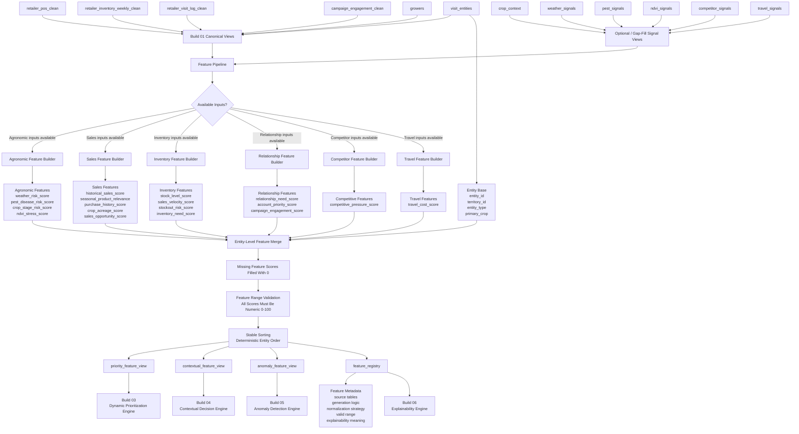

# Build 02 — Feature Generation Pipeline  
## Final Ground-Truth Functionality Record

---

# 1. Build Purpose

Build 02 implements the **feature generation layer** of KshetraAI.

The core responsibility of this build is:

```text
Convert validated canonical data views
into normalized, deterministic, explainable feature scores
that downstream intelligence engines can consume.
```

Build 02 does not make final decisions.

It does not rank visits, recommend actions, trigger alerts, generate final explanations, or learn from outcomes.

Instead, it answers:

```text
What meaningful operational signals can be extracted
from the available processed data?
```

---

# 2. What Was Actually Implemented

Build 02 is implemented through multiple feature builder modules under:

```text
backend/features/
```

The implemented feature modules include:

```text
agronomic_features.py
sales_features.py
inventory_features.py
relationship_features.py
competitor_features.py
travel_features.py
feature_pipeline.py
feature_registry.py
```

The implemented functionality includes:

- agronomic feature generation
- sales opportunity feature generation
- inventory urgency feature generation
- relationship and engagement feature generation
- competitive pressure feature generation
- travel cost feature generation
- combined feature-view generation
- feature registry metadata
- feature range validation
- deterministic stable sorting
- 0–100 score normalization
- output view construction for downstream builds

The feature pipeline explicitly states that it orchestrates existing feature builders into stable feature-ready views and does not rank entities, generate recommendations, detect anomalies, generate explanation text, or implement API/frontend behavior. :contentReference[oaicite:0]{index=0}

---

# 3. Functional Role of Build 02

Build 02 acts as the **signal translation layer**.

Build 01 gives clean canonical data.

But downstream intelligence engines do not directly want raw rows such as:

```text
POS transactions
weekly inventory snapshots
campaign events
visit logs
weather rows
NDVI rows
```

They need comparable, bounded, interpretable signals such as:

```text
weather_risk_score
inventory_need_score
sales_opportunity_score
relationship_need_score
competitive_pressure_score
travel_cost_score
```

Build 02 solves this by converting operational data into normalized feature scores.

The logical transformation is:

```text
Canonical operational data
        ↓
domain-specific feature builders
        ↓
normalized 0–100 scores
        ↓
combined entity-level feature table
        ↓
priority/contextual/anomaly feature views
```

---

# 4. Inputs Consumed

Build 02 consumes processed/canonical datasets from Build 01 and optional controlled signal datasets.

The implemented feature pipeline can consume datasets such as:

```text
visit_entities
crop_context
weather_signals
pest_signals
ndvi_signals
retailer_pos_clean
retailer_inventory_weekly_clean
retailer_visit_log_clean
campaign_engagement_clean
competitor_signals
travel_signals
growers
```

The pipeline decides which feature builders to run based on available datasets.

For example:

- agronomic features are built if crop, weather, pest, or NDVI signal inputs exist.
- sales features are built if POS or grower inputs exist.
- inventory features are built if inventory inputs exist.
- relationship features are built if visit, entity, or campaign inputs exist.
- competitive features are built if competitor signals exist.
- travel features are built if travel signals exist.

This dynamic builder selection is implemented in `_build_available_feature_frames(...)`. :contentReference[oaicite:1]{index=1}

---

# 5. Outputs Produced

Build 02 produces four main feature output views:

```text
priority_feature_view
contextual_feature_view
anomaly_feature_view
feature_registry
```

These output views are explicitly defined in `FEATURE_OUTPUT_VIEW_ORDER`. :contentReference[oaicite:2]{index=2}

The pipeline builds all output views through `build_feature_output_views(...)`, which creates:

- `priority_feature_view`
- `contextual_feature_view`
- `anomaly_feature_view`
- `feature_registry`

from one combined feature table. :contentReference[oaicite:3]{index=3}

The pipeline can also write these outputs as deterministic CSV files through `write_feature_output_views(...)`. :contentReference[oaicite:4]{index=4}

---

# 6. Core Feature Views Implemented

---

## 6.1 Priority Feature View

### What it does

Creates the main feature table for Build 03.

### Logic used

It includes entity context plus all canonical priority feature columns from the feature registry.

The selected base context includes:

```text
entity_id
territory_id
entity_type
primary_crop
```

Then the pipeline appends all priority feature names from the registry.

### Functional purpose

This view answers:

```text
What features are available for scoring each visit entity?
```

### Downstream value

Used by:

```text
Build 03 — Dynamic Prioritization Engine
```

---

## 6.2 Contextual Feature View

### What it does

Creates a reduced feature view focused on contextual next-best-action logic.

### Logic used

It includes only the features useful for contextual decisions:

```text
entity_id
territory_id
entity_type
primary_crop
weather_risk_score
pest_disease_risk_score
crop_stage_risk_score
inventory_need_score
sales_opportunity_score
relationship_need_score
competitive_pressure_score
account_priority_score
campaign_engagement_score
```

These columns are explicitly defined as `CONTEXTUAL_FEATURE_COLUMNS`. :contentReference[oaicite:5]{index=5}

### Functional purpose

This view answers:

```text
What context should the recommendation engine consider?
```

### Downstream value

Used by:

```text
Build 04 — Contextual Decision Engine
```

---

## 6.3 Anomaly Feature View

### What it does

Creates a feature view focused on anomaly detection.

### Logic used

It selects features related to unusual agronomic, sales, inventory, and competitive conditions:

```text
entity_id
territory_id
weather_risk_score
pest_disease_risk_score
ndvi_stress_score
sales_opportunity_score
inventory_need_score
stockout_risk_score
competitive_pressure_score
```

These columns are explicitly defined as `ANOMALY_FEATURE_COLUMNS`. :contentReference[oaicite:6]{index=6}

### Functional purpose

This view answers:

```text
Which signals are useful for detecting abnormal events?
```

### Downstream value

Used by:

```text
Build 05 — Anomaly & Opportunity Detection Engine
```

---

## 6.4 Feature Registry View

### What it does

Creates metadata documentation for all generated features.

### Logic used

The registry stores for each feature:

```text
feature_name
category
source_tables
generation_logic
normalization_strategy
valid_range
explainability_category
threshold_config_key
aliases
```

This is generated through `feature_registry_rows()`. :contentReference[oaicite:7]{index=7}

### Functional purpose

This view answers:

```text
What does each feature mean,
where did it come from,
and how should it be explained?
```

### Downstream value

Used by:

- prioritization traceability
- explainability layer
- validation
- documentation
- debugging

---

# 7. Feature Groups Implemented

---

# 7.1 Agronomic Features

## What was implemented

The agronomic builder generates:

```text
weather_risk_score
pest_disease_risk_score
crop_stage_risk_score
ndvi_stress_score
```

These are defined in `AGRONOMIC_FEATURE_COLUMNS`. :contentReference[oaicite:8]{index=8}

The module explicitly states that it converts processed agronomic signal tables into normalized feature scores and does not generate rankings, recommendations, anomaly alerts, explanation text, or API/frontend output. :contentReference[oaicite:9]{index=9}

---

## Logic used

### Crop-stage risk logic

The implementation checks whether `crop_stage_risk_score` already exists.

If it exists, the score is used after clamping.

If not, crop-stage text is mapped through a deterministic stage-risk map.

Examples:

```text
flowering → 80
boll formation → 80
maturity → 35
harvest → 20
```

This is implemented through `CROP_STAGE_RISK_MAP` and `build_crop_stage_features(...)`. :contentReference[oaicite:10]{index=10} :contentReference[oaicite:11]{index=11}

### Weather risk logic

The weather score is computed from:

```text
rainfall deviation or rainfall amount
humidity
temperature pressure
```

The formula used is:

```text
weather_risk_score =
0.45 × rainfall_deviation
+ 0.35 × humidity
+ 0.20 × temperature_pressure
```

Temperature pressure is calculated as distance from 25°C multiplied by 4.

This logic is implemented in `_weather_score(...)`. :contentReference[oaicite:12]{index=12}

If crop-stage context is provided, weather risk is blended with crop-stage vulnerability:

```text
0.80 × weather_risk_score
+ 0.20 × crop_stage_risk_score
```

This makes weather risk more contextual to crop vulnerability. :contentReference[oaicite:13]{index=13}

### Pest/disease risk logic

The implementation checks whether `pest_disease_risk_score` already exists.

If not, it derives risk from:

```text
alert_severity
pest_alert_active
```

Severity is mapped to numeric scores, and inactive alerts reduce the risk to zero.

The severity map includes:

```text
none → 0
low → 30
moderate / medium → 55
high → 80
critical → 95
```

This logic is implemented through `SEVERITY_SCORE_MAP` and `build_pest_disease_features(...)`. :contentReference[oaicite:14]{index=14} :contentReference[oaicite:15]{index=15}

### NDVI stress logic

The implementation checks whether `ndvi_stress_score` already exists.

If not, it computes NDVI stress using one of three methods:

1. `ndvi_drop_percent × 3`
2. calculated drop from `ndvi_current` and `ndvi_baseline`
3. categorical mapping from `ndvi_stress_level`

This logic is implemented in `_ndvi_score(...)`. :contentReference[oaicite:16]{index=16}

---

## How it solves its responsibility

Agronomic feature logic converts environmental and crop-context data into normalized risk signals.

It solves the question:

```text
How risky or urgent is the agricultural context for this entity?
```

It does not diagnose disease.

It only produces interpretable risk scores.

---

# 7.2 Sales Features

## What was implemented

The sales builder generates:

```text
historical_sales_score
seasonal_product_relevance
purchase_history_score
crop_acreage_score
sales_opportunity_score
```

These are defined in `SALES_FEATURE_COLUMNS`. :contentReference[oaicite:17]{index=17}

The module states that it converts processed POS, campaign, and grower context into normalized commercial opportunity features and does not rank entities, create recommendations, detect anomalies, or generate explanation text. :contentReference[oaicite:18]{index=18}

---

## Logic used

### Historical sales logic

The implementation uses POS rows to compute:

```text
total_sales_value
total_quantity
transaction_count
last_transaction_date
```

It then calculates:

```text
historical_sales_score
purchase_history_score
```

Historical sales is based on relative total sales value.

Purchase history combines frequency and recency:

```text
purchase_history_score =
0.60 × frequency_score
+ 0.40 × recency_score
```

This is implemented in `build_historical_sales_features(...)`. :contentReference[oaicite:19]{index=19}

### Seasonal relevance logic

If campaign engagement data is not available, seasonal product relevance defaults to `50`.

If campaign engagement data exists, the logic checks whether POS `sku_name` matches active campaign products.

The score becomes:

```text
40 + campaign_match_rate × 60
```

This is implemented in `build_seasonal_relevance_features(...)`. :contentReference[oaicite:20]{index=20}

### Crop acreage logic

For growers, farm size is normalized relative to the maximum available grower farm size.

This produces:

```text
crop_acreage_score
```

The logic is implemented in `build_crop_acreage_features(...)`. :contentReference[oaicite:21]{index=21}

### Final sales opportunity logic

The final sales score combines:

```text
0.35 × historical_sales_score
+ 0.25 × seasonal_product_relevance
+ 0.25 × purchase_history_score
+ 0.15 × crop_acreage_score
```

This produces:

```text
sales_opportunity_score
```

The final composition is implemented in `build_sales_feature_view(...)`. :contentReference[oaicite:22]{index=22}

---

## How it solves its responsibility

Sales feature logic converts POS, campaign, and grower-scale data into commercial opportunity signals.

It solves the question:

```text
Where is there meaningful commercial potential?
```

It does not decide who to visit.

It only produces the commercial signal that prioritization will later use.

---

# 7.3 Inventory Features

## What was implemented

The inventory builder generates:

```text
stock_level_score
sales_velocity_score
stockout_risk_score
inventory_need_score
```

These are defined in `INVENTORY_FEATURE_COLUMNS`. :contentReference[oaicite:23]{index=23}

The module states that it converts processed inventory and POS tables into normalized stock urgency features and does not rank entities, create recommendations, detect anomalies, or generate explanation text. :contentReference[oaicite:24]{index=24}

---

## Logic used

### Stock level logic

The implementation finds the latest inventory snapshot using the maximum `week_end_date`.

Then it aggregates total current stock per retailer/entity.

Stock urgency is calculated using inverse relative scoring:

```text
lower stock → higher stock_level_score
```

This is implemented in `build_stock_level_features(...)`. :contentReference[oaicite:25]{index=25}

### Sales velocity logic

The implementation identifies recent POS sales from the last 30 days relative to the maximum transaction date.

It aggregates recent units sold per entity and normalizes them to produce:

```text
sales_velocity_score
```

This is implemented in `build_sales_velocity_features(...)`. :contentReference[oaicite:26]{index=26}

### Stockout risk logic

The implementation combines stock urgency and sales velocity:

```text
stockout_risk_score =
0.65 × stock_level_score
+ 0.35 × sales_velocity_score
```

### Inventory need logic

The implementation then combines:

```text
inventory_need_score =
0.50 × stock_level_score
+ 0.25 × sales_velocity_score
+ 0.25 × stockout_risk_score
```

Both formulas are implemented in `build_inventory_feature_view(...)`. :contentReference[oaicite:27]{index=27}

---

## How it solves its responsibility

Inventory feature logic translates stock and sales movement into restocking urgency.

It solves the question:

```text
Where is stock pressure high enough to matter operationally?
```

It does not generate a restocking recommendation yet.

That belongs to Build 04.

---

# 7.4 Relationship & Engagement Features

## What was implemented

The relationship builder generates:

```text
relationship_need_score
account_priority_score
campaign_engagement_score
```

These are defined in `RELATIONSHIP_FEATURE_COLUMNS`. :contentReference[oaicite:28]{index=28}

The module states that it converts visit, entity, and campaign engagement context into relationship-oriented feature scores and does not rank entities, create recommendations, detect anomalies, or generate explanation text. :contentReference[oaicite:29]{index=29}

---

## Logic used

### Relationship need logic

The implementation calculates:

```text
last_visit_date
visit_count
days_since_last
recency_gap_score
low_coverage_score
```

Then it combines:

```text
relationship_need_score =
0.70 × recency_gap_score
+ 0.30 × low_coverage_score
```

This is implemented in `build_relationship_need_features(...)`. :contentReference[oaicite:30]{index=30}

If direct `entity_id` exists in visit rows, it uses that.

If not, it falls back to `retailer_id`.

If neither exists, it uses `territory_id`.

This fallback logic is implemented in `_entity_from_visit_rows(...)`. :contentReference[oaicite:31]{index=31}

### Account priority logic

If `account_importance` exists, it is used directly as the account priority score after clamping.

Otherwise, account priority is inferred from entity type:

```text
retailer → 70
grower → 55
distributor → 75
default → 50
```

This is implemented in `build_account_priority_features(...)`. :contentReference[oaicite:32]{index=32}

### Campaign engagement logic

The implementation separates engagement events into:

```text
whatsapp_campaign
digital_funnel_weekly
```

For WhatsApp, engagement points are calculated as:

```text
delivered_status × 25
+ opened_status × 35
+ clicked_status × 40
```

For digital funnel, engagement is calculated from:

```text
visit_rate
lead_rate
```

and combined as:

```text
visit_rate × 50
+ lead_rate × 50
```

The final engagement score is averaged per entity.

This is implemented in `build_campaign_engagement_features(...)`. :contentReference[oaicite:33]{index=33}

---

## How it solves its responsibility

Relationship feature logic converts visit history, entity importance, and engagement behavior into relationship signals.

It solves the question:

```text
Which entities need attention because of engagement gap,
strategic importance,
or campaign responsiveness?
```

It does not decide the final visit order.

---

# 7.5 Competitive Features

## What was implemented

The competitive builder generates:

```text
competitive_pressure_score
```

This is defined in `COMPETITOR_FEATURE_COLUMNS`. :contentReference[oaicite:34]{index=34}

The module states that it converts competitor signals and optional sales context into normalized competitive pressure features and does not rank entities, create recommendations, detect anomalies, or generate explanation text. :contentReference[oaicite:35]{index=35}

---

## Logic used

If `competitive_pressure_score` already exists, the implementation uses it after clamping.

Otherwise, it derives pressure from:

```text
competitor_promotion_active
competitor_discount_level
competitor_availability_score
regional_sales_drop_score
```

The formula is:

```text
competitive_pressure_score =
0.30 × promotion_score
+ 0.25 × discount_score
+ 0.25 × availability_score
+ 0.20 × sales_drop_score
```

This logic is implemented in `build_competitor_pressure_features(...)`. :contentReference[oaicite:36]{index=36}

If POS context is available, the module computes a sales-decline proxy and blends it into competitive pressure:

```text
0.85 × competitive_pressure_score
+ 0.15 × sales_decline_proxy_score
```

This is also implemented in `build_competitor_pressure_features(...)`. :contentReference[oaicite:37]{index=37}

The sales-decline proxy compares recent units and prior units to estimate decline. :contentReference[oaicite:38]{index=38}

---

## How it solves its responsibility

Competitive feature logic converts direct or proxy competitor signals into a single market-pressure score.

It solves the question:

```text
Where is competitive pressure high enough to influence field attention?
```

It does not generate defensive recommendations yet.

---

# 7.6 Travel Features

## What was implemented

The travel builder generates:

```text
travel_cost_score
```

This is defined in `TRAVEL_FEATURE_COLUMNS`. :contentReference[oaicite:39]{index=39}

The module states that it converts lightweight travel signals into normalized route cost features and does not optimize routes, rank entities, create recommendations, detect anomalies, or generate explanation text. :contentReference[oaicite:40]{index=40}

---

## Logic used

If `travel_cost_score` already exists, the implementation uses it after clamping.

Otherwise, it derives travel cost from:

```text
distance_km
estimated_route_time_min
nearby_cluster_count
route_efficiency_score
```

The formula is:

```text
travel_cost_score =
0.45 × distance_penalty
+ 0.35 × time_penalty
+ 0.20 × (100 - route_efficiency)
```

This logic is implemented in `build_travel_cost_features(...)`. :contentReference[oaicite:41]{index=41}

---

## How it solves its responsibility

Travel feature logic converts operational route burden into a cost score.

It solves the question:

```text
How costly or difficult is this visit from a route perspective?
```

It does not optimize the route.

It only produces a travel-cost signal.

---

# 8. Combined Feature Pipeline Logic

The feature pipeline combines all available feature groups into one entity-level feature table.

The logic is:

```text
available datasets
        ↓
run relevant feature builders
        ↓
build entity base
        ↓
merge feature frames by entity_id
        ↓
fill missing feature scores with 0
        ↓
validate all features are numeric and within 0–100
        ↓
produce stable output views
```

The combined feature table is built through `build_combined_feature_view(...)`. :contentReference[oaicite:42]{index=42}

The pipeline builds an entity base from `visit_entities` when available.

If `visit_entities` is unavailable, it constructs a fallback entity base from all entity IDs found in generated feature frames. :contentReference[oaicite:43]{index=43}

This is important because the feature pipeline can still function even if only partial feature-producing inputs exist.

---

# 9. Feature Validation Logic

The feature pipeline validates that every feature column:

```text
is numeric
and lies within 0–100
```

If any feature column contains invalid values or missing numeric values, it raises:

```text
FeaturePipelineError
```

This logic is implemented in `_validate_feature_ranges(...)`. :contentReference[oaicite:44]{index=44}

This makes downstream scoring safer because Build 03 can assume valid bounded features.

---

# 10. Feature Registry Logic

The feature registry defines feature metadata as immutable `FeatureSpec` records.

Each feature includes:

```text
feature_name
category
source_tables
generation_logic
normalization_strategy
valid_range
explainability_category
threshold_config_key
aliases
```

This is defined in the `FeatureSpec` dataclass. :contentReference[oaicite:45]{index=45}

The registry includes features across categories:

```text
agronomic
sales
inventory
relationship
competitive
travel
```

It also defines aliases, for example:

```text
pest_risk_score → pest_disease_risk_score
relationship_gap_score → relationship_need_score
travel_feasibility_score → travel_cost_score
```

These alias mappings are implemented through `FEATURE_ALIASES`. :contentReference[oaicite:46]{index=46}

The registry can validate itself using `validate_feature_registry(...)`, checking for uniqueness, 0–100 ranges, non-empty source tables, generation logic, normalization strategy, and explainability category. :contentReference[oaicite:47]{index=47}

---

# 11. Determinism Logic

Build 02 preserves determinism through multiple mechanisms.

---

## 11.1 Stable sorting

Each feature module uses stable sorting with merge sort.

Example helper:

```text
_stable_frame(...)
```

This ensures same input rows produce same output order.

---

## 11.2 Fixed formulas

All feature formulas use fixed deterministic weights.

Examples:

```text
weather risk = 0.45 rainfall + 0.35 humidity + 0.20 temperature pressure
inventory need = 0.50 stock + 0.25 velocity + 0.25 stockout risk
sales opportunity = 0.35 historical + 0.25 seasonal + 0.25 purchase + 0.15 acreage
```

---

## 11.3 Clamping

All major feature outputs are clamped to:

```text
0–100
```

This prevents downstream instability.

---

## 11.4 Latest-record selection

Where time-series data exists, the implementation uses deterministic latest-record logic.

For agronomic signals, `_latest_by_entity(...)` sorts by `entity_id` and `date`, keeps the latest per entity, and drops the date after selection. :contentReference[oaicite:48]{index=48}

---

# 12. How Build 02 Solves Its Responsibility

Build 02 solves its responsibility by creating a stable feature abstraction between raw processed data and intelligence engines.

Without Build 02, every later engine would need to understand raw operational data.

For example:

```text
Build 03 would need to interpret POS transactions,
inventory rows,
weather readings,
campaign events,
and visit logs.
```

That would mix responsibilities and create architectural drift.

Build 02 prevents this by converting all those signals into normalized features.

The clean responsibility boundary becomes:

```text
Build 01:
Clean canonical data

Build 02:
Generate normalized feature signals

Build 03+:
Use feature signals for intelligence
```

---

# 13. What Build 02 Intentionally Does Not Do

Build 02 intentionally does not:

- rank entities
- calculate final priority scores
- generate next-best actions
- detect anomaly alerts
- generate explanation text
- capture outcomes
- expose APIs
- implement frontend behavior
- perform route optimization
- train ML models

This is correct because Build 02 is only the:

```text
feature generation layer
```

not the:

```text
decision-making layer
```

---

# 14. Pending or Intentionally Out of Scope

Based on the inspected implementation, the following are either pending or intentionally outside Build 02.

---

## 14.1 Full Route Optimization

Travel features produce a `travel_cost_score`.

They do not solve route optimization.

This is intentional.

---

## 14.2 Final Priority Formula

The pipeline produces features for prioritization.

It does not apply final component weights or produce `priority_score`.

That belongs to Build 03.

---

## 14.3 Recommendation Logic

The pipeline produces contextual signals.

It does not generate `recommended_actions`.

That belongs to Build 04.

---

## 14.4 Alert Detection

The pipeline produces anomaly-relevant features.

It does not trigger `anomaly_alerts`.

That belongs to Build 05.

---

## 14.5 Human Explanation Text

The feature registry provides metadata useful for explanations.

But it does not generate final human-readable explanation text.

That belongs to Build 06.

---

## 14.6 External Signal Availability

Competitive, travel, weather, pest, and NDVI feature generation depends on those signal datasets being available.

If those datasets are absent, the corresponding feature frame is not built.

This is expected because some of those signals may come from controlled gap-fill or later sourcing.

---

# 15. Final Ground-Truth Summary

Build 02 implemented the **feature generation layer** of KshetraAI.

The actual logical solution is:

```text
Processed canonical datasets
        ↓
domain-specific feature builders
        ↓
deterministic formulas and mappings
        ↓
0–100 normalized feature scores
        ↓
combined entity-level feature table
        ↓
priority/contextual/anomaly output views
        ↓
feature registry metadata
```

The most important output of this build is not a decision.

It is:

```text
A stable, normalized, explainable feature layer
that downstream intelligence components can trust.
```

---

# 16. Final One-Line Definition

```text
Build 02 converts KshetraAI’s canonical operational data
into deterministic, normalized, explainable feature signals
for prioritization, contextual reasoning,
anomaly detection, and future explainability workflows.
```


