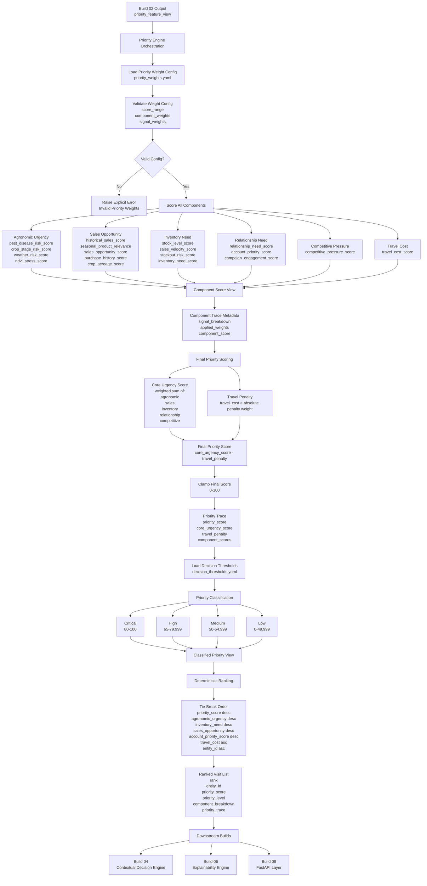

# Build 03 — Dynamic Prioritization Engine  
## Final Ground-Truth Functionality Record

---

# 1. Build Purpose

Build 03 implements the **dynamic prioritization layer** of KshetraAI.

The core responsibility of this build is:

```text
Convert normalized feature scores
into final priority scores,
priority levels,
and deterministic ranked visit lists.
```

Build 03 answers:

```text
Who should be visited first,
how urgent is the visit,
and which component scores contributed?
```

It does not decide what the rep should say during the visit.

It does not generate recommendations, anomaly alerts, explanation text, APIs, frontend workflows, or outcome learning.

---

# 2. What Was Actually Implemented

Build 03 is implemented through the priority engine modules under:

```text
backend/engines/
```

The actual implementation includes:

```text
priority_engine.py
component_scorers.py
scoring_engine.py
priority_classifier.py
ranking_engine.py
```

It also uses configuration from:

```text
backend/config/priority_weights.yaml
backend/config/decision_thresholds.yaml
```

The implemented functionality includes:

- loading priority component and signal weights from YAML
- validating component/signal weight configuration
- converting feature scores into component scores
- combining component scores into final priority scores
- separating core urgency from travel penalty
- classifying priority scores into priority levels
- ranking entities deterministically
- preserving trace metadata for downstream explainability
- validating required ranking inputs
- validating score ranges

The orchestration module connects Build 02 feature rows to weighted priority scores and explicitly states that it does not classify levels, rank entities, generate recommendations, detect anomalies, or implement API/frontend behavior at the row-scoring stage. :contentReference[oaicite:0]{index=0}

---

# 3. Functional Role of Build 03

Build 03 acts as the **visit urgency decision layer**.

Build 02 creates feature signals such as:

```text
weather_risk_score
pest_disease_risk_score
inventory_need_score
sales_opportunity_score
relationship_need_score
competitive_pressure_score
travel_cost_score
```

Build 03 converts these into:

```text
component scores
        ↓
final priority score
        ↓
priority level
        ↓
ranked visit order
```

The build creates the operational answer:

```text
This entity should be visited before that entity because its weighted urgency is higher.
```

---

# 4. Inputs Consumed

Build 03 consumes:

```text
priority_feature_view
```

from Build 02.

The priority feature view should contain:

```text
entity_id
territory_id
entity_type
primary_crop
```

plus the feature scores required by the component scoring config.

The exact signal requirements are defined in:

```text
backend/config/priority_weights.yaml
```

The configuration defines six priority components:

```text
agronomic_urgency
sales_opportunity
inventory_need
relationship_need
competitive_pressure
travel_cost
```

and their component weights. :contentReference[oaicite:1]{index=1}

---

# 5. Outputs Produced

Build 03 produces scored, classified, and ranked priority outputs.

The main output contains:

```text
rank
entity_id
territory_id
entity_type
primary_crop
component scores
priority_score
core_urgency_score
travel_penalty
priority_level
priority_level_key
priority_severity_rank
component_breakdown
priority_trace
classification_trace
```

The Build 03 orchestration path is:

```text
build_priority_score_view(...)
        ↓
add_priority_classification(...)
        ↓
rank_priority_scores(...)
```

This is implemented in `build_ranked_priority_view(...)`. :contentReference[oaicite:2]{index=2}

---

# 6. Core Logic Flow

The implemented priority flow is:

```text
Feature row
        ↓
score all configured components
        ↓
combine component scores using component weights
        ↓
subtract travel penalty
        ↓
clamp final score to 0–100
        ↓
classify score into priority level
        ↓
rank entities deterministically
```

This makes Build 03 a controlled deterministic scoring system, not a black-box recommender.

---

# 7. Component Scoring Logic

The component scoring module converts normalized feature scores into higher-level component scores.

The component scoring module explicitly states that it converts normalized feature scores into component scores only and does not calculate final priority, classify urgency, rank entities, generate recommendations, or produce explanation text. :contentReference[oaicite:3]{index=3}

---

## 7.1 Component Weight Configuration

Component weights are loaded from:

```text
backend/config/priority_weights.yaml
```

The configured weights are:

| Component | Weight |
|---|---:|
| `agronomic_urgency` | `0.30` |
| `sales_opportunity` | `0.25` |
| `inventory_need` | `0.20` |
| `relationship_need` | `0.10` |
| `competitive_pressure` | `0.10` |
| `travel_cost` | `-0.05` |

These weights are defined in the config file. :contentReference[oaicite:4]{index=4}

---

## 7.2 Signal Weight Validation

The implementation validates that the priority weight config contains:

```text
score_range
component_weights
signal_weights
```

It also validates that each component with signal weights has a corresponding component weight and that each component’s signal weights sum to `1.0`.

This validation is implemented in `_validate_priority_weight_config(...)`. :contentReference[oaicite:5]{index=5}

This prevents invalid scoring configuration from silently corrupting priority scores.

---

## 7.3 Signal Score Validation

For each component, each required signal is read from the feature row.

The implementation validates that:

- the signal exists
- the signal is numeric
- the signal lies within the configured score range

If a required signal is missing or invalid, `ComponentScoringError` is raised.

This logic is implemented in `_coerce_signal_score(...)`. :contentReference[oaicite:6]{index=6}

---

## 7.4 Component Score Calculation

Each component score is calculated as:

```text
component_score =
sum(signal_score × signal_weight)
```

Then the result is clamped to the configured score range.

This is implemented in `score_component(...)`. :contentReference[oaicite:7]{index=7}

The output is a traceable `ComponentScore` object containing:

```text
component_name
score
signal_breakdown
applied_weights
```

The `ComponentScore` dataclass provides trace metadata for downstream explainability. :contentReference[oaicite:8]{index=8}

---

# 8. Implemented Component Logic

---

## 8.1 Agronomic Urgency

### Input signals

```text
pest_disease_risk_score
crop_stage_risk_score
weather_risk_score
ndvi_stress_score
```

### Signal weights

```text
pest_disease_risk_score: 0.35
crop_stage_risk_score: 0.25
weather_risk_score: 0.20
ndvi_stress_score: 0.20
```

These are configured under `agronomic_urgency`. :contentReference[oaicite:9]{index=9}

### Logic

```text
agronomic_urgency =
0.35 × pest_disease_risk_score
+ 0.25 × crop_stage_risk_score
+ 0.20 × weather_risk_score
+ 0.20 × ndvi_stress_score
```

### Responsibility

This component estimates:

```text
How urgent the agricultural situation is.
```

---

## 8.2 Sales Opportunity

### Input signals

```text
historical_sales_score
seasonal_product_relevance
sales_opportunity_score
purchase_history_score
crop_acreage_score
```

### Signal weights

```text
historical_sales_score: 0.25
seasonal_product_relevance: 0.25
sales_opportunity_score: 0.20
purchase_history_score: 0.15
crop_acreage_score: 0.15
```

These are configured under `sales_opportunity`. 

### Logic

```text
sales_opportunity =
0.25 × historical_sales_score
+ 0.25 × seasonal_product_relevance
+ 0.20 × sales_opportunity_score
+ 0.15 × purchase_history_score
+ 0.15 × crop_acreage_score
```

### Responsibility

This component estimates:

```text
How commercially valuable the visit may be.
```

---

## 8.3 Inventory Need

### Input signals

```text
stock_level_score
sales_velocity_score
stockout_risk_score
inventory_need_score
```

### Signal weights

```text
stock_level_score: 0.30
sales_velocity_score: 0.25
stockout_risk_score: 0.25
inventory_need_score: 0.20
```

These are configured under `inventory_need`. :contentReference[oaicite:11]{index=11}

### Logic

```text
inventory_need =
0.30 × stock_level_score
+ 0.25 × sales_velocity_score
+ 0.25 × stockout_risk_score
+ 0.20 × inventory_need_score
```

### Responsibility

This component estimates:

```text
How urgent the stock/replenishment situation is.
```

---

## 8.4 Relationship Need

### Input signals

```text
relationship_need_score
account_priority_score
campaign_engagement_score
```

### Signal weights

```text
relationship_need_score: 0.50
account_priority_score: 0.30
campaign_engagement_score: 0.20
```

These are configured under `relationship_need`. :contentReference[oaicite:12]{index=12}

### Logic

```text
relationship_need =
0.50 × relationship_need_score
+ 0.30 × account_priority_score
+ 0.20 × campaign_engagement_score
```

### Responsibility

This component estimates:

```text
How much account engagement attention is needed.
```

---

## 8.5 Competitive Pressure

### Input signal

```text
competitive_pressure_score
```

### Signal weight

```text
competitive_pressure_score: 1.00
```

This is configured under `competitive_pressure`. :contentReference[oaicite:13]{index=13}

### Logic

```text
competitive_pressure =
competitive_pressure_score
```

### Responsibility

This component estimates:

```text
How much competitor-driven market pressure exists.
```

---

## 8.6 Travel Cost

### Input signal

```text
travel_cost_score
```

### Signal weight

```text
travel_cost_score: 1.00
```

This is configured under `travel_cost`. :contentReference[oaicite:14]{index=14}

### Logic

```text
travel_cost =
travel_cost_score
```

### Responsibility

This component estimates:

```text
How costly or difficult the visit is operationally.
```

Travel is treated as a penalty in the final score.

---

# 9. Final Priority Score Logic

The final scoring module combines component scores into one priority score.

The scoring module explicitly states that it combines component scores into a final priority score and does not classify priority levels, rank entities, generate recommendations, detect anomalies, or create explanation text. :contentReference[oaicite:15]{index=15}

---

## 9.1 Core Urgency and Penalty Separation

The implementation separates components into:

```text
core_urgency_components
penalty_components
```

Core urgency components are:

```text
agronomic_urgency
sales_opportunity
inventory_need
relationship_need
competitive_pressure
```

Penalty components are:

```text
travel_cost
```

This policy is defined in the priority weight config. :contentReference[oaicite:16]{index=16}

---

## 9.2 Final Score Formula

The final formula is:

```text
priority_score =
core_urgency_score - travel_penalty
```

Where:

```text
core_urgency_score =
sum(component_score × component_weight)
for all core urgency components
```

and:

```text
travel_penalty =
sum(component_score × absolute penalty weight)
for penalty components
```

This logic is implemented in `calculate_priority_score(...)`. :contentReference[oaicite:17]{index=17}

The final score is clamped to the configured 0–100 range if enabled. :contentReference[oaicite:18]{index=18}

---

## 9.3 Trace Preservation

The final priority score is stored as a traceable `PriorityScore` object containing:

```text
priority_score
core_urgency_score
travel_penalty
component_scores
applied_weights
component_breakdown
```

This is defined in the `PriorityScore` dataclass. :contentReference[oaicite:19]{index=19}

The helper `priority_score_as_row(...)` flattens this into stable output columns including:

```text
priority_score
core_urgency_score
travel_penalty
component_scores
component_breakdown
priority_trace
```

:contentReference[oaicite:20]{index=20}

---

# 10. Priority Classification Logic

The classification module assigns priority levels to final priority scores.

The module explicitly states that it assigns configured priority levels and does not rank entities, generate recommendations, detect anomalies, or produce explanation text. :contentReference[oaicite:21]{index=21}

---

## 10.1 Thresholds Used

Priority classification thresholds are loaded from:

```text
backend/config/decision_thresholds.yaml
```

The implemented levels are:

| Level | Score Range | Severity Rank |
|---|---:|---:|
| Critical | `80–100` | `4` |
| High | `65–79.999` | `3` |
| Medium | `50–64.999` | `2` |
| Low | `0–49.999` | `1` |

These are defined in `decision_thresholds.yaml`. :contentReference[oaicite:22]{index=22}

---

## 10.2 Classification Method

The classifier sorts priority levels from highest minimum score to lowest.

Then it assigns the first level whose `min_score` is satisfied.

This is implemented through:

```text
_ordered_levels(...)
classify_priority_score(...)
```

:contentReference[oaicite:23]{index=23} :contentReference[oaicite:24]{index=24}

---

## 10.3 Classification Output

The classifier adds:

```text
priority_level
priority_level_key
priority_severity_rank
classification_trace
```

to the score view.

This is implemented in `add_priority_classification(...)`. :contentReference[oaicite:25]{index=25}

---

# 11. Ranking Logic

The ranking module produces the final ranked visit list.

The module explicitly states that it ranks already-scored priority rows and does not calculate feature scores, classify priority levels, generate recommendations, detect anomalies, or create explanation text. :contentReference[oaicite:26]{index=26}

---

## 11.1 Ranking Rules

Default ranking rules are:

```text
priority_score descending
agronomic_urgency descending
inventory_need descending
sales_opportunity descending
account_priority_score descending
travel_cost ascending
entity_id ascending
```

These are defined in `DEFAULT_RANKING_RULES`. :contentReference[oaicite:27]{index=27}

This gives deterministic tie-breaking.

---

## 11.2 Required Ranking Columns

The ranking engine requires:

```text
entity_id
priority_score
agronomic_urgency
inventory_need
sales_opportunity
travel_cost
```

These are defined in `REQUIRED_RANKING_COLUMNS`. :contentReference[oaicite:28]{index=28}

---

## 11.3 Ranking Method

The ranking engine:

1. Validates required columns.
2. Sorts by configured ranking rules using stable merge sort.
3. Inserts a `rank` column starting from 1.

This is implemented in `rank_priority_scores(...)`. :contentReference[oaicite:29]{index=29}

---

# 12. Orchestration Logic

The `priority_engine.py` module orchestrates the complete Build 03 pipeline.

The flow is:

```text
score_priority_row(...)
        ↓
build_priority_score_view(...)
        ↓
add_priority_classification(...)
        ↓
rank_priority_scores(...)
```

`score_priority_row(...)` loads the weight config, scores all components, and calculates the final priority score. :contentReference[oaicite:30]{index=30}

`build_priority_score_view(...)` processes each feature row, preserves entity context, attaches component scores, and adds final priority scoring trace data. :contentReference[oaicite:31]{index=31}

`build_ranked_priority_view(...)` then classifies and ranks the output. :contentReference[oaicite:32]{index=32}

---

# 13. How Build 03 Solves Its Responsibility

Build 03 solves prioritization by separating the problem into four clean steps:

```text
1. Convert feature scores into component scores.
2. Combine component scores into a final priority score.
3. Classify the final score into an operational priority level.
4. Rank all entities deterministically.
```

This prevents the system from mixing unrelated logic.

For example:

- component scoring only computes component-level values.
- final scoring only combines components.
- classification only assigns labels.
- ranking only orders already-scored entities.

This modular design keeps prioritization:

```text
deterministic,
explainable,
configurable,
and auditable.
```

---

# 14. What Build 03 Intentionally Does Not Do

Build 03 intentionally does not:

- generate feature scores
- generate next-best-action recommendations
- generate anomaly alerts
- generate human-readable explanation text
- implement APIs
- implement frontend behavior
- capture outcomes
- update weights from learning
- optimize routes

This is correct because Build 03 is only the:

```text
dynamic prioritization engine
```

not the:

```text
contextual decision engine
```

or:

```text
explainability engine
```

---

# 15. Pending or Intentionally Out of Scope

Based on the inspected implementation, the following are intentionally outside Build 03.

---

## 15.1 Recommendation Logic

The engine tells which entity has higher priority.

It does not tell what the representative should say or do.

That belongs to Build 04.

---

## 15.2 Anomaly Detection

The engine may use anomaly-relevant features indirectly, but it does not trigger alerts.

That belongs to Build 05.

---

## 15.3 Natural-Language Explanation

The engine preserves trace metadata but does not generate final human-readable explanations.

That belongs to Build 06.

---

## 15.4 Learning-Based Weight Updates

Weights are loaded from config.

The engine does not learn or automatically mutate weights.

That belongs to future outcome-learning/recalibration logic and must remain human-reviewable.

---

## 15.5 Full Route Optimization

Travel cost is used only as a penalty.

The engine does not optimize route sequencing beyond deterministic ranking.

---

# 16. Final Ground-Truth Summary

Build 03 implemented the **dynamic prioritization engine**.

The actual logical solution is:

```text
priority_feature_view
        ↓
component scoring using signal weights
        ↓
core urgency score
        ↓
travel penalty
        ↓
final priority score
        ↓
priority level classification
        ↓
deterministic ranked visit list
```

The most important output of this build is:

```text
a ranked, explainable, deterministic visit priority list.
```

---

# 17. Final One-Line Definition

```text
Build 03 converts normalized KshetraAI feature signals
into deterministic weighted priority scores,
classifies urgency levels,
and produces a stable ranked visit list
with traceable component-level reasoning.
```


