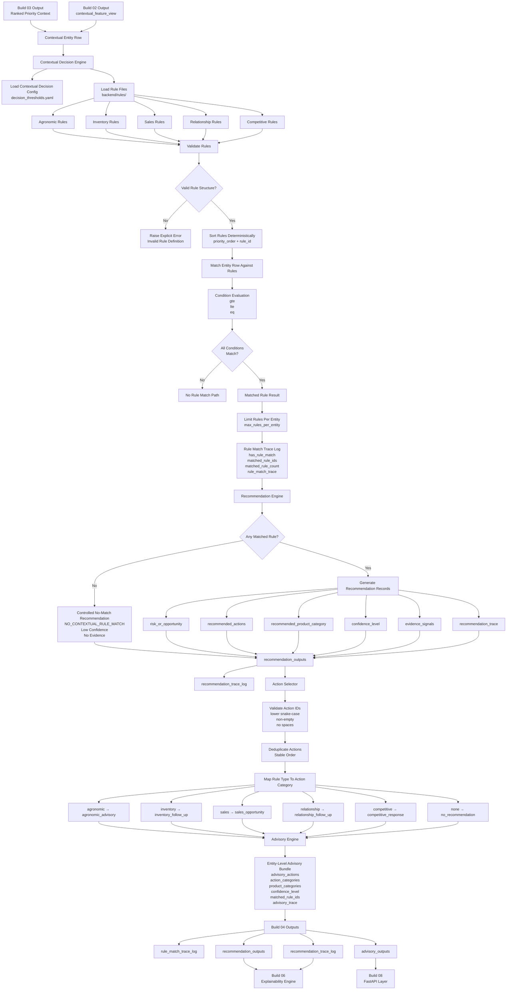

# Build 04 — Contextual Decision Engine  
## Final Ground-Truth Functionality Record

---

# 1. Build Purpose

Build 04 implements the **contextual decision layer** of KshetraAI.

The core responsibility of this build is:

```text
Convert prioritized/contextual feature rows
into structured next-best-action recommendations
using controlled deterministic rules.
```

Build 04 answers:

```text
What should the field representative discuss or do
for a given prioritized entity,
based on the entity’s operational context?
```

It does not decide who should be visited first.

That was Build 03.

It does not detect anomalies, generate final explanation text, expose APIs, render frontend screens, or learn from outcomes.

---

# 2. What Was Actually Implemented

Build 04 is implemented through the contextual decision modules under:

```text
backend/engines/
backend/rules/
```

The inspected implementation includes:

```text
backend/engines/contextual_decision_engine.py
backend/engines/recommendation_engine.py
backend/engines/advisory_engine.py
backend/engines/action_selector.py
```

and rule files:

```text
backend/rules/agronomic_rules.yaml
backend/rules/inventory_rules.yaml
backend/rules/sales_rules.yaml
backend/rules/relationship_rules.yaml
backend/rules/competitor_rules.yaml
```

The implemented functionality includes:

- loading contextual decision controls from config
- loading contextual decision rules from YAML files
- validating rule structure
- validating supported operators, rule types, confidence levels, and product categories
- matching entity rows against deterministic rule conditions
- limiting the number of matched rules per entity
- producing rule-match trace logs
- generating structured recommendation records
- generating fallback “no contextual rule matched” recommendation records
- converting recommendation records into advisory bundles
- selecting and deduplicating structured actions
- preserving evidence signals and trace metadata
- writing contextual output views as deterministic CSVs

The contextual decision module explicitly states that it loads controlled decision rules and matches them against contextual entity rows, while not generating final recommendation records, explanation text, priority scores, anomaly alerts, API responses, or frontend behavior. :contentReference[oaicite:0]{index=0}

---

# 3. Functional Role of Build 04

Build 04 acts as the **next-best-action reasoning layer**.

Build 03 tells:

```text
This entity is important to visit.
```

Build 04 tells:

```text
When the rep visits this entity,
what should be discussed or checked?
```

The build uses deterministic rule matching instead of free-form LLM reasoning.

The logical transformation is:

```text
contextual feature row
        ↓
rule matching
        ↓
matched rule trace
        ↓
structured recommendation record
        ↓
advisory action bundle
```

This keeps recommendation behavior:

```text
controlled,
auditable,
safe,
and explainable.
```

---

# 4. Inputs Consumed

Build 04 consumes contextual rows that combine prioritization context and feature context.

Expected input fields include:

```text
entity_id
territory_id
entity_type
primary_crop
priority_score
priority_level
```

plus feature fields used by the rules, such as:

```text
pest_disease_risk_score
crop_stage_risk_score
weather_risk_score
ndvi_stress_score
inventory_need_score
stockout_risk_score
sales_velocity_score
stock_level_score
sales_opportunity_score
seasonal_product_relevance
historical_sales_score
purchase_history_score
relationship_need_score
account_priority_score
campaign_engagement_score
competitive_pressure_score
```

The contextual decision engine defines the entity context columns as:

```text
entity_id
territory_id
entity_type
primary_crop
priority_score
priority_level
```

:contentReference[oaicite:1]{index=1}

---

# 5. Outputs Produced

Build 04 produces four main output views:

```text
rule_match_trace_log
recommendation_outputs
recommendation_trace_log
advisory_outputs
```

These are explicitly listed in `CONTEXTUAL_DECISION_OUTPUT_VIEW_ORDER`. :contentReference[oaicite:2]{index=2}

The orchestration function `build_contextual_decision_output_views(...)` builds:

- rule match trace log
- recommendation outputs
- recommendation trace log
- advisory outputs

from the contextual input view. :contentReference[oaicite:3]{index=3}

---

# 6. Core Logic Flow

The implemented Build 04 flow is:

```text
contextual feature view
        ↓
load contextual config
        ↓
load deterministic YAML rules
        ↓
validate rule definitions
        ↓
match entity rows against rules
        ↓
generate rule-match trace
        ↓
generate recommendation records
        ↓
select safe structured actions
        ↓
bundle actions into advisory output
```

This is a controlled rule-engine design.

It does not rely on a generative model to invent actions.

---

# 7. Rule Loading Logic

## What it does

The contextual decision engine loads rules from the rule directory:

```text
backend/rules/
```

in a fixed order:

```text
agronomic_rules.yaml
inventory_rules.yaml
sales_rules.yaml
relationship_rules.yaml
competitor_rules.yaml
```

This order is defined as `RULE_FILE_ORDER`. :contentReference[oaicite:4]{index=4}

---

## How it works

The function `load_contextual_rules(...)`:

1. Loads contextual decision controls.
2. Opens each YAML rule file in deterministic order.
3. Validates every rule.
4. Converts each rule into a `ContextualRule`.
5. Sorts rules by:

```text
priority_order
rule_id
```

This gives deterministic rule processing. :contentReference[oaicite:5]{index=5}

---

# 8. Rule Structure Implemented

Each contextual rule contains:

```text
rule_id
rule_type
priority_order
conditions
risk_or_opportunity
recommended_actions
recommended_product_category
confidence_level
evidence_fields
```

The `ContextualRule` dataclass stores these fields and provides trace metadata through `to_trace(...)`. :contentReference[oaicite:6]{index=6}

This means every rule is not just an action trigger.

It also carries:

```text
why it matched,
what evidence fields supported it,
what risk/opportunity it represents,
and what confidence level it assigns.
```

---

# 9. Rule Validation Logic

Before rules are used, the implementation validates them.

The validation checks:

- `rule_id` exists
- `rule_type` is allowed
- `confidence_level` is allowed
- `recommended_product_category` is allowed
- rule conditions are non-empty
- condition operators are supported
- every condition field exists in `evidence_fields`

This validation is implemented in `_validate_rule_mapping(...)`. :contentReference[oaicite:7]{index=7}

This prevents unsafe or incomplete rules from silently entering the recommendation engine.

---

# 10. Supported Condition Operators

The engine supports deterministic condition operators:

```text
gte
lte
eq
```

The matching logic is implemented in `_condition_matches(...)`.

For numeric comparisons:

```text
gte → actual >= expected
lte → actual <= expected
```

For equality:

```text
eq → normalized string equality
```

Unsupported operators raise `ContextualRuleMatchingError`. :contentReference[oaicite:8]{index=8}

---

# 11. Rule Matching Logic

## What it does

For each entity row, the engine matches all eligible rules.

A rule matches only if:

```text
all conditions are true
```

This is implemented in `_rule_matches(...)`, which applies all conditions for the rule. :contentReference[oaicite:9]{index=9}

---

## How it handles rule count

After matching, the engine limits matched rules to:

```text
max_rules_per_entity
```

from contextual decision config.

This prevents one entity from receiving an uncontrolled number of recommendations.

The limit is applied inside `match_contextual_rules(...)`. :contentReference[oaicite:10]{index=10}

---

## Match trace

For each entity, the rule-matching result preserves:

```text
entity_id
has_match
matched_rule_ids
matched_rules
```

This is implemented in `RuleMatchResult.to_trace(...)`. :contentReference[oaicite:11]{index=11}

---

# 12. Rule Match View Logic

The function `build_rule_match_view(...)` creates a stable row-level trace of which rules matched each entity.

For each contextual row, it adds:

```text
has_rule_match
matched_rule_ids
matched_rule_count
rule_match_trace
```

and preserves available entity context columns.

This output is sorted deterministically by `entity_id`. :contentReference[oaicite:12]{index=12}

---

# 13. Recommendation Generation Logic

The recommendation engine converts matched contextual rules into structured recommendation records.

The recommendation module explicitly states that it converts matched contextual rules into recommendation records and does not perform priority scoring, anomaly detection, explanation generation, API formatting, frontend rendering, or free-form reasoning. :contentReference[oaicite:13]{index=13}

---

## 13.1 Recommendation Record Structure

Each recommendation record contains:

```text
entity_id
rule_id
rule_type
risk_or_opportunity
recommended_actions
recommended_product_category
confidence_level
evidence_signals
```

The `RecommendationRecord` dataclass exposes both row output and trace output. :contentReference[oaicite:14]{index=14}

---

## 13.2 Matched Rule Recommendation

When rules match, the recommendation engine creates one structured record per matched rule.

The record preserves:

- matched rule ID
- rule type
- risk/opportunity label
- recommended actions
- product category
- confidence level
- evidence signals

This logic is implemented in `_record_from_rule(...)`. :contentReference[oaicite:15]{index=15}

---

## 13.3 No-Match Recommendation

If no contextual rule matches, the system does not hallucinate advice.

Instead, it emits a controlled fallback:

```text
rule_id = NO_CONTEXTUAL_RULE_MATCH
risk_or_opportunity = No contextual rule matched
recommended_actions = record_no_contextual_recommendation
recommended_product_category = None
confidence_level = Low
evidence_signals = {}
```

This fallback is implemented in `generate_recommendations(...)`. :contentReference[oaicite:16]{index=16}

This is important because it keeps the system deterministic and prevents unsupported recommendations.

---

# 14. Recommendation View Logic

The function `build_recommendation_view(...)`:

1. Loads contextual rules.
2. Matches rules for each contextual entity row.
3. Generates recommendation records.
4. Preserves entity context.
5. Sorts output by:

```text
entity_id
matched_rule_id
```

This creates stable structured recommendation rows. :contentReference[oaicite:17]{index=17}

---

# 15. Action Selection Logic

The action selector turns recommendation actions into normalized, deduplicated selected actions.

The action selector module explicitly states that it normalizes structured recommendation actions into deterministic action selections and does not generate explanation text, priority scores, anomaly alerts, API responses, frontend content, or free-form advice. :contentReference[oaicite:18]{index=18}

---

## 15.1 Rule Type to Action Category

The implementation maps rule types to action categories:

| Rule Type | Action Category |
|---|---|
| `agronomic` | `agronomic_advisory` |
| `inventory` | `inventory_follow_up` |
| `sales` | `sales_opportunity` |
| `relationship` | `relationship_follow_up` |
| `competitive` | `competitive_response` |
| `none` | `no_recommendation` |

This mapping is defined in `RULE_TYPE_TO_ACTION_CATEGORY`. :contentReference[oaicite:19]{index=19}

---

## 15.2 Action Deduplication

The function `select_actions(...)`:

- validates recommendation structure
- maps each action to an action category
- validates action IDs
- deduplicates repeated actions
- preserves deterministic order

This is implemented in `select_actions(...)`. :contentReference[oaicite:20]{index=20}

---

## 15.3 Action ID Safety

Action IDs must be:

```text
non-empty strings
lower snake-case style
no spaces
```

Invalid action IDs raise `ActionSelectionError`.

This validation is implemented in `_validate_action_id(...)`. :contentReference[oaicite:21]{index=21}

---

# 16. Advisory Bundle Logic

The advisory engine converts one or more recommendation records into a single entity-level advisory bundle.

The advisory module explicitly states that it turns structured recommendation records into entity-level advisory bundles and does not generate human-readable explanation text, priority scores, anomaly alerts, API responses, frontend content, or free-form advice. :contentReference[oaicite:22]{index=22}

---

## 16.1 Advisory Bundle Structure

Each advisory bundle contains:

```text
entity_id
advisory_actions
action_categories
recommended_product_categories
confidence_level
matched_rule_ids
risk_or_opportunity_labels
selected_actions
```

This structure is defined in the `AdvisoryBundle` dataclass. :contentReference[oaicite:23]{index=23}

---

## 16.2 Advisory Bundle Construction

The function `build_advisory_bundle(...)`:

1. Requires at least one recommendation.
2. Ensures all recommendations belong to the same entity.
3. Selects deterministic actions.
4. Collects matched rule IDs.
5. Collects risk/opportunity labels.
6. Collects product categories.
7. Assigns the highest confidence level among matched recommendations.

This is implemented in `build_advisory_bundle(...)`. :contentReference[oaicite:24]{index=24}

---

## 16.3 Advisory View Construction

The function `build_advisory_view(...)`:

- groups recommendation records by `entity_id`
- builds one advisory bundle per entity
- preserves available entity context
- sorts output by `entity_id`

This is implemented in `build_advisory_view(...)`. :contentReference[oaicite:25]{index=25}

---

# 17. Implemented Rule Categories

Build 04 implements five rule categories.

---

## 17.1 Agronomic Rules

Agronomic rules handle possible pest/disease pressure and weather-linked crop stress.

Implemented rules include:

```text
AGRONOMIC_PEST_DISEASE_RISK_HIGH
AGRONOMIC_WEATHER_STRESS_MONITORING
```

The first rule triggers when:

```text
pest_disease_risk_score >= 75
crop_stage_risk_score >= 60
```

and recommends actions such as inspecting symptoms and discussing crop protection advisory if symptoms are observed. :contentReference[oaicite:26]{index=26}

The second rule triggers when:

```text
weather_risk_score >= 70
ndvi_stress_score >= 60
```

and recommends stress inspection and preventive crop-care steps. :contentReference[oaicite:27]{index=27}

---

## 17.2 Inventory Rules

Inventory rules handle replenishment and fast-moving SKU pressure.

Implemented rules include:

```text
INVENTORY_REPLENISHMENT_NEED_HIGH
INVENTORY_FAST_MOVING_SKU_MONITORING
```

The high replenishment rule triggers when:

```text
inventory_need_score >= 75
stockout_risk_score >= 70
```

and recommends reviewing stock position and discussing replenishment quantity. :contentReference[oaicite:28]{index=28}

The fast-moving SKU monitoring rule triggers when:

```text
sales_velocity_score >= 70
stock_level_score >= 60
```

and recommends reviewing fast-moving SKU availability and reorder timing. :contentReference[oaicite:29]{index=29}

---

## 17.3 Sales Rules

Sales rules handle seasonal sales opportunity and repeat purchase opportunity.

Implemented rules include:

```text
SALES_SEASONAL_OPPORTUNITY_HIGH
SALES_PURCHASE_HISTORY_OPPORTUNITY
```

The seasonal opportunity rule triggers when:

```text
sales_opportunity_score >= 75
seasonal_product_relevance >= 70
```

and recommends discussing seasonally relevant products and order planning. :contentReference[oaicite:30]{index=30}

The repeat purchase rule triggers when:

```text
historical_sales_score >= 65
purchase_history_score >= 60
```

and recommends reviewing purchase patterns and reorder readiness. :contentReference[oaicite:31]{index=31}

---

## 17.4 Relationship Rules

Relationship rules handle follow-up and campaign engagement opportunities.

Implemented rules include:

```text
RELATIONSHIP_FOLLOW_UP_NEED_HIGH
RELATIONSHIP_CAMPAIGN_ENGAGEMENT_OPPORTUNITY
```

The follow-up rule triggers when:

```text
relationship_need_score >= 75
account_priority_score >= 65
```

and recommends relationship follow-up and feedback capture. :contentReference[oaicite:32]{index=32}

The campaign engagement rule triggers when:

```text
campaign_engagement_score >= 70
account_priority_score >= 50
```

and recommends campaign follow-up and next-step confirmation. :contentReference[oaicite:33]{index=33}

---

## 17.5 Competitive Rules

Competitive rules handle defensive market-response situations.

Implemented rules include:

```text
COMPETITOR_PRESSURE_RESPONSE_HIGH
COMPETITOR_PRESSURE_MONITORING
```

The high competitive pressure rule triggers when:

```text
competitive_pressure_score >= 75
sales_opportunity_score >= 60
```

and recommends discussing competitive market context and reinforcing value proposition. :contentReference[oaicite:34]{index=34}

The monitoring rule triggers when:

```text
competitive_pressure_score >= 60
```

and recommends collecting competitor activity feedback and monitoring switching risk. :contentReference[oaicite:35]{index=35}

---

# 18. Safety Logic

Build 04 is intentionally safe and controlled.

It avoids:

- confirmed disease diagnosis
- unsupported product certainty
- free-form advice
- hidden LLM reasoning
- recommendations without rule evidence

Examples of safe phrasing in rules:

```text
Possible pest or disease pressure
Possible weather-linked crop stress
Possible fast-moving stock pressure
Possible competitor activity pressure
```

The agronomic rules explicitly state that they do not diagnose crop disease, generate explanation text, or modify priority. :contentReference[oaicite:36]{index=36}

This keeps the engine advisory-oriented rather than diagnosis-oriented.

---

# 19. Determinism Logic

Build 04 preserves determinism through:

- fixed rule-file order
- deterministic rule sorting by `priority_order` and `rule_id`
- explicit operator-based condition matching
- max rules per entity
- stable sorting by entity and rule ID
- JSON serialization with sorted keys for complex columns
- deduplicated action selection in stable order

The output writer serializes complex dictionary/list columns into stable JSON using sorted keys. :contentReference[oaicite:37]{index=37}

---

# 20. How Build 04 Solves Its Responsibility

Build 04 solves contextual reasoning by using a controlled rule engine.

The problem is:

```text
The system must say what to do at the point of visit,
but it must not hallucinate or behave like an uncontrolled chatbot.
```

The implemented solution is:

```text
Use transparent YAML rules
        ↓
validate every rule
        ↓
match rules against contextual features
        ↓
generate structured recommendation records
        ↓
deduplicate and bundle actions
        ↓
preserve evidence and trace metadata
```

This gives field reps actionable guidance while preserving control.

---

# 21. What Build 04 Intentionally Does Not Do

Build 04 intentionally does not:

- calculate priority scores
- rank entities
- detect anomaly alerts
- generate final human-readable explanation text
- expose API endpoints
- render frontend content
- learn from outcomes
- use free-form LLM reasoning
- confirm agronomic diagnosis

This is correct because Build 04 is only the:

```text
contextual decision and next-best-action layer
```

not the:

```text
anomaly detection layer
```

or:

```text
explainability layer
```

---

# 22. Pending or Intentionally Out of Scope

Based on the inspected implementation, the following are intentionally outside Build 04.

---

## 22.1 Final Explanation Text

Build 04 stores evidence signals and traces.

It does not generate polished human explanation text.

That belongs to Build 06.

---

## 22.2 API Response Formatting

Build 04 outputs structured data.

It does not expose `/recommendations/{entity_id}` or frontend-ready JSON directly.

That belongs to Build 08.

---

## 22.3 Frontend Display

Build 04 does not render UI panels.

That belongs to Build 09.

---

## 22.4 Learning From Recommendation Outcomes

Build 04 does not update rules from outcomes.

Outcome learning belongs to Build 07 and any future human-reviewed recalibration process.

---

## 22.5 Autonomous Recommendation Generation

Build 04 does not use uncontrolled LLM reasoning.

All recommendations must come from validated rules.

---

# 23. Final Ground-Truth Summary

Build 04 implemented the **contextual next-best-action engine**.

The actual logical solution is:

```text
contextual feature row
        ↓
validated rule loading
        ↓
deterministic condition matching
        ↓
matched rule trace
        ↓
structured recommendation records
        ↓
safe action selection
        ↓
entity-level advisory bundles
```

The most important output of this build is:

```text
a structured, evidence-backed, deterministic recommendation/advisory layer.
```

---

# 24. Final One-Line Definition

```text
Build 04 converts prioritized contextual feature rows
into controlled, deterministic, evidence-backed next-best-action recommendations
using validated YAML rules and safe action bundling.
```


