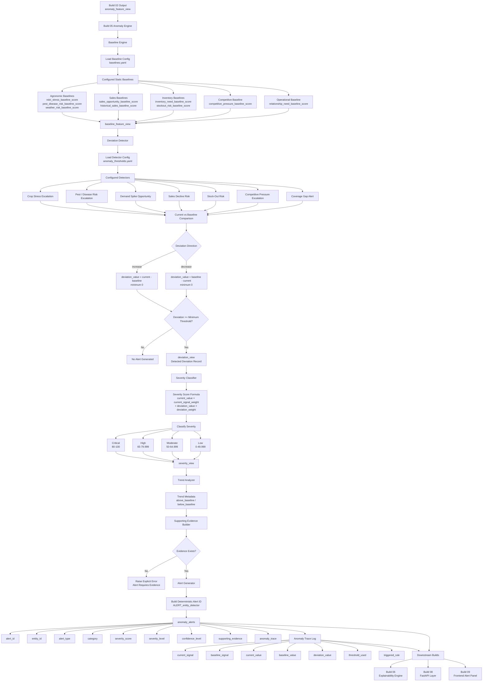

# Build 05 — Anomaly & Opportunity Detection Engine  
## Final Ground-Truth Functionality Record

---

# 1. Build Purpose

Build 05 implements the **anomaly and opportunity detection layer** of KshetraAI.

The core responsibility of this build is:

```text
Compare current operational feature signals
against configured baselines,
detect meaningful deviations,
classify severity,
and generate structured anomaly/opportunity alerts.
```

Build 05 answers:

```text
What unusual or important operational event requires field attention?
```

It does not decide visit ranking, generate contextual recommendations, create final explanation text, expose APIs, render frontend screens, or train ML anomaly models.

---

# 2. What Was Actually Implemented

Build 05 is implemented under:

```text
backend/anomaly/
backend/config/
```

The inspected implementation includes:

```text
backend/anomaly/anomaly_engine.py
backend/anomaly/baseline_engine.py
backend/anomaly/deviation_detector.py
backend/anomaly/severity_classifier.py
backend/anomaly/alert_generator.py
backend/anomaly/trend_analyzer.py
```

and configuration files:

```text
backend/config/baselines.yaml
backend/config/anomaly_thresholds.yaml
```

The implemented functionality includes:

- static configured baseline preparation
- baseline trace metadata generation
- deviation detection using configured detectors
- directional deviation comparison
- severity score calculation
- severity level classification
- structured alert generation
- deterministic alert ID creation
- supporting evidence construction
- anomaly trace log creation
- trend metadata generation
- validation of detector configs, baseline configs, required fields, numeric ranges, evidence, and alert trace requirements

The anomaly engine explicitly wires baseline preparation, deviation detection, severity classification, alert generation, and trace logging, while not implementing priority ranking, recommendations, explanations, APIs, frontend behavior, or ML anomaly models. :contentReference[oaicite:0]{index=0}

---

# 3. Functional Role of Build 05

Build 05 acts as the **proactive monitoring layer**.

Build 03 answers:

```text
Who should be visited first?
```

Build 04 answers:

```text
What should the rep do or discuss?
```

Build 05 answers:

```text
What abnormal risk, opportunity, or operational event is emerging?
```

The logical transformation is:

```text
anomaly_feature_view
        ↓
baseline enrichment
        ↓
current-vs-baseline deviation detection
        ↓
severity classification
        ↓
structured anomaly alerts
        ↓
trace log for explainability
```

This keeps anomaly detection deterministic and explainable.

---

# 4. Inputs Consumed

Build 05 consumes:

```text
anomaly_feature_view
```

from Build 02.

This view contains current operational feature signals such as:

```text
weather_risk_score
pest_disease_risk_score
ndvi_stress_score
sales_opportunity_score
historical_sales_score
inventory_need_score
stockout_risk_score
sales_velocity_score
competitive_pressure_score
relationship_need_score
account_priority_score
```

It also consumes configured baseline and detector rules from:

```text
backend/config/baselines.yaml
backend/config/anomaly_thresholds.yaml
```

The baseline configuration defines static prototype defaults until historical rolling baselines are derived from processed data. It explicitly states that these configured baselines do not implement detection, scoring, recommendations, explanations, or learning. :contentReference[oaicite:1]{index=1}

---

# 5. Outputs Produced

Build 05 produces the following logical output views:

```text
baseline_feature_view
deviation_view
severity_view
anomaly_alerts
anomaly_trace_log
```

These outputs are captured in the `AnomalyDetectionOutputs` dataclass. :contentReference[oaicite:2]{index=2}

The final downstream-facing outputs are mainly:

```text
anomaly_alerts
anomaly_trace_log
```

The orchestration function `build_anomaly_outputs(...)` runs the full deterministic flow and returns all output views. :contentReference[oaicite:3]{index=3}

---

# 6. Core Logic Flow

The implemented Build 05 flow is:

```text
anomaly_feature_view
        ↓
add configured baselines
        ↓
detect deviations
        ↓
calculate severity scores
        ↓
classify severity levels
        ↓
generate anomaly alerts
        ↓
generate anomaly trace log
```

This flow is implemented in `build_anomaly_outputs(...)`. :contentReference[oaicite:4]{index=4}

---

# 7. Baseline Preparation Logic

## What it does

The baseline engine enriches the current anomaly feature view with configured baseline values.

It does not detect deviations, classify severity, generate alerts, create recommendations, modify priority scores, or format explanations. :contentReference[oaicite:5]{index=5}

---

## 7.1 Baseline Configuration

Baselines are loaded from:

```text
backend/config/baselines.yaml
```

The baseline config includes:

```text
baseline_policy
baseline_groups
baseline_output_schema
```

The baseline policy defines:

```text
score range: 0–100
default source: configured_static_baseline
deterministic join keys: entity_id, territory_id
```

:contentReference[oaicite:6]{index=6}

---

## 7.2 Baseline Groups Implemented

The implemented baseline groups are:

| Group | Baseline Signals |
|---|---|
| `agronomic` | `ndvi_stress_baseline_score`, `pest_disease_risk_baseline_score`, `weather_risk_baseline_score` |
| `sales` | `sales_opportunity_baseline_score`, `historical_sales_baseline_score` |
| `inventory` | `inventory_need_baseline_score`, `stockout_risk_baseline_score` |
| `competitive` | `competitive_pressure_baseline_score` |
| `operational` | `relationship_need_baseline_score` |

These are defined in `baselines.yaml`. :contentReference[oaicite:7]{index=7}

---

## 7.3 Baseline Enrichment

The function `build_baseline_feature_view(...)`:

1. Loads baseline specs.
2. Validates required source signals.
3. Adds each baseline signal as a column.
4. Adds a `baseline_trace`.
5. Sorts by `entity_id`.

This is implemented in the baseline engine. :contentReference[oaicite:8]{index=8}

---

## 7.4 Baseline Trace

Each baseline spec stores:

```text
baseline_signal
source_signal
default_value
baseline_group
source_view
baseline_window_days
baseline_source
```

The `BaselineSpec` dataclass exposes this through `to_trace(...)`. :contentReference[oaicite:9]{index=9}

This allows later anomaly explanations to show which baseline was used.

---

# 8. Deviation Detection Logic

## What it does

The deviation detector compares current signals with baseline signals.

It does not classify severity, generate alerts, create recommendations, modify priority scores, or format explanations. :contentReference[oaicite:10]{index=10}

---

## 8.1 Detector Configuration

Detectors are loaded from:

```text
backend/config/anomaly_thresholds.yaml
```

The config defines:

```text
score_range
severity_levels
alert_categories
confidence_levels
detection_policy
detectors
```

The detector config file states that it defines deterministic alert configuration only and does not implement anomaly detection logic, priority scoring, recommendations, explanation text, API behavior, frontend behavior, or ML models. :contentReference[oaicite:11]{index=11}

---

## 8.2 Detector Structure

Each detector contains:

```text
detector_id
alert_type
category
current_signal
baseline_signal
deviation_direction
minimum_deviation_score
high_deviation_score
critical_deviation_score
severity_signal_weights
confidence_level
evidence_fields
```

This is represented by the `DetectorSpec` dataclass. :contentReference[oaicite:12]{index=12}

---

## 8.3 Directional Deviation Logic

The detector supports two deviation directions:

```text
increase
decrease
```

For increase detectors:

```text
deviation_value = max(0, current_value - baseline_value)
```

For decrease detectors:

```text
deviation_value = max(0, baseline_value - current_value)
```

This logic is implemented in `_calculate_directional_deviation(...)`. :contentReference[oaicite:13]{index=13}

---

## 8.4 Minimum Deviation Threshold

A detector only produces a deviation record if:

```text
deviation_value >= minimum_deviation_score
```

Otherwise, no alert path is triggered for that detector.

This is implemented in `detect_deviations_for_row(...)`. :contentReference[oaicite:14]{index=14}

---

## 8.5 Deviation Record Output

Each deviation record contains:

```text
entity_id
territory_id
detector_id
alert_type
category
current_signal
baseline_signal
current_value
baseline_value
deviation_value
deviation_direction
minimum_deviation_score
confidence_level
evidence_signals
deviation_trace
```

This is defined in the `DeviationRecord` dataclass. :contentReference[oaicite:15]{index=15}

---

# 9. Implemented Detectors

Build 05 implements seven configured detectors.

---

## 9.1 Agronomic Crop Stress Escalation

### Detector ID

```text
AGRONOMIC_CROP_STRESS_ESCALATION
```

### Logic

Compares:

```text
ndvi_stress_score
against
ndvi_stress_baseline_score
```

Direction:

```text
increase
```

Minimum deviation:

```text
20
```

Alert type:

```text
Possible crop stress escalation
```

Category:

```text
agronomic_anomaly
```

This is configured in `anomaly_thresholds.yaml`. :contentReference[oaicite:16]{index=16}

---

## 9.2 Pest Weather Risk Escalation

### Detector ID

```text
AGRONOMIC_PEST_WEATHER_RISK_ESCALATION
```

### Logic

Compares:

```text
pest_disease_risk_score
against
pest_disease_risk_baseline_score
```

Direction:

```text
increase
```

Minimum deviation:

```text
15
```

Alert type:

```text
Possible pest or disease risk escalation
```

Category:

```text
agronomic_anomaly
```

This is configured in `anomaly_thresholds.yaml`. :contentReference[oaicite:17]{index=17}

---

## 9.3 Sales Demand Spike Opportunity

### Detector ID

```text
SALES_DEMAND_SPIKE_OPPORTUNITY
```

### Logic

Compares:

```text
sales_opportunity_score
against
sales_opportunity_baseline_score
```

Direction:

```text
increase
```

Minimum deviation:

```text
20
```

Alert type:

```text
Demand spike opportunity
```

Category:

```text
sales_opportunity
```

This is configured in `anomaly_thresholds.yaml`. :contentReference[oaicite:18]{index=18}

---

## 9.4 Sales Decline Risk

### Detector ID

```text
SALES_DECLINE_RISK
```

### Logic

Compares:

```text
historical_sales_score
against
historical_sales_baseline_score
```

Direction:

```text
decrease
```

Minimum deviation:

```text
20
```

Alert type:

```text
Sales decline warning
```

Category:

```text
sales_risk
```

This is configured in `anomaly_thresholds.yaml`. :contentReference[oaicite:19]{index=19}

---

## 9.5 Inventory Stockout Risk

### Detector ID

```text
INVENTORY_STOCKOUT_RISK
```

### Logic

Compares:

```text
inventory_need_score
against
inventory_need_baseline_score
```

Direction:

```text
increase
```

Minimum deviation:

```text
15
```

Alert type:

```text
Possible stock-out risk
```

Category:

```text
inventory_risk
```

This is configured in `anomaly_thresholds.yaml`. :contentReference[oaicite:20]{index=20}

---

## 9.6 Competitive Pressure Escalation

### Detector ID

```text
COMPETITIVE_PRESSURE_ESCALATION
```

### Logic

Compares:

```text
competitive_pressure_score
against
competitive_pressure_baseline_score
```

Direction:

```text
increase
```

Minimum deviation:

```text
15
```

Alert type:

```text
Competitive pressure escalation
```

Category:

```text
competitive_event
```

This is configured in `anomaly_thresholds.yaml`. :contentReference[oaicite:21]{index=21}

---

## 9.7 Operational Coverage Gap

### Detector ID

```text
OPERATIONAL_COVERAGE_GAP
```

### Logic

Compares:

```text
relationship_need_score
against
relationship_need_baseline_score
```

Direction:

```text
increase
```

Minimum deviation:

```text
20
```

Alert type:

```text
Coverage gap alert
```

Category:

```text
operational_gap
```

This is configured in `anomaly_thresholds.yaml`. :contentReference[oaicite:22]{index=22}

---

# 10. Severity Classification Logic

## What it does

The severity classifier converts deviation records into severity scores and labels.

It does not generate alerts, recommendations, priority rankings, API responses, frontend behavior, or human-readable explanations. :contentReference[oaicite:23]{index=23}

---

## 10.1 Severity Score Formula

The severity score is calculated as:

```text
severity_score =
current_value × current_signal_weight
+ deviation_value × deviation_weight
```

This is implemented in `_calculate_severity_score(...)`. :contentReference[oaicite:24]{index=24}

The weights are detector-specific and configured in `anomaly_thresholds.yaml`.

---

## 10.2 Severity Levels

Configured severity levels are:

| Severity | Score Range | Severity Rank |
|---|---:|---:|
| Critical | `80–100` | `4` |
| High | `65–79.999` | `3` |
| Moderate | `50–64.999` | `2` |
| Low | `0–49.999` | `1` |

These levels are defined in `anomaly_thresholds.yaml`. :contentReference[oaicite:25]{index=25}

---

## 10.3 Classification Method

The classifier sorts severity levels by minimum score from highest to lowest and assigns the first matching level.

This is implemented in `_classify_score(...)` and `_ordered_levels(...)`. :contentReference[oaicite:26]{index=26}

---

## 10.4 Severity Trace

Each severity classification preserves:

```text
entity_id
detector_id
severity_score
severity_level
severity_level_key
severity_rank
score_components
applied_weights
```

This is defined in the `SeverityClassification` dataclass. :contentReference[oaicite:27]{index=27}

---

# 11. Alert Generation Logic

## What it does

The alert generator converts severity-classified deviations into structured anomaly alert records and trace log rows.

It does not generate priority rankings, recommendations, explanation text, API responses, or frontend behavior. :contentReference[oaicite:28]{index=28}

---

## 11.1 Alert Output Columns

The final alert rows contain:

```text
alert_id
entity_id
territory_id
detector_id
alert_type
category
severity_score
severity_level
severity_rank
confidence_level
supporting_evidence
detected_at
anomaly_trace
```

These are defined in `ALERT_OUTPUT_COLUMNS`. :contentReference[oaicite:29]{index=29}

---

## 11.2 Deterministic Alert ID

Each alert ID is generated as:

```text
ALERT_<ENTITY_ID>_<DETECTOR_ID>
```

This is implemented in `_build_alert_id(...)`. :contentReference[oaicite:30]{index=30}

---

## 11.3 Deterministic Detected Time

The default detection timestamp is:

```text
configured_static_detection_run
```

This is defined as `DETERMINISTIC_DETECTED_AT`. :contentReference[oaicite:31]{index=31}

This avoids unstable timestamps in deterministic prototype runs.

---

## 11.4 Supporting Evidence

Before an alert is generated, the system builds structured supporting evidence from the deviation row.

If evidence is missing, alert generation fails.

This behavior is implemented through `build_supporting_evidence(...)`, which requires non-empty evidence signals. :contentReference[oaicite:32]{index=32}

---

## 11.5 Anomaly Trace

Each alert preserves anomaly trace metadata including:

```text
entity_id
territory_id
detector_id
alert_type
category
current_signal
baseline_signal
current_value
baseline_value
deviation_value
threshold_used
severity_score
severity_level
confidence_level
triggered_rule
trend
deviation_trace
severity_trace
```

This is built in `_build_anomaly_trace(...)`. :contentReference[oaicite:33]{index=33}

---

# 12. Trend Analysis Logic

## What it does

The trend analyzer derives compact trend metadata from current-vs-baseline anomaly signals.

It does not generate recommendations, priority scores, explanations, API responses, frontend behavior, or ML predictions. :contentReference[oaicite:34]{index=34}

---

## 12.1 Trend Direction

If deviation direction is:

```text
increase
```

the trend direction becomes:

```text
above_baseline
```

If deviation direction is:

```text
decrease
```

the trend direction becomes:

```text
below_baseline
```

This is implemented in `_trend_direction(...)`. :contentReference[oaicite:35]{index=35}

---

## 12.2 Trend Summary

The trend summary includes:

```text
current_signal
baseline_signal
current_value
baseline_value
deviation_value
deviation_direction
trend_direction
```

This is defined in `TrendSummary`. :contentReference[oaicite:36]{index=36}

---

# 13. Trace Log Logic

The alert generator creates a separate trace log view from generated alerts.

Trace log rows include:

```text
alert_id
entity_id
territory_id
detector_id
alert_type
current_signal
baseline_signal
current_value
baseline_value
deviation_value
threshold_used
severity_score
severity_level
confidence_level
triggered_rule
detected_at
```

These columns are defined in `TRACE_OUTPUT_COLUMNS`. :contentReference[oaicite:37]{index=37}

The trace log is built by `build_trace_log_view(...)`. :contentReference[oaicite:38]{index=38}

---

# 14. Determinism Logic

Build 05 preserves determinism through:

- configured static baselines
- deterministic detector ordering by `detector_id`
- deterministic directional deviation formulas
- deterministic severity calculation
- fixed severity thresholds
- deterministic alert IDs
- deterministic detected timestamp
- stable sorting by entity, severity, alert type, and detector
- no random sampling
- no ML anomaly model
- no live timestamp by default

This makes repeated runs reproducible.

---

# 15. How Build 05 Solves Its Responsibility

Build 05 solves anomaly detection by decomposing the problem into five clean steps:

```text
1. Attach baseline values to current feature signals.
2. Detect directional deviations beyond configured thresholds.
3. Convert deviations into severity scores.
4. Classify severity into operational levels.
5. Generate evidence-backed anomaly alerts and trace logs.
```

This avoids black-box anomaly detection.

The system can explain:

```text
which signal changed,
what baseline it was compared to,
how large the deviation was,
what detector triggered,
what severity was assigned,
and what evidence supported the alert.
```

---

# 16. What Build 05 Intentionally Does Not Do

Build 05 intentionally does not:

- calculate priority scores
- rank entities
- generate contextual recommendations
- generate final human-readable explanation text
- expose API endpoints
- render frontend content
- learn from alert outcomes
- train ML anomaly models
- update baselines dynamically from historical data

This is correct because Build 05 is only the:

```text
deterministic anomaly and opportunity detection layer
```

not the:

```text
recommendation layer
```

or:

```text
outcome learning layer
```

---

# 17. Pending or Intentionally Out of Scope

Based on the inspected implementation, the following are intentionally outside Build 05.

---

## 17.1 Rolling Historical Baselines

Current baselines are configured static prototype defaults.

Historical rolling baselines are not yet derived from processed data.

This is explicitly acknowledged in the baseline config comment. :contentReference[oaicite:39]{index=39}

---

## 17.2 ML-Based Anomaly Detection

No isolation forest, clustering, forecasting, or statistical anomaly model is implemented.

The build uses deterministic configured detectors.

---

## 17.3 Recommendation From Alerts

Build 05 generates alerts.

It does not decide the next-best-action response.

That belongs to Build 04 or downstream orchestration.

---

## 17.4 Explanation Text

Build 05 produces evidence and trace metadata.

It does not generate polished human explanation text.

That belongs to Build 06.

---

## 17.5 Outcome-Based Alert Calibration

Build 05 does not update thresholds based on alert validation outcomes.

That belongs to Build 07 and future human-reviewed recalibration.

---

# 18. Final Ground-Truth Summary

Build 05 implemented the **deterministic anomaly and opportunity detection engine**.

The actual logical solution is:

```text
anomaly_feature_view
        ↓
configured baseline enrichment
        ↓
current-vs-baseline deviation detection
        ↓
severity score calculation
        ↓
severity classification
        ↓
structured anomaly alert generation
        ↓
anomaly trace logging
```

The most important output of this build is:

```text
evidence-backed anomaly/opportunity alerts
with clear baseline, deviation, severity, and trace metadata.
```

---

# 19. Final One-Line Definition

```text
Build 05 compares current KshetraAI feature signals against deterministic configured baselines
to detect meaningful deviations,
classify severity,
and produce evidence-backed anomaly and opportunity alerts
with traceable reasoning.
```


