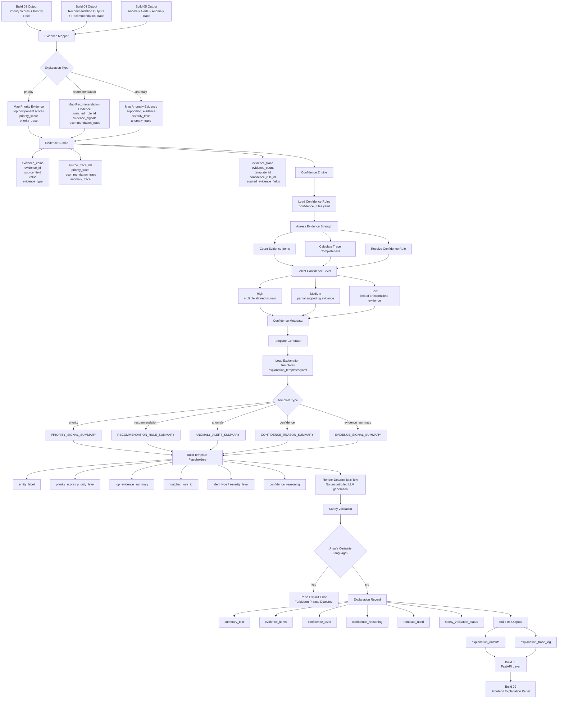

# Build 06 — Explainability & Trust Engine  
## Final Ground-Truth Functionality Record

---

# 1. Build Purpose

Build 06 implements the **explainability and trust layer** of KshetraAI.

The core responsibility of this build is:

```text
Convert priority, recommendation, and anomaly outputs
into structured, evidence-backed, deterministic explanations.
```

Build 06 answers:

```text
Why did the system prioritize this entity,
why was this recommendation generated,
or why was this anomaly alert triggered?
```

It does not calculate scores, create recommendations, detect anomalies, expose APIs, render frontend screens, or use uncontrolled LLM generation.

---

# 2. What Was Actually Implemented

Build 06 is implemented under:

```text
backend/explainability/
backend/config/
```

The inspected implementation includes:

```text
backend/explainability/explanation_engine.py
backend/explainability/evidence_mapper.py
backend/explainability/confidence_engine.py
backend/explainability/template_generator.py
backend/explainability/explanation_registry.py
```

and configuration files:

```text
backend/config/explanation_templates.yaml
backend/config/confidence_rules.yaml
```

The implemented functionality includes:

- mapping priority outputs into evidence bundles
- mapping recommendation outputs into evidence bundles
- mapping anomaly alert outputs into evidence bundles
- generating structured evidence items
- loading controlled explanation templates
- loading deterministic confidence rules
- assessing confidence from evidence count and trace completeness
- rendering deterministic template-based explanation text
- validating evidence presence
- validating source trace IDs
- blocking unsafe certainty language
- producing explanation output rows
- producing explanation trace rows

The explanation engine explicitly states that it converts mapped evidence plus confidence metadata into structured explanation records and does not calculate priority scores, create recommendations, detect anomalies, call APIs, render frontend content, or use uncontrolled LLM generation. :contentReference[oaicite:0]{index=0}

---

# 3. Functional Role of Build 06

Build 06 acts as the **reasoning translation layer**.

Earlier builds generate intelligence outputs:

```text
Build 03 → priority scores and ranking traces
Build 04 → recommendation records and rule traces
Build 05 → anomaly alerts and anomaly traces
```

Build 06 converts those traces into:

```text
structured explanation records
```

The logical transformation is:

```text
upstream intelligence output
        ↓
evidence mapping
        ↓
confidence assessment
        ↓
template rendering
        ↓
safe explanation output
        ↓
trace log
```

This keeps explanations grounded in existing outputs.

Build 06 does not invent new reasons.

---

# 4. Inputs Consumed

Build 06 consumes outputs from previous intelligence builds.

Expected upstream inputs include:

```text
ranked priority view
recommendation outputs
anomaly alerts
priority_trace
classification_trace
recommendation_trace
anomaly_trace
supporting_evidence
component_scores
evidence_signals
```

The evidence mapper supports three core upstream explanation types:

```text
priority
recommendation
anomaly
```

through `map_priority_evidence(...)`, `map_recommendation_evidence(...)`, and `map_anomaly_evidence(...)`. :contentReference[oaicite:1]{index=1}

---

# 5. Outputs Produced

Build 06 produces two main output views:

```text
explanation_outputs
explanation_trace_log
```

The explanation output columns are:

```text
entity_id
explanation_type
source_output_type
source_output_id
summary_text
evidence_items
confidence_level
confidence_reasoning
source_trace_ids
template_used
safety_validation_status
```

These are defined as `EXPLANATION_OUTPUT_COLUMNS`. :contentReference[oaicite:2]{index=2}

The explanation trace columns are:

```text
entity_id
explanation_type
source_output_type
source_output_id
evidence_used
template_used
confidence_rule_used
safety_validation_status
```

These are defined as `EXPLANATION_TRACE_COLUMNS`. :contentReference[oaicite:3]{index=3}

---

# 6. Core Logic Flow

The implemented Build 06 flow is:

```text
upstream output row
        ↓
map into evidence bundle
        ↓
validate evidence and trace metadata
        ↓
assess confidence
        ↓
render explanation from controlled template
        ↓
validate safe language
        ↓
produce explanation output
        ↓
produce explanation trace log
```

This gives deterministic and auditable explanations.

---

# 7. Evidence Mapping Logic

## What it does

The evidence mapper converts existing priority, recommendation, and anomaly outputs into structured evidence bundles.

It does not generate human-readable explanation text, calculate scores, create recommendations, detect anomalies, call APIs, or render frontend content. :contentReference[oaicite:4]{index=4}

---

## 7.1 Evidence Item Structure

Each evidence item contains:

```text
evidence_id
source_field
value
evidence_type
```

This is defined in the `EvidenceItem` dataclass. :contentReference[oaicite:5]{index=5}

---

## 7.2 Evidence Bundle Structure

Each evidence bundle contains:

```text
entity_id
explanation_type
source_output_type
source_output_id
evidence_items
confidence_level
source_trace_ids
template_id
template
```

This is defined in the `EvidenceBundle` dataclass. :contentReference[oaicite:6]{index=6}

The evidence trace includes:

```text
evidence_count
source_trace_ids
template_id
confidence_rule_id
required_evidence_fields
```

This makes later explanation generation traceable.

---

# 8. Priority Evidence Logic

## What it does

Priority evidence explains why an entity received a priority score.

The mapper requires:

```text
entity_id
priority_score
priority_level
priority_trace
```

It extracts component scores from either:

```text
component_scores
```

or:

```text
priority_trace.component_scores
```

Then it selects the top numeric components.

This is implemented in `map_priority_evidence(...)`. :contentReference[oaicite:7]{index=7}

---

## Logic used

The top component signals are selected using:

```text
sort by score descending
then component name ascending
limit to top 3
```

This is implemented in `_top_numeric_items(...)`. :contentReference[oaicite:8]{index=8}

The priority evidence bundle includes:

```text
top priority components
priority_score
source_trace_ids = priority_trace, classification_trace
```

---

## How it solves priority explainability

It answers:

```text
Which component scores contributed most to the priority decision?
```

It does not recompute the priority score.

It only explains the existing one.

---

# 9. Recommendation Evidence Logic

## What it does

Recommendation evidence explains why a recommendation was generated.

The mapper requires:

```text
entity_id
matched_rule_id
recommended_actions
evidence_signals
confidence_level
recommendation_trace
```

This is implemented in `map_recommendation_evidence(...)`. :contentReference[oaicite:9]{index=9}

---

## Logic used

The mapper converts each `evidence_signals` item into an evidence item:

```text
evidence_id = recommendation:<signal>
source_field = signal
value = signal value
evidence_type = recommendation_signal
```

The source output ID becomes:

```text
matched_rule_id
```

and source trace IDs are:

```text
recommendation_trace
```

---

## How it solves recommendation explainability

It answers:

```text
Which rule matched,
and which supporting signals caused the recommendation?
```

It does not create new actions.

It only explains existing recommendation records.

---

# 10. Anomaly Evidence Logic

## What it does

Anomaly evidence explains why an anomaly alert was triggered.

The mapper requires:

```text
entity_id
alert_id
alert_type
severity_level
supporting_evidence
confidence_level
anomaly_trace
```

This is implemented in `map_anomaly_evidence(...)`. :contentReference[oaicite:10]{index=10}

---

## Logic used

The mapper converts each structured supporting evidence item into an evidence item.

Each anomaly evidence item uses:

```text
evidence_id = anomaly:<signal>
source_field = signal
value = evidence value
evidence_type = anomaly_signal
```

This conversion is implemented in `_evidence_item_from_alert_item(...)`. :contentReference[oaicite:11]{index=11}

---

## How it solves anomaly explainability

It answers:

```text
Which signals supported this alert,
and which alert trace generated it?
```

It does not detect anomalies.

It only explains existing anomaly alerts.

---

# 11. Evidence View Logic

The function `build_evidence_view(...)` builds a stable evidence bundle view for one upstream output type.

It:

1. Selects the correct mapper based on explanation type.
2. Maps each source row into an evidence bundle.
3. Converts bundles into rows.
4. Sorts by:

```text
entity_id
explanation_type
source_output_id
```

This is implemented in `build_evidence_view(...)`. :contentReference[oaicite:12]{index=12}

Supported evidence types are:

```text
priority
recommendation
anomaly
```

Unsupported explanation types raise an explicit error. :contentReference[oaicite:13]{index=13}

---

# 12. Confidence Reasoning Logic

## What it does

The confidence engine converts evidence bundles into deterministic confidence metadata.

It does not generate final explanation text, calculate priority scores, create recommendations, detect anomalies, call APIs, or render frontend content. :contentReference[oaicite:14]{index=14}

---

## 12.1 Confidence Output

Confidence metadata contains:

```text
entity_id
explanation_type
source_output_type
source_output_id
confidence_level
confidence_rank
confidence_reasoning
confidence_rule_id
evidence_count
trace_completeness
confidence_trace
```

These are defined in `CONFIDENCE_OUTPUT_COLUMNS`. :contentReference[oaicite:15]{index=15}

---

## 12.2 Confidence Rules

Confidence rules are loaded from:

```text
backend/config/confidence_rules.yaml
```

The config defines confidence levels:

| Level | Rank | Meaning |
|---|---:|---|
| High | `3` | multiple strong evidence signals are aligned |
| Medium | `2` | some supporting evidence is available |
| Low | `1` | available evidence is limited or incomplete |

These are defined in `confidence_rules.yaml`. :contentReference[oaicite:16]{index=16}

---

## 12.3 Confidence Assessment Logic

The confidence engine:

1. Resolves the confidence rule ID from evidence trace.
2. Checks that the rule applies to the explanation type.
3. Counts evidence items.
4. Calculates trace completeness.
5. Selects High, Medium, or Low based on configured thresholds.

This is implemented in `assess_confidence(...)`. :contentReference[oaicite:17]{index=17}

---

## 12.4 Trace Completeness Logic

Trace completeness is computed from:

```text
source_trace_ids
required_evidence_fields
evidence_count
expected evidence source count
```

It produces a score between 0 and 1.

This is implemented in `_trace_completeness(...)`. :contentReference[oaicite:18]{index=18}

---

# 13. Template Registry Logic

## What it does

The explanation registry loads controlled explanation templates and confidence rules.

It does not generate explanations, score priorities, create recommendations, detect anomalies, call APIs, or render frontend content. :contentReference[oaicite:19]{index=19}

---

## 13.1 Explanation Types

The template config defines explanation types:

```text
priority
recommendation
anomaly
confidence
evidence_summary
```

Each type has:

```text
label
source_output_type
required_trace_fields
default_template_id
```

These are defined in `explanation_templates.yaml`. :contentReference[oaicite:20]{index=20}

---

## 13.2 Templates Implemented

The config defines templates:

```text
PRIORITY_SIGNAL_SUMMARY
RECOMMENDATION_RULE_SUMMARY
ANOMALY_ALERT_SUMMARY
CONFIDENCE_REASON_SUMMARY
EVIDENCE_SIGNAL_SUMMARY
```

Each template includes:

```text
explanation_type
source_output_type
confidence_rule_id
required_evidence_fields
placeholders
text_template
safety_notes
```

The template section is defined in `explanation_templates.yaml`. :contentReference[oaicite:21]{index=21}

---

## 13.3 Registry Validation

The registry validates that:

- required config sections exist
- default templates are configured
- trace fields are non-empty
- template explanation types are supported
- required evidence fields exist
- placeholders exist
- safety notes exist

This is implemented in `_validate_template_config(...)`. :contentReference[oaicite:22]{index=22}

---

# 14. Template Rendering Logic

## What it does

The template generator renders configured explanation templates from mapped evidence and confidence metadata.

It does not calculate scores, create recommendations, detect anomalies, call APIs, render frontend content, or use uncontrolled LLM generation. :contentReference[oaicite:23]{index=23}

---

## 14.1 Rendering Method

The function `render_explanation_text(...)`:

1. Reads `template_id`.
2. Loads the template spec.
3. Builds placeholders.
4. Renders text using deterministic string formatting.
5. Validates safe text.

This is implemented in `render_explanation_text(...)`. :contentReference[oaicite:24]{index=24}

---

## 14.2 Evidence Summary

Evidence is summarized by formatting up to the first three evidence items.

The format is:

```text
source field=value
```

joined with semicolons.

This is implemented in `summarize_evidence_items(...)`. :contentReference[oaicite:25]{index=25}

---

## 14.3 Placeholders

Template placeholders include:

```text
entity_label
priority_level
priority_score
top_evidence_summary
recommended_action_summary
matched_rule_id
alert_type
severity_level
confidence_level
confidence_reasoning
```

These are built in `_build_placeholders(...)`. :contentReference[oaicite:26]{index=26}

---

# 15. Safety Logic

Build 06 prevents unsafe explanation wording.

The template config forbids phrases such as:

```text
definitely infected
confirmed disease
guaranteed
will definitely
must be purchased
certain outcome
```

These forbidden phrases are defined in `explanation_templates.yaml`. :contentReference[oaicite:27]{index=27}

The template generator checks rendered text and raises an error if unsafe certainty language appears. :contentReference[oaicite:28]{index=28}

This ensures explanations remain evidence-backed and avoid unsafe certainty.

---

# 16. Explanation Generation Logic

## What it does

The explanation engine converts a confidence-enriched evidence row into a final explanation record.

The function `generate_explanation(...)`:

1. Loads template config.
2. Validates evidence row.
3. Assesses confidence.
4. Adds confidence metadata to render row.
5. Renders explanation text.
6. Produces an `ExplanationRecord`.

This is implemented in `generate_explanation(...)`. :contentReference[oaicite:29]{index=29}

---

## 16.1 Explanation Record Structure

Each explanation record contains:

```text
entity_id
explanation_type
source_output_type
source_output_id
summary_text
evidence_items
confidence_level
confidence_reasoning
source_trace_ids
template_used
safety_validation_status
confidence_rule_used
```

This is defined in the `ExplanationRecord` dataclass. :contentReference[oaicite:30]{index=30}

---

## 16.2 Explanation View

The function `build_explanation_view(...)` generates stable explanation output rows and sorts them by:

```text
entity_id
explanation_type
source_output_id
```

:contentReference[oaicite:31]{index=31}

---

## 16.3 Explanation Trace View

The function `build_explanation_trace_view(...)` generates explanation trace rows from the same evidence view.

It preserves:

```text
evidence_used
template_used
confidence_rule_used
safety_validation_status
```

:contentReference[oaicite:32]{index=32}

---

# 17. Determinism Logic

Build 06 preserves determinism through:

- controlled YAML templates
- controlled confidence rules
- deterministic template selection
- deterministic top evidence sorting
- deterministic confidence thresholds
- deterministic string formatting
- stable output sorting
- no uncontrolled LLM generation
- no random sampling
- fixed forbidden phrase checks

The template policy explicitly uses:

```text
generation_mode: deterministic_template
forbid_uncontrolled_llm_generation: true
```

:contentReference[oaicite:33]{index=33}

---

# 18. How Build 06 Solves Its Responsibility

Build 06 solves explainability by separating explanation generation into clean stages:

```text
1. Map upstream intelligence into evidence.
2. Assess confidence from evidence and trace completeness.
3. Render safe explanation text using controlled templates.
4. Preserve explanation trace metadata.
```

This avoids the main risk of AI explanation systems:

```text
inventing reasons after the fact.
```

Instead, explanations are grounded in existing:

```text
priority traces,
recommendation traces,
and anomaly traces.
```

---

# 19. What Build 06 Intentionally Does Not Do

Build 06 intentionally does not:

- calculate priority scores
- rank entities
- generate recommendations
- detect anomalies
- create new evidence
- create new actions
- expose API endpoints
- render frontend UI
- use uncontrolled LLM generation
- learn from outcomes

This is correct because Build 06 is only the:

```text
explainability and trust layer
```

not the:

```text
decision-making layer
```

or:

```text
learning layer
```

---

# 20. Pending or Intentionally Out of Scope

Based on the inspected implementation, the following are intentionally outside Build 06.

---

## 20.1 Full Natural-Language Generation

The system uses deterministic templates.

It does not use LLM-based free-form explanation generation.

---

## 20.2 Advanced Safety Review Workflow

The template config allows statuses such as:

```text
Safe
Needs Review
```

but the current generated explanation record sets:

```text
safety_validation_status = Safe
```

The broader human review workflow is not implemented here.

---

## 20.3 Multi-Language Explanations

The current templates are English deterministic templates.

Multi-language rendering is not part of this build.

---

## 20.4 Domain Expert Explanation Expansion

The system explains supplied signals.

It does not add external agronomic knowledge or expert claims beyond evidence.

---

## 20.5 Frontend Explanation UI

The engine produces explanation rows.

It does not display them.

That belongs to Build 09.

---

# 21. Final Ground-Truth Summary

Build 06 implemented the **deterministic explainability and trust engine**.

The actual logical solution is:

```text
priority/recommendation/anomaly outputs
        ↓
evidence mapping
        ↓
confidence assessment
        ↓
template-based explanation rendering
        ↓
safety validation
        ↓
explanation output
        ↓
explanation trace log
```

The most important output of this build is:

```text
safe, evidence-backed explanation records
that explain existing system intelligence without inventing new reasoning.
```

---

# 22. Final One-Line Definition

```text
Build 06 converts KshetraAI’s priority, recommendation, and anomaly traces
into deterministic, evidence-backed, confidence-aware explanations
using controlled templates and safety validation.
```


