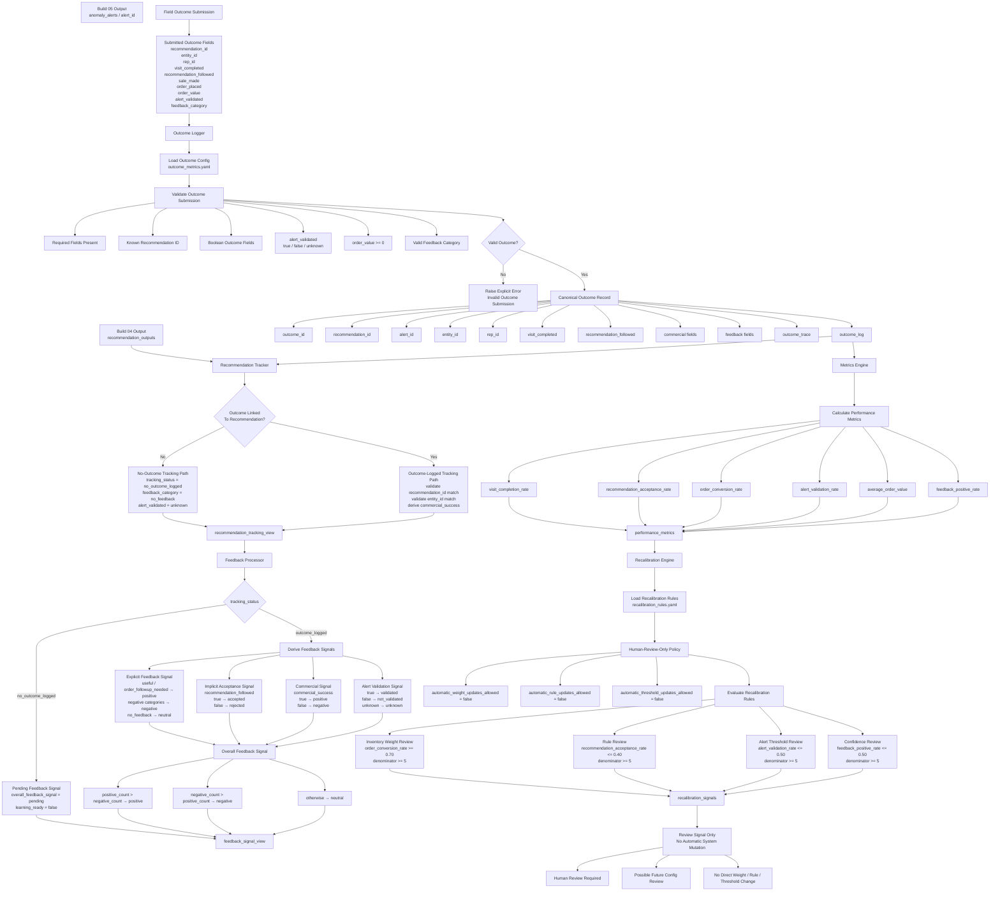

# Build 07 — Outcome Learning & Feedback Engine  
## Final Ground-Truth Functionality Record

---

# 1. Build Purpose

Build 07 implements the **outcome learning and feedback layer** of KshetraAI.

The core responsibility of this build is:

```text
Capture field outcomes,
link them back to recommendations,
convert them into feedback signals,
calculate performance metrics,
and generate human-reviewable recalibration suggestions.
```

Build 07 answers:

```text
What happened after the recommendation was used in the field?
```

and:

```text
What review signals should the team consider before changing future system behavior?
```

This build does **not** automatically update the system.

It does not mutate priority weights, rewrite contextual rules, change anomaly thresholds, retrain models, generate recommendations, detect anomalies, create explanations, expose APIs, or render frontend screens.

---

# 2. Actual Files Used as Source of Truth

This ground-truth record is based only on the inspected actual implementation files:

```text
backend/learning/outcome_logger.py
backend/learning/recommendation_tracker.py
backend/learning/feedback_processor.py
backend/learning/metrics_engine.py
backend/learning/recalibration_engine.py
backend/config/outcome_metrics.yaml
backend/config/recalibration_rules.yaml
```

No planned-but-unverified module names are used in this record.

---

# 3. What Was Actually Implemented

Build 07 implemented five logical sublayers:

```text
1. Outcome logging
2. Recommendation outcome tracking
3. Feedback signal processing
4. Performance metric calculation
5. Human-reviewable recalibration signal generation
```

The implementation creates a deterministic closed-loop flow:

```text
submitted field outcome
        ↓
canonical outcome log
        ↓
recommendation tracking view
        ↓
feedback signal view
        ↓
performance metrics
        ↓
human-review-only recalibration signals
```

The outcome logger explicitly normalizes submitted field outcomes into a canonical outcome log and does not calculate metrics, generate recalibration signals, mutate weights, generate recommendations, detect anomalies, create explanations, call APIs, or render frontend content. :contentReference[oaicite:0]{index=0}

---

# 4. Functional Role of Build 07

Earlier builds produce operational intelligence:

```text
Build 03 → priority score and ranked visit plan
Build 04 → contextual recommendation
Build 05 → anomaly / opportunity alert
Build 06 → explanation and evidence
```

Build 07 closes the loop by asking:

```text
Was the visit completed?
Was the recommendation followed?
Did it produce a sale or order?
Was the alert validated?
What feedback did the rep provide?
```

The system then converts those answers into:

```text
structured learning signals
```

but does not directly change the intelligence logic.

So Build 07 is a **measurement and review-signal layer**, not an autonomous learning engine.

---

# 5. Inputs Consumed

Build 07 consumes three main input categories.

---

## 5.1 Field Outcome Submissions

Outcome submissions include fields such as:

```text
recommendation_id
alert_id
entity_id
rep_id
visit_completed
recommendation_followed
sale_made
order_placed
order_value
alert_validated
feedback_category
rep_feedback
submitted_at
```

The required outcome submission fields are validated inside `log_outcome(...)`. :contentReference[oaicite:1]{index=1}

---

## 5.2 Recommendation Outputs

Recommendation tracking consumes recommendation rows with:

```text
entity_id
matched_rule_id
recommended_actions
recommended_product_category
confidence_level
```

These are required by `track_recommendation(...)`. :contentReference[oaicite:2]{index=2}

---

## 5.3 Configuration Inputs

Build 07 consumes two configuration files:

```text
backend/config/outcome_metrics.yaml
backend/config/recalibration_rules.yaml
```

`outcome_metrics.yaml` defines deterministic outcome logging schemas, allowed values, and metric formulas only. It explicitly does not implement scoring, recommendation generation, anomaly detection, explanation generation, APIs, frontend behavior, autonomous retraining, or production weight changes. :contentReference[oaicite:3]{index=3}

`recalibration_rules.yaml` defines human-reviewable suggestions only and explicitly does not mutate priority weights, decision rules, anomaly thresholds, explanation templates, APIs, frontend behavior, or production logic automatically. :contentReference[oaicite:4]{index=4}

---

# 6. Outputs Produced

Build 07 produces the following logical outputs:

```text
outcome_log
recommendation_tracking_view
feedback_signal_view
performance_metrics
recalibration_signals
```

Each output serves a different learning-loop purpose.

---

# 7. Outcome Logging Logic

## 7.1 What It Does

The outcome logger converts raw submitted field outcome data into a canonical outcome record.

It validates:

```text
required fields
known recommendation ID policy
entity ID
rep ID
feedback category
boolean outcome fields
alert validation value
non-negative order value
submitted timestamp
```

The output is a stable `OutcomeRecord`. :contentReference[oaicite:5]{index=5}

---

## 7.2 Outcome Record Structure

Each canonical outcome record contains:

```text
outcome_id
recommendation_id
alert_id
entity_id
rep_id
visit_completed
recommendation_followed
sale_made
order_placed
order_value
alert_validated
feedback_category
rep_feedback
submitted_at
outcome_trace
```

The `OutcomeRecord.to_row(...)` method returns this stable row structure. :contentReference[oaicite:6]{index=6}

---

## 7.3 Outcome Trace Logic

The outcome trace captures audit-level learning signals:

```text
commercial_success
recommendation_acceptance
visit_executed
alert_validation_status
feedback_category
```

Commercial success is defined as:

```text
sale_made == true
AND order_placed == true
AND order_value > 0
```

This is encoded in `OutcomeRecord.to_trace(...)`. :contentReference[oaicite:7]{index=7}

---

## 7.4 Outcome ID Logic

If no outcome ID is supplied, the system creates one deterministically:

```text
OUTCOME_<ENTITY_ID>_<RECOMMENDATION_ID>
```

This is implemented through `_build_outcome_id(...)`. :contentReference[oaicite:8]{index=8}

---

## 7.5 Outcome Log View

The function `build_outcome_log(...)` converts multiple submissions into a stable canonical outcome log.

It sorts outcomes by configured deterministic keys:

```text
entity_id
recommendation_id
outcome_id
```

The sorting keys are defined in `outcome_metrics.yaml`. :contentReference[oaicite:9]{index=9}

The outcome log builder applies these keys when returning the output. :contentReference[oaicite:10]{index=10}

---

# 8. Outcome Validation Logic

## 8.1 Required Fields

The outcome logger requires:

```text
recommendation_id
entity_id
rep_id
visit_completed
recommendation_followed
sale_made
order_placed
order_value
alert_validated
feedback_category
```

Missing fields raise an explicit `OutcomeLoggingError`. :contentReference[oaicite:11]{index=11}

---

## 8.2 Known Recommendation Validation

The config supports:

```text
require_known_recommendation_id: true
```

When enabled and a list of known recommendation IDs is supplied, unknown recommendation IDs are rejected.

This validation is implemented in `_validate_known_recommendation(...)`. :contentReference[oaicite:12]{index=12}

---

## 8.3 Boolean Validation

The fields below must be boolean values:

```text
visit_completed
recommendation_followed
sale_made
order_placed
```

String values `"true"` and `"false"` are also normalized.

Invalid values raise an explicit error. :contentReference[oaicite:13]{index=13}

---

## 8.4 Alert Validation Logic

`alert_validated` supports:

```text
true
false
unknown
```

This allows the system to distinguish between:

```text
alert confirmed
alert not confirmed
alert not checked / unknown
```

The logic is implemented in `_alert_validation_value(...)`. :contentReference[oaicite:14]{index=14}

---

## 8.5 Order Value Logic

`order_value` must be numeric and non-negative.

The final value is rounded to two decimals.

This is implemented in `_order_value(...)`. :contentReference[oaicite:15]{index=15}

---

# 9. Recommendation Tracking Logic

## 9.1 What It Does

The recommendation tracker links recommendation outputs to logged outcomes.

It does not calculate aggregate metrics, generate recalibration signals, mutate weights, generate recommendations, detect anomalies, create explanations, call APIs, or render frontend content. :contentReference[oaicite:16]{index=16}

The tracker answers:

```text
For this recommendation, was there an outcome?
If yes, what happened?
If no, mark it as pending/no outcome logged.
```

---

## 9.2 Recommendation Tracking Record

A tracking record includes:

```text
recommendation_id
entity_id
matched_rule_id
recommended_actions
recommended_product_category
recommendation_confidence_level
outcome_id
rep_id
visit_completed
recommendation_followed
sale_made
order_placed
order_value
commercial_success
alert_id
alert_validated
feedback_category
submitted_at
tracking_status
tracking_trace
```

This structure is defined in `RECOMMENDATION_TRACKING_COLUMNS`. :contentReference[oaicite:17]{index=17}

---

## 9.3 No-Outcome Path

If no outcome is linked to a recommendation, the tracker emits a stable pending record:

```text
tracking_status = no_outcome_logged
visit_completed = None
recommendation_followed = None
sale_made = None
order_placed = None
order_value = 0.0
commercial_success = False
alert_validated = unknown
feedback_category = no_feedback
```

This is implemented in `track_recommendation(...)`. :contentReference[oaicite:18]{index=18}

---

## 9.4 Outcome-Logged Path

If an outcome exists, the tracker validates that:

```text
outcome.recommendation_id == recommendation_id
outcome.entity_id == recommendation.entity_id
```

If either does not match, an explicit error is raised. :contentReference[oaicite:19]{index=19}

Then it derives:

```text
commercial_success =
sale_made AND order_placed AND order_value > 0
```

This logic is implemented inside the tracked outcome record construction. :contentReference[oaicite:20]{index=20}

---

## 9.5 Tracking View

The function `build_recommendation_tracking_view(...)`:

1. Validates the recommendation view.
2. Builds an outcome lookup by `recommendation_id`.
3. Tracks each recommendation against its outcome if available.
4. Sorts by:

```text
entity_id
recommendation_id
```

This is implemented in the recommendation tracker. :contentReference[oaicite:21]{index=21}

---

# 10. Feedback Processing Logic

## 10.1 What It Does

The feedback processor converts tracked recommendation outcomes into deterministic learning input signals.

It does not calculate aggregate metrics, generate recalibration signals, mutate weights, generate recommendations, detect anomalies, create explanations, call APIs, or render frontend content. :contentReference[oaicite:22]{index=22}

The feedback processor answers:

```text
Was this recommendation outcome positive, negative, neutral, or still pending?
```

---

## 10.2 Feedback Signal Output

Each feedback signal contains:

```text
feedback_signal_id
recommendation_id
entity_id
outcome_id
feedback_category
explicit_feedback_signal
implicit_acceptance_signal
commercial_signal
alert_validation_signal
overall_feedback_signal
learning_ready
feedback_trace
```

These columns are defined in `FEEDBACK_SIGNAL_COLUMNS`. :contentReference[oaicite:23]{index=23}

---

## 10.3 Pending Feedback Logic

If:

```text
tracking_status = no_outcome_logged
```

then the processor returns:

```text
explicit_feedback_signal = pending
implicit_acceptance_signal = pending
commercial_signal = pending
alert_validation_signal = pending
overall_feedback_signal = pending
learning_ready = false
```

This prevents incomplete outcomes from being treated as learning-ready. :contentReference[oaicite:24]{index=24}

---

## 10.4 Explicit Feedback Logic

Positive feedback categories are:

```text
useful
order_followup_needed
```

Negative feedback categories are:

```text
not_useful
wrong_timing
incorrect_risk
customer_not_interested
```

`no_feedback` becomes:

```text
neutral
```

This mapping is implemented through `POSITIVE_FEEDBACK_CATEGORIES`, `NEGATIVE_FEEDBACK_CATEGORIES`, and `_explicit_feedback_signal(...)`. :contentReference[oaicite:25]{index=25} :contentReference[oaicite:26]{index=26}

---

## 10.5 Implicit Acceptance Signal

`recommendation_followed` is converted into:

```text
true  → accepted
false → rejected
```

This is implemented through `_boolean_signal(...)`. :contentReference[oaicite:27]{index=27}

---

## 10.6 Commercial Signal

`commercial_success` is converted into:

```text
true  → positive
false → negative
```

This uses the same boolean signal logic. :contentReference[oaicite:28]{index=28}

---

## 10.7 Alert Validation Signal

`alert_validated` is converted into:

```text
true    → validated
false   → not_validated
unknown → unknown
```

This is implemented in `_alert_validation_signal(...)`. :contentReference[oaicite:29]{index=29}

---

## 10.8 Overall Feedback Signal

The overall signal is derived by counting positive and negative signals.

Positive signals include:

```text
positive
accepted
validated
```

Negative signals include:

```text
negative
rejected
not_validated
```

Decision rule:

```text
positive_count > negative_count → positive
negative_count > positive_count → negative
otherwise → neutral
```

This is implemented in `_overall_feedback_signal(...)`. :contentReference[oaicite:30]{index=30}

---

# 11. Performance Metric Calculation Logic

## 11.1 What It Does

The metrics engine calculates deterministic aggregate performance metrics from the canonical outcome log.

It does not generate recalibration signals, mutate weights, generate recommendations, detect anomalies, create explanations, call APIs, or render frontend content. :contentReference[oaicite:31]{index=31}

---

## 11.2 Metrics Produced

The metric config defines the following metrics:

```text
visit_completion_rate
recommendation_acceptance_rate
order_conversion_rate
alert_validation_rate
average_order_value
feedback_positive_rate
```

These metric definitions are configured in `outcome_metrics.yaml`. :contentReference[oaicite:32]{index=32}

---

## 11.3 Metric Output Structure

Each metric output row contains:

```text
metric_id
metric_name
numerator
denominator
metric_value
metric_unit
metric_trace
```

This structure is defined in `PerformanceMetric.to_row(...)`. :contentReference[oaicite:33]{index=33}

---

## 11.4 Visit Completion Rate

```text
visit_completion_rate =
count(visit_completed == true) / count(all_outcomes)
```

The metric uses:

```text
numerator_field = visit_completed
denominator_scope = all_outcomes
```

as configured in `outcome_metrics.yaml`. :contentReference[oaicite:34]{index=34}

---

## 11.5 Recommendation Acceptance Rate

```text
recommendation_acceptance_rate =
count(recommendation_followed == true) / count(all_outcomes)
```

The metric uses:

```text
numerator_field = recommendation_followed
denominator_scope = all_outcomes
```

:contentReference[oaicite:35]{index=35}

---

## 11.6 Order Conversion Rate

```text
order_conversion_rate =
count(order_placed == true) / count(completed_visits)
```

The metric uses:

```text
numerator_field = order_placed
denominator_scope = completed_visits
```

:contentReference[oaicite:36]{index=36}

---

## 11.7 Alert Validation Rate

```text
alert_validation_rate =
count(alert_validated == true) / count(alert_validated in {true, false})
```

The denominator excludes unknown alert outcomes.

The denominator scope is:

```text
alert_outcomes
```

:contentReference[oaicite:37]{index=37}

The denominator mask logic treats only `True` and `False` alert values as alert outcomes. :contentReference[oaicite:38]{index=38}

---

## 11.8 Average Order Value

```text
average_order_value =
sum(order_value for placed_orders) / count(placed_orders)
```

The denominator scope is:

```text
placed_orders
```

:contentReference[oaicite:39]{index=39}

The implementation sums numeric order values and safely divides by denominator. :contentReference[oaicite:40]{index=40}

---

## 11.9 Feedback Positive Rate

```text
feedback_positive_rate =
count(feedback_category in {useful, order_followup_needed})
/
count(feedback_category != no_feedback)
```

The positive categories are configured in `outcome_metrics.yaml`. :contentReference[oaicite:41]{index=41}

The implementation counts only configured positive feedback categories. :contentReference[oaicite:42]{index=42}

---

## 11.10 Safe Divide Logic

If a metric denominator is zero, the metric value becomes:

```text
0.0
```

instead of throwing a division error.

This is implemented in `_safe_divide(...)`. :contentReference[oaicite:43]{index=43}

---

# 12. Recalibration Signal Logic

## 12.1 What It Does

The recalibration engine evaluates configured outcome metrics against review-only recalibration rules.

It does not mutate priority weights, rewrite decision rules, change anomaly thresholds, retrain models, generate recommendations, detect anomalies, create explanations, call APIs, or render frontend content. :contentReference[oaicite:44]{index=44}

The important point is:

```text
Build 07 generates recalibration suggestions,
not automatic recalibration.
```

---

## 12.2 Recalibration Policy

The recalibration config enforces:

```text
mode: human_review_only
requires_human_review: true
automatic_weight_updates_allowed: false
automatic_rule_updates_allowed: false
automatic_threshold_updates_allowed: false
```

This is configured in `recalibration_rules.yaml`. :contentReference[oaicite:45]{index=45}

The engine also validates that this policy is not violated. :contentReference[oaicite:46]{index=46}

---

## 12.3 Recalibration Signal Output

Each signal contains:

```text
signal_id
signal_type
source_metric
affected_component
trigger_condition
suggestion_text
requires_human_review
signal_trace
```

This schema is configured in `recalibration_rules.yaml`. :contentReference[oaicite:47]{index=47}

The `RecalibrationSignal` dataclass returns this stable output. :contentReference[oaicite:48]{index=48}

---

## 12.4 Rule Evaluation Logic

For each recalibration rule, the engine:

1. Finds the source metric.
2. Checks the metric denominator.
3. Checks the trigger operator and threshold.
4. Requires `requires_human_review = true`.
5. Emits a review signal if triggered.

This is implemented in `_evaluate_rule(...)`. :contentReference[oaicite:49]{index=49}

---

## 12.5 Trigger Operators

Supported trigger operators are:

```text
gte
lte
```

This is validated in `_validate_recalibration_config(...)` and evaluated in `_triggered(...)`. :contentReference[oaicite:50]{index=50} :contentReference[oaicite:51]{index=51}

---

# 13. Implemented Recalibration Rules

Build 07 implements four human-review recalibration rules.

---

## 13.1 Inventory Weight Positive Review

Rule:

```text
INVENTORY_WEIGHT_POSITIVE_REVIEW
```

Trigger:

```text
order_conversion_rate >= 0.70
minimum_denominator >= 5
```

Signal type:

```text
weight_review
```

Affected component:

```text
inventory_need
```

Purpose:

```text
If inventory-driven outcomes are converting well,
review whether inventory urgency deserves higher priority weight.
```

This is configured in `recalibration_rules.yaml`. :contentReference[oaicite:52]{index=52}

---

## 13.2 Recommendation Rule Low Acceptance Review

Rule:

```text
RECOMMENDATION_RULE_LOW_ACCEPTANCE_REVIEW
```

Trigger:

```text
recommendation_acceptance_rate <= 0.40
minimum_denominator >= 5
```

Signal type:

```text
rule_review
```

Affected component:

```text
contextual_decision_rules
```

Purpose:

```text
If recommendation acceptance is low,
review contextual rule relevance and timing before changing rules.
```

:contentReference[oaicite:53]{index=53}

---

## 13.3 Anomaly Alert Validation Review

Rule:

```text
ANOMALY_ALERT_VALIDATION_REVIEW
```

Trigger:

```text
alert_validation_rate <= 0.50
minimum_denominator >= 5
```

Signal type:

```text
alert_threshold_review
```

Affected component:

```text
anomaly_thresholds
```

Purpose:

```text
If alert validation is low,
review anomaly thresholds and supporting evidence requirements.
```

:contentReference[oaicite:54]{index=54}

---

## 13.4 Confidence Calibration Review

Rule:

```text
CONFIDENCE_CALIBRATION_REVIEW
```

Trigger:

```text
feedback_positive_rate <= 0.50
minimum_denominator >= 5
```

Signal type:

```text
confidence_review
```

Affected component:

```text
confidence_rules
```

Purpose:

```text
If positive feedback is limited,
review confidence wording and evidence requirements.
```

:contentReference[oaicite:55]{index=55}

---

# 14. Safety and Governance Logic

Build 07 includes strong anti-autonomy controls.

The recalibration config explicitly forbids automatic actions:

```text
mutate_priority_weights
rewrite_contextual_rules
change_anomaly_thresholds
update_confidence_templates
retrain_model
deploy_automatic_changes
```

These forbidden actions are listed in `recalibration_rules.yaml`. :contentReference[oaicite:56]{index=56}

This keeps outcome learning in a safe mode:

```text
measure → suggest review → human decides
```

not:

```text
measure → auto-change production logic
```

---

# 15. Determinism Logic

Build 07 preserves determinism through:

- deterministic outcome IDs
- configured static submitted timestamp fallback
- deterministic sort keys
- fixed feedback category mapping
- fixed metric formulas
- fixed recalibration rules
- explicit denominator scopes
- stable sorting of metrics and signals
- no random sampling
- no model retraining
- no automatic mutation

The outcome policy explicitly sets:

```text
deterministic_processing: true
```

and defines deterministic sort keys. :contentReference[oaicite:57]{index=57}

---

# 16. How Build 07 Solves Its Responsibility

Build 07 solves the feedback-loop problem by separating outcome learning into controlled stages:

```text
1. Capture and validate field outcome submissions.
2. Normalize outcomes into canonical outcome logs.
3. Link recommendations to their outcomes.
4. Convert row-level outcomes into feedback signals.
5. Calculate aggregate performance metrics.
6. Generate human-review-only recalibration suggestions.
```

This design prevents the system from silently changing itself.

The project gets the benefit of learning signals without the risk of uncontrolled self-modification.

---

# 17. What Build 07 Intentionally Does Not Do

Build 07 intentionally does not:

- mutate priority weights
- rewrite contextual decision rules
- change anomaly thresholds
- update confidence templates
- retrain ML models
- deploy automatic changes
- generate recommendations
- detect anomalies
- create explanations
- expose API endpoints
- render frontend content

This is correct because Build 07 is the:

```text
outcome measurement and review-signal layer
```

not the:

```text
autonomous learning or self-optimizing layer
```

---

# 18. Pending or Intentionally Out of Scope

Based on the inspected implementation, the following are intentionally outside Build 07.

---

## 18.1 Automatic Model Retraining

No automatic model retraining is implemented.

The system does not learn weights or retrain models from outcomes.

---

## 18.2 Automatic Rule Mutation

The system does not rewrite contextual rules based on feedback.

It only suggests review signals.

---

## 18.3 Automatic Threshold Mutation

The system does not change anomaly thresholds automatically.

Low alert validation can trigger a review suggestion only.

---

## 18.4 Production Recalibration Workflow

Human review signals are produced, but a full approval workflow for applying changes is not implemented in this build.

---

## 18.5 API and Frontend Integration

The learning logic exists in backend learning modules.

API exposure and frontend submission workflow belong to later builds.

---

# 19. Final Ground-Truth Summary

Build 07 implemented the **outcome learning and feedback engine**.

The actual logical solution is:

```text
field outcome submission
        ↓
canonical outcome log
        ↓
recommendation-to-outcome tracking
        ↓
feedback signal generation
        ↓
performance metric calculation
        ↓
human-review-only recalibration signals
```

The most important output of this build is not an automatic update.

It is:

```text
structured evidence for future review and controlled improvement.
```

---

# 20. Final One-Line Definition

```text
Build 07 captures field outcomes,
links them to recommendations,
derives feedback and performance signals,
and produces human-reviewable recalibration suggestions
without automatically changing KshetraAI’s scoring,
rules,
thresholds,
or deployed behavior.
```


