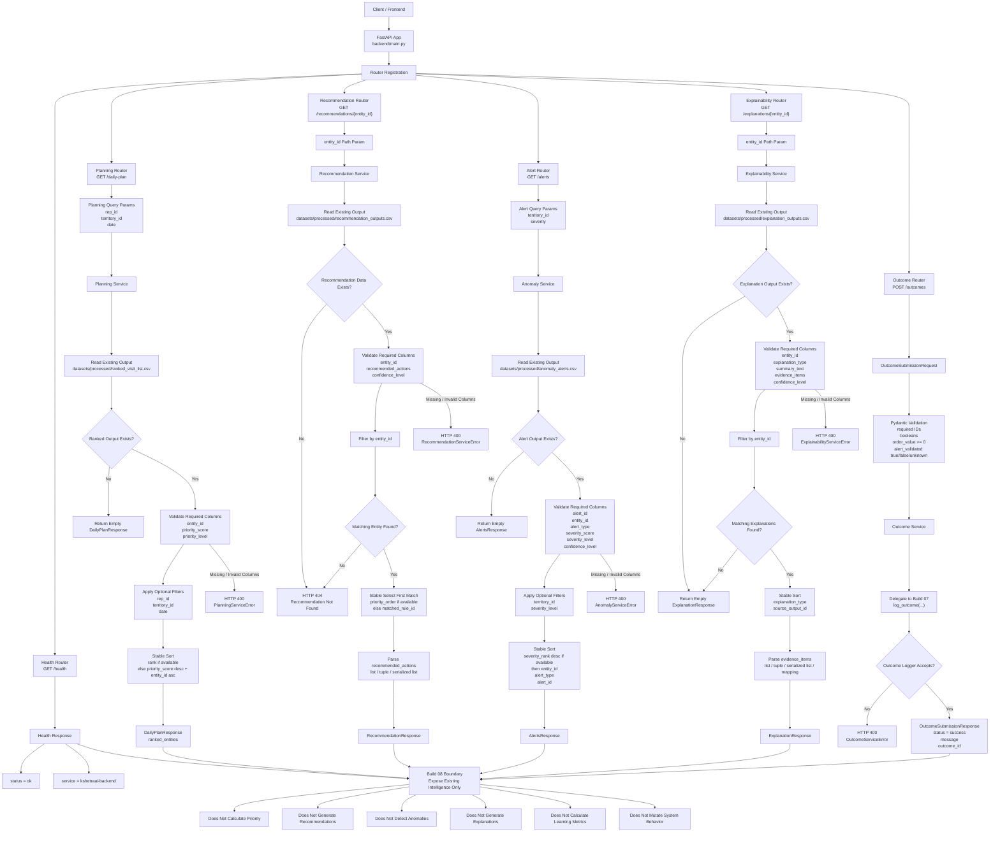

# Build 08 — FastAPI Backend Integration  
## Final Ground-Truth Functionality Record

---

# 1. Build Purpose

Build 08 implements the **FastAPI backend integration layer** of KshetraAI.

The core responsibility of this build is:

```text
Expose existing backend intelligence outputs through stable API routes,
validate request/response contracts,
delegate all business logic to existing backend services,
and keep the API layer thin.
```

Build 08 answers:

```text
How can frontend or external clients access KshetraAI outputs safely and consistently?
```

It does **not** calculate priority scores, generate recommendations, detect anomalies, create explanations, calculate learning metrics, or mutate system behavior.

---

# 2. Actual Files Used as Source of Truth

This ground-truth record is based on the inspected Build 08 commit trail and confirmed API files:

```text
backend/main.py

backend/api/routes/health_routes.py
backend/api/routes/planning_routes.py
backend/api/routes/recommendation_routes.py
backend/api/routes/anomaly_routes.py
backend/api/routes/explainability_routes.py
backend/api/routes/outcome_routes.py

backend/api/schemas/planning_schema.py
backend/api/schemas/recommendation_schema.py
backend/api/schemas/anomaly_schema.py
backend/api/schemas/explainability_schema.py
backend/api/schemas/outcome_schema.py

backend/api/services/planning_service.py
backend/api/services/recommendation_service.py
backend/api/services/anomaly_service.py
backend/api/services/explainability_service.py
backend/api/services/outcome_service.py

tests/test_build08_fastapi_entrypoint.py
tests/test_build08_api_schemas.py
tests/test_build08_planning_recommendation_routes.py
tests/test_build08_alert_explainability_routes.py
tests/test_build08_outcome_routes.py
```

Build 08 was implemented through commits prefixed with `Build 08:`, including the FastAPI entrypoint, API schemas, planning/recommendation routes, alert/explainability routes, outcome/health routes, and API tests. :contentReference[oaicite:0]{index=0} :contentReference[oaicite:1]{index=1} :contentReference[oaicite:2]{index=2} :contentReference[oaicite:3]{index=3} :contentReference[oaicite:4]{index=4}

---

# 3. What Was Actually Implemented

Build 08 implemented a thin FastAPI API layer with:

```text
1. FastAPI app entrypoint
2. Health route
3. Planning route
4. Recommendation route
5. Alert route
6. Explanation route
7. Outcome submission route
8. Pydantic request/response schemas
9. Service helpers for reading existing processed outputs
10. Tests for schemas, routes, services, and route registration
```

The implemented API surface is:

```text
GET  /health
GET  /daily-plan
GET  /recommendations/{entity_id}
GET  /alerts
GET  /explanations/{entity_id}
POST /outcomes
```

The app entrypoint explicitly states that the API layer is intentionally thin and leaves all intelligence logic inside existing backend modules. :contentReference[oaicite:5]{index=5}

---

# 4. Functional Role of Build 08

Build 08 acts as the **transport and integration layer**.

Earlier builds produce intelligence artifacts:

```text
Build 03 → ranked visit list
Build 04 → recommendation outputs
Build 05 → anomaly alerts
Build 06 → explanation outputs
Build 07 → outcome logging logic
```

Build 08 exposes those artifacts through API contracts.

The logical transformation is:

```text
processed backend outputs
        ↓
API service helpers
        ↓
Pydantic response models
        ↓
FastAPI routes
        ↓
frontend / client access
```

For outcome submission, the direction is reversed:

```text
client outcome payload
        ↓
Pydantic request validation
        ↓
outcome API service
        ↓
Build 07 outcome logger
        ↓
stable outcome submission response
```

---

# 5. Core Architectural Principle

The main architectural rule of Build 08 is:

```text
Routes should not contain intelligence logic.
```

Routes are thin handlers.

Services handle data access and response formatting.

Earlier builds remain responsible for domain intelligence.

This separation is visible across the route/service design:

```text
route layer:
- accepts request parameters
- calls service function
- maps service errors to HTTP errors

service layer:
- reads existing processed outputs
- validates required columns
- applies API-level filters
- formats Pydantic response objects
```

---

# 6. FastAPI App Entrypoint

## 6.1 What It Does

`backend/main.py` creates the FastAPI app and registers all routers.

The app metadata includes:

```text
API_TITLE = KshetraAI Backend
API_VERSION = 0.1.0
```

The app is created through:

```text
create_app()
```

and exposed as:

```text
app = create_app()
```

The initial entrypoint commit implemented `create_app()`, registered the health router, and described the API layer as thin. :contentReference[oaicite:6]{index=6}

Later Build 08 commits added planning, recommendation, anomaly, explainability, and outcome routers to the same app registration flow. :contentReference[oaicite:7]{index=7} :contentReference[oaicite:8]{index=8} :contentReference[oaicite:9]{index=9}

---

## 6.2 Why This Matters

The app entrypoint centralizes API route registration.

This gives one stable backend entrypoint for:

```text
health checks
daily plans
recommendations
alerts
explanations
outcome submissions
```

---

# 7. Health API Logic

## 7.1 Endpoint

```text
GET /health
```

## 7.2 What It Does

Returns a deterministic health response:

```json
{
  "status": "ok",
  "service": "kshetraai-backend"
}
```

The health route exposes service availability only and does not invoke or duplicate priority, recommendation, anomaly, explanation, or learning logic. :contentReference[oaicite:10]{index=10}

---

## 7.3 Responsibility

The health route answers:

```text
Is the backend service reachable?
```

It does not verify the correctness of processed data or downstream intelligence outputs.

---

# 8. API Schema Layer

Build 08 defines Pydantic schemas for all API transport contracts.

The schema commit explicitly introduced models for:

```text
planning
recommendation
anomaly
explainability
outcome
```

and tests validating response shape, defaults, and invalid-score/order-value validation. :contentReference[oaicite:11]{index=11}

---

## 8.1 Planning Schemas

Planning schemas define:

```text
DailyPlanQuery
RankedEntityResponse
DailyPlanResponse
```

They define API transport contracts only and do not calculate priority scores, ranks, or visit plans. :contentReference[oaicite:12]{index=12}

`RankedEntityResponse` validates:

```text
rank >= 1
entity_id non-empty
priority_score between 0 and 100
priority_level non-empty
```

The daily plan response contains:

```text
rep_id
territory_id
date
ranked_entities
```

---

## 8.2 Recommendation Schema

The recommendation schema defines:

```text
RecommendationResponse
```

with:

```text
entity_id
risk_or_opportunity
recommended_actions
recommended_product_category
confidence_level
```

It exposes existing recommendation outputs only and does not match rules, choose actions, or generate recommendations. :contentReference[oaicite:13]{index=13}

---

## 8.3 Anomaly Schema

The anomaly schema defines:

```text
AlertResponse
AlertsResponse
```

Each alert response contains:

```text
alert_id
entity_id
alert_type
severity_score
severity_level
confidence_level
```

`severity_score` is constrained to:

```text
0–100
```

The anomaly schema exposes existing alert outputs only and does not detect anomalies or classify severity. :contentReference[oaicite:14]{index=14}

---

## 8.4 Explainability Schema

The explainability schema defines:

```text
ExplanationItemResponse
ExplanationResponse
```

Each explanation item contains:

```text
explanation_type
summary_text
evidence_items
confidence_level
```

It exposes existing explanation outputs only and does not generate evidence, confidence, or reasoning text. :contentReference[oaicite:15]{index=15}

---

## 8.5 Outcome Schema

The outcome schema defines:

```text
OutcomeSubmissionRequest
OutcomeSubmissionResponse
```

The request validates:

```text
recommendation_id
entity_id
rep_id
visit_completed
recommendation_followed
sale_made
order_placed
order_value >= 0
alert_validated = true / false / unknown
feedback_category
rep_feedback
alert_id
```

The schema validates API payloads for outcome submission only and does not log outcomes, calculate metrics, or generate learning signals. :contentReference[oaicite:16]{index=16}

---

# 9. Planning API Logic

## 9.1 Endpoint

```text
GET /daily-plan
```

## 9.2 Query Parameters

```text
rep_id
territory_id
date
```

Each is optional and validated as a non-empty string when supplied.

---

## 9.3 Route Responsibility

The planning route remains a thin request/response handler and delegates processed-output access to the planning service. :contentReference[oaicite:17]{index=17}

The route:

```text
accepts optional filters
calls get_daily_plan_response(...)
returns DailyPlanResponse
maps PlanningServiceError to HTTP 400
```

---

## 9.4 Service Responsibility

The planning service reads an existing ranked visit list from:

```text
datasets/processed/ranked_visit_list.csv
```

It does not calculate priority scores, classify priority, rank entities, or run feature engineering. :contentReference[oaicite:18]{index=18}

---

## 9.5 Planning Service Logic

The service:

```text
1. Loads ranked_visit_list from provided DataFrame or default CSV path.
2. Returns an empty DailyPlanResponse if the source view is empty or missing.
3. Requires entity_id, priority_score, and priority_level columns.
4. Applies optional filters for rep_id, territory_id, and date if those columns exist.
5. Sorts by rank if rank exists.
6. Otherwise sorts by priority_score descending and entity_id ascending.
7. Converts rows into RankedEntityResponse objects.
```

This means the API exposes an already-ranked plan.

It does not create the plan.

---

# 10. Recommendation API Logic

## 10.1 Endpoint

```text
GET /recommendations/{entity_id}
```

---

## 10.2 Route Responsibility

The recommendation route exposes existing recommendation outputs only and delegates all data access to the recommendation service. :contentReference[oaicite:19]{index=19}

The route:

```text
accepts entity_id
calls get_recommendation_response(entity_id)
returns RecommendationResponse
maps RecommendationNotFoundError to HTTP 404
maps RecommendationServiceError to HTTP 400
```

---

## 10.3 Service Responsibility

The recommendation service reads existing recommendation outputs from:

```text
datasets/processed/recommendation_outputs.csv
```

It does not match rules, select actions, score confidence, or generate new recommendations. :contentReference[oaicite:20]{index=20}

---

## 10.4 Recommendation Service Logic

The service:

```text
1. Loads recommendation outputs from provided DataFrame or default CSV path.
2. Raises not-found if no data exists.
3. Requires entity_id, recommended_actions, and confidence_level columns.
4. Filters rows by entity_id.
5. Raises not-found if no matching row exists.
6. Sorts matches by priority_order when available.
7. Otherwise sorts by matched_rule_id when available.
8. Returns the first stable match.
9. Parses recommended_actions from list, tuple, or serialized list string.
10. Returns a RecommendationResponse.
```

The service selects from already-generated recommendation rows.

It does not create recommendation logic.

---

# 11. Alert API Logic

## 11.1 Endpoint

```text
GET /alerts
```

---

## 11.2 Query Parameters

```text
territory_id
severity
```

Both are optional API-level filters.

---

## 11.3 Route Responsibility

The anomaly route exposes existing anomaly alert outputs only and delegates data access to the anomaly service. :contentReference[oaicite:21]{index=21}

The route:

```text
accepts territory_id and severity filters
calls get_alerts_response(...)
returns AlertsResponse
maps AnomalyServiceError to HTTP 400
```

---

## 11.4 Service Responsibility

The anomaly service reads existing anomaly alerts from:

```text
datasets/processed/anomaly_alerts.csv
```

It does not detect anomalies, calculate severity, or generate alert evidence. :contentReference[oaicite:22]{index=22}

---

## 11.5 Alert Service Logic

The service:

```text
1. Loads anomaly_alerts from provided DataFrame or default CSV path.
2. Returns empty AlertsResponse if source view is empty or missing.
3. Requires alert_id, entity_id, alert_type, severity_score, severity_level, and confidence_level.
4. Applies optional territory_id filter if territory_id column exists.
5. Applies optional severity filter against severity_level.
6. Sorts by severity_rank descending when severity_rank exists.
7. Then sorts by entity_id, alert_type, and alert_id.
8. Converts rows into AlertResponse objects.
```

This exposes alert outputs from Build 05.

It does not perform Build 05 detection again.

---

# 12. Explainability API Logic

## 12.1 Endpoint

```text
GET /explanations/{entity_id}
```

---

## 12.2 Route Responsibility

The explainability route exposes existing explanation outputs only and delegates data access to the explainability service. :contentReference[oaicite:23]{index=23}

The route:

```text
accepts entity_id
calls get_explanation_response(entity_id)
returns ExplanationResponse
maps ExplainabilityServiceError to HTTP 400
```

---

## 12.3 Service Responsibility

The explainability service reads existing explanation outputs from:

```text
datasets/processed/explanation_outputs.csv
```

It does not map evidence, assess confidence, or generate explanation text. :contentReference[oaicite:24]{index=24}

---

## 12.4 Explainability Service Logic

The service:

```text
1. Loads explanation_outputs from provided DataFrame or default CSV path.
2. Returns empty ExplanationResponse if source view is empty or missing.
3. Requires entity_id, explanation_type, summary_text, evidence_items, and confidence_level.
4. Filters rows by entity_id.
5. Returns empty ExplanationResponse if entity has no explanations.
6. Sorts by explanation_type and source_output_id when available.
7. Parses evidence_items from list, tuple, serialized list string, or mapping-style items.
8. Converts evidence mappings into readable text.
9. Returns ExplanationResponse.
```

This exposes explanation outputs from Build 06.

It does not generate explanations.

---

# 13. Outcome API Logic

## 13.1 Endpoint

```text
POST /outcomes
```

---

## 13.2 Route Responsibility

The outcome route accepts validated outcome submissions and delegates normalization to the outcome service.

It does not calculate metrics or generate learning signals. :contentReference[oaicite:25]{index=25}

The route:

```text
accepts OutcomeSubmissionRequest
calls submit_outcome_response(...)
returns OutcomeSubmissionResponse
maps OutcomeServiceError to HTTP 400
```

---

## 13.3 Service Responsibility

The outcome service delegates outcome normalization to the existing Build 07 outcome logger.

It does not calculate metrics, generate feedback analytics, create recalibration signals, or write production data. :contentReference[oaicite:26]{index=26}

---

## 13.4 Outcome Service Logic

The service:

```text
1. Receives a validated OutcomeSubmissionRequest.
2. Converts it to a dictionary.
3. Calls Build 07 log_outcome(...).
4. Maps OutcomeLoggingError into OutcomeServiceError.
5. Returns status, message, and outcome_id.
```

The response shape is:

```json
{
  "status": "success",
  "message": "Outcome recorded successfully.",
  "outcome_id": "..."
}
```

Important boundary:

```text
POST /outcomes validates and normalizes one submitted outcome.
It does not persist production data by itself.
It does not calculate performance metrics.
It does not generate recalibration signals.
```

---

# 14. Error Handling Logic

Build 08 maps service-level errors into HTTP responses.

Implemented mappings:

```text
PlanningServiceError → HTTP 400
RecommendationNotFoundError → HTTP 404
RecommendationServiceError → HTTP 400
AnomalyServiceError → HTTP 400
ExplainabilityServiceError → HTTP 400
OutcomeServiceError → HTTP 400
```

All route-level errors use a structured detail shape:

```json
{
  "error": "..."
}
```

This keeps transport-layer error behavior predictable.

---

# 15. Data Access Logic

Build 08 services read existing processed outputs from default paths:

```text
datasets/processed/ranked_visit_list.csv
datasets/processed/recommendation_outputs.csv
datasets/processed/anomaly_alerts.csv
datasets/processed/explanation_outputs.csv
```

For tests and internal usage, services also accept DataFrame inputs directly.

This makes service logic testable without requiring real processed files.

When a processed file is missing:

```text
planning → empty daily plan response
alerts → empty alerts response
explanations → empty explanation response
recommendations → not found
```

The behavior is route-specific and intentional.

---

# 16. Validation Logic

Build 08 applies validation at multiple layers.

---

## 16.1 Pydantic Schema Validation

Pydantic schemas validate:

```text
non-empty IDs
score ranges
rank >= 1
non-negative order_value
allowed alert_validated shape
stable default empty lists
```

Schema tests confirm invalid rank, severity score above 100, and negative order value fail validation. :contentReference[oaicite:27]{index=27}

---

## 16.2 Service Column Validation

Services validate required columns before formatting responses.

Examples:

```text
planning requires entity_id, priority_score, priority_level
recommendation requires entity_id, recommended_actions, confidence_level
alerts require alert_id, entity_id, alert_type, severity_score, severity_level, confidence_level
explanations require entity_id, explanation_type, summary_text, evidence_items, confidence_level
```

Missing required columns raise explicit service errors.

---

## 16.3 Value Conversion Validation

Services also validate and normalize values:

```text
priority_score must be numeric
severity_score must be numeric
rank must be >= 1
entity_id cannot be empty
recommended_actions cannot be empty
evidence_items cannot be empty
```

This ensures invalid processed outputs are not silently exposed.

---

# 17. Testing Logic

Build 08 added tests for:

```text
FastAPI app entrypoint
route registration
schema shapes
schema validation failures
planning service filters
recommendation service not-found behavior
alert filters
explanation evidence formatting
outcome submission delegation
HTTP error mapping
```

The entrypoint test confirms route registration for:

```text
/health
/daily-plan
/recommendations/{entity_id}
/alerts
/explanations/{entity_id}
/outcomes
```

The Build 08 commits include dedicated API schema, planning/recommendation route, alert/explainability route, and outcome route tests. :contentReference[oaicite:28]{index=28} :contentReference[oaicite:29]{index=29} :contentReference[oaicite:30]{index=30} :contentReference[oaicite:31]{index=31} :contentReference[oaicite:32]{index=32}

---

# 18. How Build 08 Solves Its Responsibility

Build 08 solves backend integration by separating API transport from intelligence logic.

The problem is:

```text
The frontend/client needs stable access to outputs,
but the API must not duplicate scoring, recommendation, anomaly,
explanation, or learning logic.
```

The implemented solution is:

```text
FastAPI app
        ↓
thin route handlers
        ↓
Pydantic schemas
        ↓
service helpers
        ↓
existing processed outputs / existing backend modules
```

This keeps the project architecture clean:

```text
Builds 01–07 produce and validate intelligence.
Build 08 exposes that intelligence safely through API contracts.
```

---

# 19. What Build 08 Intentionally Does Not Do

Build 08 intentionally does not:

```text
calculate feature scores
rank entities from scratch
generate priority scores
match contextual decision rules
generate recommendations
detect anomalies
calculate anomaly severity
generate alert evidence
map explanation evidence
assess explanation confidence
generate explanation text
calculate learning metrics
generate recalibration signals
write production outcome data
render frontend screens
```

This is correct because Build 08 is only the:

```text
FastAPI transport and integration layer
```

not the:

```text
intelligence engine layer
```

---

# 20. Pending or Intentionally Out of Scope

Based on the inspected implementation, the following are intentionally outside Build 08.

---

## 20.1 Authentication and Authorization

No authentication or role-based access control is implemented in Build 08.

This means the API contracts exist, but production-grade access control is still outside this build.

---

## 20.2 Persistent Outcome Storage

`POST /outcomes` delegates to Build 07 `log_outcome(...)` and returns a normalized response.

It does not write production outcome data to a database or persistent file.

---

## 20.3 Live Pipeline Execution

The API does not trigger Build 01–07 pipelines.

It reads existing processed outputs.

---

## 20.4 Pagination

List endpoints such as `/daily-plan` and `/alerts` do not implement pagination.

They return filtered response lists directly.

---

## 20.5 API Versioning

The app has an internal `API_VERSION`, but route paths are not versioned as `/api/v1/...`.

---

## 20.6 Frontend Integration

The API provides backend contracts.

Frontend rendering is still outside this build.

---

# 21. Final Ground-Truth Summary

Build 08 implemented the **FastAPI backend integration layer**.

The actual logical solution is:

```text
existing processed outputs / existing backend logic
        ↓
API service helpers
        ↓
Pydantic schemas
        ↓
FastAPI route handlers
        ↓
stable client-facing API responses
```

The implemented endpoints are:

```text
GET  /health
GET  /daily-plan
GET  /recommendations/{entity_id}
GET  /alerts
GET  /explanations/{entity_id}
POST /outcomes
```

The most important architectural truth is:

```text
Build 08 exposes intelligence;
it does not recreate intelligence.
```

---

# 22. Final One-Line Definition

```text
Build 08 exposes KshetraAI’s existing planning, recommendation,
alert, explanation, and outcome-submission capabilities through a thin,
validated FastAPI layer that delegates business logic to existing backend modules
and preserves clear separation between API transport and intelligence execution.
```


