```mermaid
flowchart TD

%% ==========================================
%% Build 09 — Frontend Dashboard & Workflow Layer
%% Ground-Truth Logic Flow
%% ==========================================

A["Build 08 FastAPI Backend"]

A --> A1["GET /health"]
A --> A2["GET /daily-plan"]
A --> A3["GET /recommendations/{entity_id}"]
A --> A4["GET /explanations/{entity_id}"]
A --> A5["GET /alerts"]
A --> A6["POST /outcomes"]

%% ----------------------------
%% Frontend App Shell
%% ----------------------------

B["React + TypeScript Frontend"]

B --> B1["frontend/main.tsx<br/>React root mount"]
B --> B2["frontend/App.tsx<br/>workflow state"]
B --> B3["DashboardLayout<br/>sidebar + workspace"]

B2 --> C["Workflow Selection State"]

C --> C1["repId"]
C --> C2["territoryId"]
C --> C3["planDate"]
C --> C4["selectedEntityId"]

B3 --> D["Workflow Navigation"]

D --> D1["Dashboard"]
D --> D2["Daily Visit Plan"]
D --> D3["Recommendation + Explanation"]
D --> D4["Alerts"]
D --> D5["Outcome Submission"]

%% ----------------------------
%% API Client Layer
%% ----------------------------

B --> E["Typed API Client<br/>frontend/services/apiClient.ts"]

E --> E1["API_BASE_URL<br/>VITE_KSHETRA_API_BASE_URL<br/>fallback localhost:8000"]
E --> E2["apiFetch<T>()"]
E --> E3["ApiClientError"]
E --> E4["Typed Request / Response Models"]

E2 --> A1
E2 --> A2
E2 --> A3
E2 --> A4
E2 --> A5
E2 --> A6

%% ----------------------------
%% Hook Layer
%% ----------------------------

B --> F["Hook Layer"]

F --> F1["useApiResource<T><br/>data / error / isLoading / reload"]
F --> F2["useHealth"]
F --> F3["useDailyPlan"]
F --> F4["useRecommendation"]
F --> F5["useExplanation"]
F --> F6["useAlerts"]
F --> F7["useSubmitOutcome"]

F2 --> E
F3 --> E
F4 --> E
F5 --> E
F6 --> E
F7 --> E

%% ----------------------------
%% Dashboard Page
%% ----------------------------

D1 --> G["Dashboard Page"]

G --> G1["Select / hold workflow context"]
G1 --> C
G --> G2["Open Daily Plan"]

G2 --> D2

%% ----------------------------
%% Visit Plan Page
%% ----------------------------

D2 --> H["VisitPlan.tsx"]

H --> H1["useDailyPlan<br/>repId + territoryId + date"]
H1 --> A2

A2 --> H2["DailyPlanResponse"]
H2 --> H3["ranked_entities"]

H3 --> H4["PriorityCard List"]

H4 --> H5["Displays<br/>rank<br/>entity name/id<br/>priority_score<br/>priority_level<br/>main_reason"]

H4 --> H6["Open details"]

H6 --> H7["Set selectedEntityId"]
H7 --> C4
H7 --> D3

H --> H8["UI States"]
H8 --> H9["Loading daily plan"]
H8 --> H10["Unable to load daily plan"]
H8 --> H11["No ranked visits returned"]
H8 --> H12["Success list"]

%% ----------------------------
%% Recommendation + Explanation Page
%% ----------------------------

D3 --> I["RecommendationView.tsx"]

I --> I1["useRecommendation(selectedEntityId)"]
I --> I2["useExplanation(selectedEntityId)"]

I1 --> A3
I2 --> A4

A3 --> I3["RecommendationResponse"]
A4 --> I4["ExplanationResponse"]

I3 --> I5["RecommendationPanel"]
I4 --> I6["ExplanationPanel"]

I5 --> I7["Displays<br/>risk_or_opportunity<br/>recommended_actions<br/>product_category<br/>confidence_level"]

I6 --> I8["Displays<br/>summary_text<br/>evidence_items<br/>confidence_level"]

I --> I9["UI States"]
I9 --> I10["Loading recommendation/explanation"]
I9 --> I11["Unable to load recommendation"]
I9 --> I12["Unable to load explanation"]
I9 --> I13["No recommendation loaded"]
I9 --> I14["No explanation loaded"]
I9 --> I15["Success panels"]

I --> I16["Open Alerts"]
I16 --> D4

%% ----------------------------
%% Alerts Page
%% ----------------------------

D4 --> J["AlertsView.tsx"]

J --> J1["useAlerts<br/>territoryId filter"]
J1 --> A5

A5 --> J2["AlertsResponse"]
J2 --> J3["AlertPanel"]

J3 --> J4["Displays<br/>alert_id<br/>entity_id<br/>alert_type<br/>severity_score<br/>severity_level<br/>confidence_level"]

J --> J5["UI States"]
J5 --> J6["Loading alerts"]
J5 --> J7["Unable to load alerts"]
J5 --> J8["No active alerts returned"]
J5 --> J9["Success alert list"]

J --> J10["Open Outcome"]
J10 --> D5

%% ----------------------------
%% Outcome Submission Page
%% ----------------------------

D5 --> K["OutcomeSubmission.tsx"]

K --> K1["OutcomeForm"]

K1 --> K2["Captures Payload Fields"]
K2 --> K3["recommendation_id"]
K2 --> K4["entity_id"]
K2 --> K5["rep_id"]
K2 --> K6["visit_completed"]
K2 --> K7["recommendation_followed"]
K2 --> K8["sale_made"]
K2 --> K9["order_placed"]
K2 --> K10["order_value"]
K2 --> K11["alert_validated"]
K2 --> K12["feedback_category"]
K2 --> K13["rep_feedback"]
K2 --> K14["alert_id"]

K1 --> K15["Local Validation"]
K15 --> K16["required IDs present"]
K15 --> K17["order_value >= 0"]
K15 --> K18["alert_validated<br/>true / false / unknown"]

K15 --> K19{"Valid Form?"}

K19 -- "No" --> K20["Inline Validation Error"]
K19 -- "Yes" --> K21["OutcomeSubmissionRequest"]

K21 --> K22["useSubmitOutcome"]
K22 --> A6

A6 --> K23["OutcomeSubmissionResponse"]
K23 --> K24["Success State<br/>message + outcome_id"]

K22 --> K25["Submission Error State"]

%% ----------------------------
%% Testing / Boundary
%% ----------------------------

L["Build 09 Frontend Workflow Tests"]

L --> L1["Build script available<br/>tsc -b + vite build"]
L --> L2["API client preserves Build 08 endpoints"]
L --> L3["Pages use hooks<br/>no direct fetch in pages"]
L --> L4["Loading / error / empty / success states"]
L --> L5["Outcome form captures required payload fields"]
L --> L6["Frontend does not recreate backend intelligence logic"]

B --> L

%% ----------------------------
%% Explicit Non-Responsibilities
%% ----------------------------

M["Build 09 Boundary"]

M --> M1["Does Not Calculate Priority Scores"]
M --> M2["Does Not Generate Recommendations"]
M --> M3["Does Not Detect Anomalies"]
M --> M4["Does Not Generate Explanations"]
M --> M5["Does Not Calculate Learning Metrics"]
M --> M6["Does Not Mutate Backend Rules"]

H --> M
I --> M
J --> M
K --> M

```

# Build 09 — Frontend Dashboard & Workflow Layer  
## Final Ground-Truth Functionality Record

---

# 1. Build Purpose

Build 09 implements the **frontend dashboard and workflow layer** of KshetraAI.

The core responsibility of this build is:

```text
Provide a React + TypeScript user interface
that consumes Build 08 API endpoints,
renders operational intelligence outputs,
guides the field workflow,
and submits visit outcome feedback.
```

Build 09 answers:

```text
How does a field representative or demo user interact with KshetraAI intelligence?
```

It does **not** calculate priority scores, generate recommendations, detect anomalies, generate explanations, calculate learning metrics, or mutate backend rules.

---

# 2. Actual Files Used as Source of Truth

This ground-truth record is based on the inspected Build 09 commit trail and confirmed frontend files.

Confirmed Build 09 commit sequence:

```text
Build 09: Create frontend application shell
Build 09: Implement API client and state hooks
Build 09: Implement daily visit plan view
Build 09: Implement recommendation and explanation views
Build 09: Implement alert and outcome views
Build 09: Add frontend workflow tests
Build 09: Verify frontend workflow checklist
Build 09: Update frontend workflow build status
```

Actual implementation areas confirmed:

```text
frontend/App.tsx
frontend/main.tsx
frontend/layouts/DashboardLayout.tsx

frontend/components/AlertPanel.tsx
frontend/components/ExplanationPanel.tsx
frontend/components/LoadingState.tsx
frontend/components/OutcomeForm.tsx
frontend/components/PriorityCard.tsx
frontend/components/RecommendationPanel.tsx

frontend/pages/Dashboard.tsx
frontend/pages/VisitPlan.tsx
frontend/pages/RecommendationView.tsx
frontend/pages/AlertsView.tsx
frontend/pages/OutcomeSubmission.tsx

frontend/services/apiClient.ts

frontend/hooks/useApiResource.ts
frontend/hooks/useHealth.ts
frontend/hooks/useDailyPlan.ts
frontend/hooks/useRecommendation.ts
frontend/hooks/useExplanation.ts
frontend/hooks/useAlerts.ts
frontend/hooks/useSubmitOutcome.ts

frontend/state/workflowStore.ts
frontend/styles/global.css

tests/test_build09_frontend_workflow.py
```

The Build 09 commit series confirms creation of the frontend shell, API client/hooks, daily visit plan view, recommendation/explanation views, alert/outcome views, and frontend workflow tests. :contentReference[oaicite:0]{index=0} :contentReference[oaicite:1]{index=1} :contentReference[oaicite:2]{index=2} :contentReference[oaicite:3]{index=3} :contentReference[oaicite:4]{index=4} :contentReference[oaicite:5]{index=5}

---

# 3. What Was Actually Implemented

Build 09 implemented a frontend workflow application with:

```text
1. React + TypeScript application shell
2. Dashboard layout and workflow navigation
3. Typed API client for Build 08 endpoints
4. Reusable API resource hook
5. Endpoint-specific frontend hooks
6. Daily visit plan view
7. Recommendation and explanation view
8. Alert view
9. Outcome submission view
10. Reusable display components
11. Loading, error, empty, and success UI states
12. Frontend workflow tests
```

The actual frontend workflow is:

```text
Dashboard
    ↓
Daily Visit Plan
    ↓
Recommendation + Explanation
    ↓
Alerts
    ↓
Outcome Submission
```

The frontend consumes backend outputs through Build 08 API endpoints.

It does not recreate backend intelligence logic.

---

# 4. Functional Role of Build 09

Build 09 acts as the **human interaction layer**.

Earlier builds produce and expose intelligence:

```text
Build 03 → ranked visit list
Build 04 → recommendation outputs
Build 05 → anomaly alerts
Build 06 → explanations
Build 07 → outcome logging logic
Build 08 → FastAPI routes
```

Build 09 turns those backend contracts into a usable workflow interface:

```text
API response
        ↓
typed API client
        ↓
React hooks
        ↓
page state
        ↓
reusable UI components
        ↓
field workflow screen
```

For outcome capture:

```text
form input
        ↓
local validation
        ↓
typed outcome payload
        ↓
POST /outcomes
        ↓
success/error UI state
```

---

# 5. Frontend Application Shell

## 5.1 What It Does

The frontend shell is created through:

```text
frontend/main.tsx
frontend/App.tsx
frontend/index.html
frontend/layouts/DashboardLayout.tsx
```

The application renders into the root DOM element and wraps the app in React `StrictMode`.

The shell commit created the React app entrypoint, layout, base components, page placeholders, styling, and package setup. :contentReference[oaicite:6]{index=6}

---

## 5.2 Workflow State

`App.tsx` maintains two pieces of workflow state:

```text
activeStep
selection
```

`activeStep` controls which workflow page is currently visible.

`selection` stores the selected operational context, such as:

```text
repId
territoryId
planDate
selectedEntityId
```

The app shell routes the workflow internally without adding a router library.

---

## 5.3 Workflow Steps

The workflow navigation supports these conceptual steps:

```text
dashboard
visit-plan
recommendation
alerts
outcome
```

The UI advances through these screens based on user actions.

Example:

```text
Open plan
    ↓
Open recommendation for selected entity
    ↓
Open alerts
    ↓
Open outcome submission
```

---

# 6. Layout Logic

## 6.1 Dashboard Layout

`DashboardLayout` provides the main application frame.

It includes:

```text
sidebar navigation
workflow step buttons
brand block
workspace area
```

The sidebar lets the user switch workflow sections.

The currently active step receives the active navigation class.

---

## 6.2 Why This Matters

The layout creates a consistent workflow shell.

It keeps page-specific rendering separate from navigation structure.

This supports the project architecture:

```text
layout controls workflow shell
pages control workflow screens
components control reusable display sections
hooks control API state
```

---

# 7. API Client Logic

## 7.1 What It Does

`frontend/services/apiClient.ts` defines the typed frontend contract for Build 08 APIs.

It includes TypeScript response/request types and functions for:

```text
GET  /health
GET  /daily-plan
GET  /recommendations/{entity_id}
GET  /alerts
GET  /explanations/{entity_id}
POST /outcomes
```

The API client commit implemented endpoint wrappers, typed response contracts, error handling, environment-based base URL, and outcome submission support. :contentReference[oaicite:7]{index=7}

---

## 7.2 API Base URL

The API base URL is resolved from:

```text
VITE_KSHETRA_API_BASE_URL
```

with fallback:

```text
http://127.0.0.1:8000
```

This lets the frontend run locally against the FastAPI backend.

---

## 7.3 API Fetch Logic

The API client uses a shared `apiFetch<T>(...)` helper.

The helper:

```text
1. Performs fetch against API_BASE_URL + path.
2. Parses the response body as JSON when possible.
3. Converts non-OK responses into ApiClientError.
4. Extracts structured API error messages from response payloads.
5. Returns typed response data.
```

The client does not perform backend scoring or data transformation beyond request/response formatting.

---

## 7.4 Endpoint Contract Preservation

The frontend test verifies that the API client preserves Build 08 contracts:

```text
/health
/daily-plan
/recommendations/{entity_id}
/alerts
/explanations/{entity_id}
/outcomes
POST method for outcomes
Content-Type: application/json
```

:contentReference[oaicite:8]{index=8}

---

# 8. Hook Layer Logic

## 8.1 Generic API Resource Hook

`useApiResource<T>(...)` centralizes read-request state handling.

It manages:

```text
data
error
isLoading
reload
```

The hook:

```text
1. Accepts a request function.
2. Supports enabled/disabled loading.
3. Executes the request on mount/effect.
4. Stores returned data.
5. Stores error messages.
6. Exposes reload for retry/refresh.
```

This prevents every page from manually duplicating fetch state logic.

---

## 8.2 Endpoint-Specific Hooks

Build 09 implements specific hooks:

```text
useHealth()
useDailyPlan(query)
useRecommendation(entityId)
useExplanation(entityId)
useAlerts(query)
useSubmitOutcome()
```

These hooks wrap the API client functions and expose page-friendly state.

The test confirms workflow pages use hooks for API access and do not call `fetch(...)` directly inside pages. :contentReference[oaicite:9]{index=9}

---

## 8.3 Recommendation and Explanation Hook Enablement

The recommendation and explanation hooks only run when:

```text
entityId.trim().length > 0
```

This prevents requests with empty entity IDs.

---

## 8.4 Outcome Submission Hook

`useSubmitOutcome()` manages POST submission state:

```text
data
error
isSubmitting
submit(payload)
```

It calls:

```text
submitOutcome(payload)
```

and returns either the API response or `null` on failure.

---

# 9. Dashboard Page Logic

## 9.1 What It Does

The dashboard page acts as the workflow starting point.

It allows the user to review or set the workflow context before opening the daily visit plan.

The selected context is stored in the shared workflow selection state.

---

## 9.2 Responsibility

The dashboard does not call backend intelligence endpoints directly.

It prepares the frontend workflow context:

```text
rep
territory
date
selected entity context
```

Then it transitions to the visit-plan step.

---

# 10. Daily Visit Plan View Logic

## 10.1 What It Does

`VisitPlan.tsx` renders the ranked visit plan returned by:

```text
GET /daily-plan
```

The daily visit plan commit replaced shell placeholder content with actual backend API integration. :contentReference[oaicite:10]{index=10}

---

## 10.2 Input Context

The page uses:

```text
selection.repId
selection.territoryId
selection.planDate
```

and sends them as filters through `useDailyPlan(...)`.

---

## 10.3 API Data Flow

The logic is:

```text
selection
        ↓
useDailyPlan({ repId, territoryId, date })
        ↓
GET /daily-plan
        ↓
DailyPlanResponse
        ↓
ranked_entities
        ↓
PriorityCard list
```

---

## 10.4 UI States

The visit plan page handles:

```text
loading
error
empty
success
```

Specifically:

```text
Loading daily plan from backend API
Unable to load daily plan
No ranked visits returned
Ranked daily visit plan
```

The frontend workflow test verifies these state markers. :contentReference[oaicite:11]{index=11}

---

## 10.5 Selection Handoff

When the user opens a priority card, the app stores:

```text
selectedEntityId
```

and moves to the recommendation screen.

This connects the daily plan workflow to the entity-specific recommendation workflow.

---

# 11. Priority Card Logic

## 11.1 What It Displays

`PriorityCard` displays:

```text
rank
entityName
entityId
priorityScore
priorityLevel
mainReason
```

It also exposes an action button:

```text
Open details
```

---

## 11.2 Responsibility

The card displays already-calculated backend priority output.

It does not calculate:

```text
rank
priority score
priority level
main reason
```

Those values come from the API response.

---

# 12. Recommendation View Logic

## 12.1 What It Does

`RecommendationView.tsx` renders both:

```text
GET /recommendations/{entity_id}
GET /explanations/{entity_id}
```

The recommendation/explanation commit connected the view to backend API hooks and removed placeholder shell data. :contentReference[oaicite:12]{index=12}

---

## 12.2 Input Context

The page uses:

```text
selection.selectedEntityId
```

to load recommendation and explanation data.

---

## 12.3 API Data Flow

The recommendation side:

```text
selectedEntityId
        ↓
useRecommendation(entityId)
        ↓
GET /recommendations/{entity_id}
        ↓
RecommendationResponse
        ↓
RecommendationPanel
```

The explanation side:

```text
selectedEntityId
        ↓
useExplanation(entityId)
        ↓
GET /explanations/{entity_id}
        ↓
ExplanationResponse
        ↓
ExplanationPanel
```

---

## 12.4 UI States

The recommendation view handles:

```text
loading
recommendation error
explanation error
recommendation empty
explanation empty
success
```

State markers include:

```text
Loading recommendation and explanation from backend API
Unable to load recommendation
Unable to load explanation
No recommendation loaded
No explanation loaded
```

These are verified by the frontend workflow tests. :contentReference[oaicite:13]{index=13}

---

## 12.5 Important Boundary

The recommendation page does not:

```text
match contextual rules
select actions
generate recommendations
generate explanation text
assess confidence
```

It only renders returned backend data.

---

# 13. Recommendation Panel Logic

## 13.1 What It Displays

`RecommendationPanel` displays:

```text
entityId
riskOrOpportunity
recommendedActions
recommendedProductCategory
confidenceLevel
```

---

## 13.2 Responsibility

The panel presents the next-best-action output generated by backend logic.

It does not decide what action to recommend.

---

# 14. Explanation Panel Logic

## 14.1 What It Displays

`ExplanationPanel` displays a list of explanation items.

Each item includes:

```text
explanationType
summaryText
evidenceItems
confidenceLevel
```

---

## 14.2 Responsibility

The panel presents backend explanation output.

It does not map evidence, assess confidence, or render explanation text from templates.

---

# 15. Alerts View Logic

## 15.1 What It Does

`AlertsView.tsx` renders anomaly/opportunity alerts returned by:

```text
GET /alerts
```

The alert/outcome commit connected alerts to the backend API and removed shell alert placeholder content. :contentReference[oaicite:14]{index=14}

---

## 15.2 Input Context

The page uses:

```text
selection.territoryId
```

as an API filter.

---

## 15.3 API Data Flow

```text
territoryId
        ↓
useAlerts({ territoryId })
        ↓
GET /alerts
        ↓
AlertsResponse
        ↓
AlertPanel
```

---

## 15.4 UI States

The alert page handles:

```text
loading
error
empty
success
```

State markers include:

```text
Loading alerts from backend API
Unable to load alerts
No active alerts returned
```

These are verified by the frontend workflow tests. :contentReference[oaicite:15]{index=15}

---

## 15.5 Important Boundary

The alerts page does not:

```text
compare baselines
detect deviations
classify severity
generate alert evidence
```

It only displays existing backend alert outputs.

---

# 16. Alert Panel Logic

## 16.1 What It Displays

`AlertPanel` displays:

```text
alertId
entityId
alertType
severityScore
severityLevel
confidenceLevel
```

---

## 16.2 Responsibility

The panel visualizes backend alert records.

It does not calculate severity or validate anomalies.

---

# 17. Outcome Submission View Logic

## 17.1 What It Does

`OutcomeSubmission.tsx` renders a field outcome capture screen and submits data to:

```text
POST /outcomes
```

The alert/outcome commit connected the outcome page to `useSubmitOutcome()` and the backend outcome API. :contentReference[oaicite:16]{index=16}

---

## 17.2 Input Context

The page uses:

```text
selection.selectedEntityId
selection.repId
```

It passes these values into the outcome form.

---

## 17.3 Outcome Submission Flow

```text
Outcome form input
        ↓
local validation
        ↓
OutcomeSubmissionRequest payload
        ↓
useSubmitOutcome()
        ↓
POST /outcomes
        ↓
OutcomeSubmissionResponse
        ↓
success or error UI
```

---

## 17.4 UI States

The outcome submission page handles:

```text
submitting
error
success
```

Success state shows:

```text
message
outcome_id or status
```

Error state shows:

```text
Unable to submit outcome
```

The workflow test verifies outcome success/error state markers. :contentReference[oaicite:17]{index=17}

---

# 18. Outcome Form Logic

## 18.1 What It Captures

`OutcomeForm` captures the Build 08/Build 07 outcome payload fields:

```text
recommendation_id
entity_id
rep_id
visit_completed
recommendation_followed
sale_made
order_placed
order_value
alert_validated
feedback_category
rep_feedback
alert_id
```

The frontend test explicitly checks that these payload fields exist in the form implementation. :contentReference[oaicite:18]{index=18}

---

## 18.2 Local Validation

The form validates:

```text
recommendation_id must not be empty
entity_id must not be empty
rep_id must not be empty
order_value must be zero or positive
```

Validation messages include:

```text
Recommendation ID, entity ID, and rep ID are required.
Order value must be zero or a positive number.
```

These are verified by the Build 09 workflow tests. :contentReference[oaicite:19]{index=19}

---

## 18.3 Alert Validation Conversion

The form allows alert validation as:

```text
unknown
true
false
```

and converts it into:

```text
"unknown"
true
false
```

before sending the payload.

---

## 18.4 Optional Text Handling

Optional text fields are trimmed.

If empty, they are sent as:

```text
undefined
```

This applies to:

```text
alert_id
feedback_category
rep_feedback
```

---

# 19. Loading, Error, Empty, and Success State Strategy

Build 09 implemented user-visible states instead of assuming happy-path API responses.

The views include:

```text
loading state
error state with retry
empty state
success data rendering
submission success state
```

This improves demo reliability because missing backend data or failed API calls are surfaced clearly.

The test suite verifies these states across:

```text
VisitPlan
RecommendationView
AlertsView
OutcomeSubmission
```

:contentReference[oaicite:20]{index=20}

---

# 20. Styling and UI Structure

Build 09 added global CSS for:

```text
application shell
sidebar
workflow navigation
cards
panels
forms
state panels
alerts
explanations
buttons
responsive layout
```

The styling supports a dashboard-style operational workflow.

It is not a design system library.

It is a scoped prototype UI layer.

---

# 21. Testing Logic

Build 09 added frontend workflow tests in:

```text
tests/test_build09_frontend_workflow.py
```

The tests verify:

```text
frontend build script exists
API client preserves Build 08 endpoint contracts
workflow pages use hooks for API access
pages do not call fetch directly
views cover loading/error/empty/success states
outcome form captures required payload fields
frontend does not recreate backend intelligence logic
```

The test explicitly checks that frontend `.tsx` files do not contain disallowed backend-intelligence fragments such as:

```text
calculatePriority
generateRecommendation
detectAnomaly
scoreWeights
priority_score =
severity_score =
```

:contentReference[oaicite:21]{index=21}

This is important because it enforces the frontend boundary.

---

# 22. How Build 09 Solves Its Responsibility

Build 09 solves the frontend workflow problem by separating responsibilities into clean layers:

```text
apiClient.ts
        → knows endpoint contracts

hooks/
        → manage API loading/error/data state

pages/
        → orchestrate workflow screens

components/
        → render reusable UI sections

workflowStore.ts
        → stores selected workflow context

global.css
        → provides scoped dashboard styling
```

This prevents pages from becoming overloaded with raw API logic or backend intelligence logic.

The frontend remains a consumer of backend intelligence, not a second intelligence engine.

---

# 23. What Build 09 Intentionally Does Not Do

Build 09 intentionally does not:

```text
calculate priority scores
rank entities
generate recommendations
match contextual rules
detect anomalies
classify anomaly severity
generate explanation text
assess confidence
calculate learning metrics
generate recalibration signals
persist outcomes locally
implement authentication
implement production routing
implement offline mode
```

This is correct because Build 09 is only the:

```text
frontend dashboard and workflow layer
```

not the:

```text
backend intelligence layer
```

---

# 24. Pending or Intentionally Out of Scope

Based on the inspected implementation, the following are intentionally outside Build 09.

---

## 24.1 Authentication and User Roles

No login, role-based access control, or protected route behavior is implemented.

---

## 24.2 Production Routing

The app uses internal workflow state instead of React Router.

This is acceptable for the prototype workflow but not a full production navigation system.

---

## 24.3 Persistent Frontend State

Workflow state is kept in React state.

It is not persisted to local storage or backend session state.

---

## 24.4 Full Outcome Recommendation ID Integration

The outcome page currently passes a fixed recommendation ID placeholder:

```text
RECOMMENDATION_FROM_API
```

This means final end-to-end linkage between selected backend recommendation record and submitted outcome can be improved in a later polish/demo pass.

---

## 24.5 Advanced Form Validation

The form performs basic local validation.

It does not fully mirror all backend validation categories or controlled dropdown values.

---

## 24.6 Frontend Unit/DOM Testing

The added tests inspect source structure and contracts.

They do not use React Testing Library or browser-based DOM interaction tests.

---

## 24.7 Offline Mode

No offline-first or mobile field sync behavior is implemented.

---

# 25. Final Ground-Truth Summary

Build 09 implemented the **React + TypeScript frontend workflow layer**.

The actual logical solution is:

```text
Build 08 API contracts
        ↓
typed frontend API client
        ↓
resource hooks
        ↓
workflow pages
        ↓
reusable UI components
        ↓
field dashboard workflow
        ↓
outcome submission back to API
```

The frontend screens implemented are:

```text
Dashboard
Daily Visit Plan
Recommendation + Explanation
Alerts
Outcome Submission
```

The most important architectural truth is:

```text
Build 09 displays and submits operational intelligence;
it does not compute or recreate that intelligence.
```

---

# 26. Final One-Line Definition

```text
Build 09 turns KshetraAI’s FastAPI-backed intelligence outputs
into a React + TypeScript dashboard workflow that displays daily plans,
recommendations, explanations, alerts, and outcome submission,
while preserving the boundary that all scoring, recommendation,
anomaly, explanation, and learning logic remains in the backend.
```


